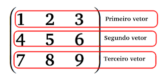
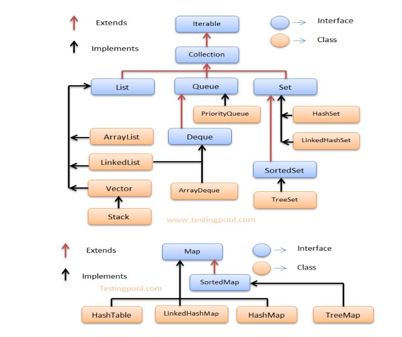
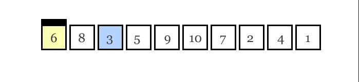
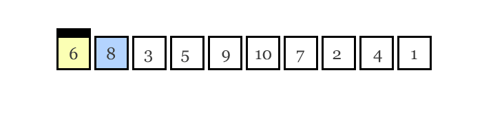
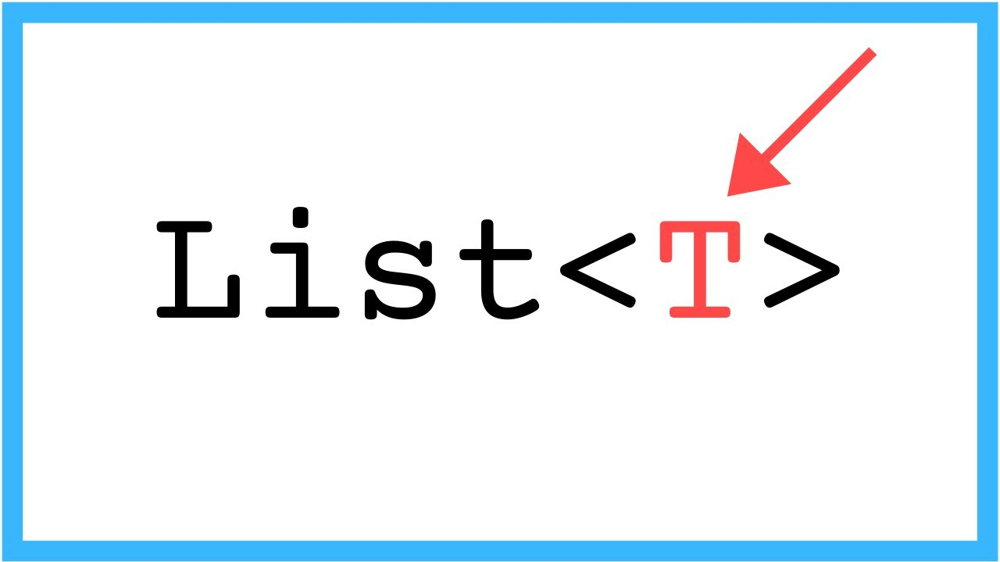
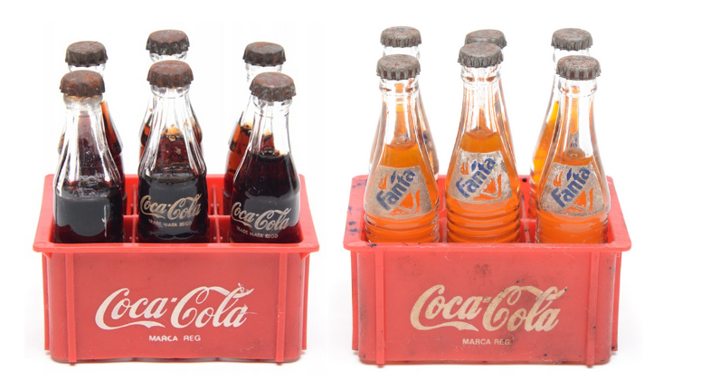

# Conjuntos e elementos

## Arrays e Coleções

Arrays ou coleções são estruturas de dados que consistem em itens ou elementos relacionados a um mesmo tipo ou sub-tipo de dados.

### Arrays

Consideramos também um array, como um grupo de posições reservadas na memória para armazenar elementos localizados através de um índice que se inicia com zero. Veja a imagem ilustrativa abaixo:

<div align="center">
  
</div>

Agora vamos ilustrar a criação de um array considerando a inserção dos elementos nos respectivos índices conforme imagem acima.

```java
public class Arrays {
  public static void main(String[] args) {
    Integer [ ] array = new Integer[6];

    array   [0] = 2;
    array   [1] = 4;
    array   [2] = 10;
    array   [3] = 5;
    array   [4] = 15;
    array   [5] = 3;
  }
}
```

Desmistificando linha por linha o algorítimo ilustrado acima:

- Na linha 3 é declarada uma variável denominada `array` que representará um conjunto de inteiros.
- Também na linha 3, identificamos a criação `new` de um conjunto de inteiros que suportará 6 elementos.
- Nas linhas 5 até 10 informamos que cada posição do conjunto receberá um valor correspondente.

Simples hein? Agora que você já aprendeu como declarar, criar e atribuir os elementos em um `array`, que tal obter um determinado elemento correspondente ao índice informado?

```java
System.out.println("Qual será o valor existente no índice 3?\nO elemento é:" + array[3]);
```

> [!WARNING]
> Índice vs Posição, é muito comum confundirmos a identificação dos elementos considerando uma determinada posição e seu respectivo índice em um conjunto.
> Para acabar com esta confusão, a regra é bem simples: Posição considera a numeração convencional iniciando com 1 (um), já o índice na linguagem Java, é iniciado pelo valor 0 (zero).

Para dominarmos os conceitos básicos quanto ao uso de arrays na linguagem Java é necessário também estarmos cientes de mais algumas regras adicionais.

<details>
  <summary>regra-01</summary>

  ```java
  // é obrigatório determinar o tamanho do array
  Integer [ ] errado = new Integer[];

  // tamanho definido em 6
  Integer [ ] certo = new Integer[6];
  ```

</details>

<details>
  <summary>regra-02</summary>

  ```java
  /*
    todos os elementos recebem o valor padrão do seu tipo
    para números = 0
    para objetos = null
    para boolean = false
  */
  int     [ ] inteiros = new int     [3];
  String  [ ] strings  = new String  [3];
  Integer [ ] numeros  = new Integer [3];

  System.out.println(inteiros [0]); //?
  System.out.println(strings  [0]); //?
  System.out.println(numeros  [0]); //?
  ```

</details>

<details>
  <summary>regra-03</summary>

  ```java
  // é possível abreviar a criação e a definição dos elementos

  // exemplo 1
  Integer [ ] array1 = new Integer[] {2, 4, 10, 5, 15, 13};

  // exemplo 2
  Integer [ ] array2 =  {2, 4, 10, 5, 15, 13};

  System.out.println(array1 [ 1 ]);
  System.out.println(array2 [ 1 ]);
  ```

</details>

#### Iteração

Compreendemos que um array é um conjunto de elementos onde o importante é conseguirmos acessar um a um de acordo com seu índice, mas também precisamos compreender que é possível acessar todos os elementos através de controle de repetição baseada na quantidade de elementos existentes no array.

Baseado na estruturação básica de um controle de repetição `for`, iremos ilustrar as duas maneiras mais comums de interagir sobre todos os elementos de um array.

<details>
  <summary>por índice</summary>

  ```java
  Integer [ ] array =  {2, 4, 10, 5, 15, 13};

  int tamanhoArray = array.length;

  for(int indice=0; indice < tamanhoArray; indice ++){
    System.out.println("O número localizado através do índice " + indice + " é " + array [indice]);
  }

  /**
    Todo array possui o atributo length que representa a quantidade de elementos existentes
    Como o índice de um array se inicia em 0, precisamos validar no for sempre enquanto indice for menor que o tamanho do array
  **/
  ```

</details>

<details>
  <summary>por elemento</summary>

  ```java
  Integer [ ] array =  {2, 4, 10, 5, 15, 13};

  for(Integer elemento : array){
    System.out.println("O elemento identificado nesta interação é o número " + elemento);
  }

  /**
    Esta alternativa de interação sobre o array baseia-se em obter o elemento correspondentemente.
  **/
  ```

</details>

#### Matriz

Matrizes também conhecidas como um array bidimensional nada mais é que a composição de um conjunto de arrays (vetores) determinando assim uma hierarquia de posições e elementos.

<div align="center">
  
</div>

Vamos imaginar que precisaremos identificar como foi carregada uma cegonha que transporta veículos conforme imagem ilustrativa abaixo:

<div align="center">
  
</div>

<details>
  <summary>matricial</summary>

  ```java
  String [] [] matrizCegonha = new String[2][2];

  // 0 = inferior / 1 = superior
  matrizCegonha [0][0] = "Picape Amarela";
  matrizCegonha [0][1] = "Picape Ver</details>melha";

  matrizCegonha [1][0] = "Hatch Azul";
  matrizCegonha [1][1] = "Hatch Verde";

  System.out.println("Qual veiculo está na primeira posição da parte superior? " + matrizCegonha[1][0]);
  System.out.println("Qual veiculo está na segunda posição da parte inferior? " + matrizCegonha[0][1]);

  System.out.println("Quantos veiculos existem na parte inferior? " + matrizCegonha[0].length);

  ```

</details>

<details>
  <summary>agrupamento</summary>

  ```java
  // Observe que somente o primeiro nível é obrigatório informar o tamanho
  String [][] matrizCegonha = new String[2][];

  // 0 = inferior / 1 = superior
  String [] vetorPicape = new String[2];
  vetorPicape [0] = "Picape Amarela";
  vetorPicape [1] = "Picape Vermelha";

  String [] vetorHatch = new String[2];
  vetorHatch [0] = "Hatch Azul";
  vetorHatch [1] = "Hatch Verde";

  matrizCegonha [0] = vetorPicape;
  matrizCegonha [1] = vetorHatch;

  System.out.println("Qual veiculo está na primeira posição da parte superior? " + matrizCegonha[1][0]);
  System.out.println("Qual veiculo está na segunda posição da parte inferior? " + matrizCegonha[0][1]);

  System.out.println("Quantos veiculos existem na parte inferior? " + matrizCegonha[0].length);
  ```

</details>

Agora que aprendemos como organizar os elementos entre vetores e consequentemente em uma matriz, chegou a hora de listar todos os elementos existentes independente do nível ou estrutura de organização.

<details>
  <summary>por índice</summary>

  ```java
  for(int m=0; m<matrizCegonha.length; m++){
    for (int v=0; v < matrizCegonha[m].length; v++){
      System.out.println("O Veículo localizado na posição " + m + " x " + v + " é " + matrizCegonha[m][v]);
    }
  }
  ```

</details>

<details>
  <summary>por elemento</summary>

  ```java
  for(String [] vetor: matrizCegonha){
    for(String veiculo: vetor){
      System.out.println("O Veículo localizado sequencialmente é " + veiculo);
    }
  }
  ```

</details>

> [!TIP]
> Pode parecer que trabalhar com arrays é um tanto quanto engessado, e realmente é. Mas não se apavore é para isso que existem os recursos disponíveis na **Collections Framework** :grin:.

### Coleções

Uma coleção é a reunião de objetos de mesma natureza

Em computação, uma coleção é um conjunto de dados geralmente do mesmo tipo que corresponde a um contexto abstrato que pode ser representado por estruturas como Listas, Conjuntos, Filas, Mapas, Grafos e etc.

<div align="center">
  
</div>

#### Introdução

Na linguagem Java toda coleção é identificada como uma `java.util.Collection` disponibilizando assim uma interface (contrato) onde cada sub-classificação de `Collection` proporciona comportamentos específicos diante dos recursos citados abaixo:

| Ação            | Método    | Descrição                                                                       |
| --------------- | --------- | ------------------------------------------------------------------------------- |
| Adicionar       | add       | Possibilita a inclusão de novos elementos na coleção                            |
| Adicionar toros | addAll    | Adiciona todos os elementos de uma coleção, outra coleção                       |
| Remover         | remove    | Remove um elemento da coleção da acordo com seu índice ou algorítimo de seleção |
| Remover todos   | removeAll | Remove todos os elementos da coleção (selecionados previamente)                 |
| Medir           | size      | Retorna a quantidade de elementos de uma coleção                                |
| Limpar          | clear     | Limpa a coleção removendo todos os seus elementos                               |
| Verificar       | contains  | Verifica a existência de um elemento atribuindo algum critério                  |
| Verificar vazio | isEmpty   | Verifica se a coleção está vazia (sem elementos)                                |
| Percorrer       | iterador  | Percorre ou navega sobre todos os elementos da coleção                          |
| Obter           | ???       | Calma, iremos explorar cada umas das alternativas disponíveis                   |

> [!TIP]
> Para conhecer todos os recursos disponíveis veja a documentação pelo [link](https://docs.oracle.com/javase/8/docs/api/java/util/Collection.html)

#### Collections Framework

Coleções em Java é um conjunto de classes e interfaces que implementam estruturas de dados de coleção comumente reutilizáveis.

Desde a versão JDK1.2 com expansão significativa na versão 5 da linguagem Java, uma coleção é um grupo de elementos organizados em estruturas de listas, conjuntos, filas e mapas que satisfarão a maioria das suas necessidades em codificação na linguagem.

Ao longo das versões da linguagem esta funcionalidade de trabalhar com um conjunto de dados vem recebendo ajustes e aprimoramentos significativos, proporcionando inúmeras alternativas para oferecer requisitos para iteração e desempenho nas suas aplicações.

Conhecer a aplicabilidade de cada classificação disponível na Collections Framework é extremamente relevante para um profissional de destaque no mercado de trabalho.

<div align="center">
  
</div>

Conforme a imagem acima devemos compreender que, existem quatro categorias de coleções: List, Set, Queue e Map e precisamos compreender e conseguir aplicar cada alternativa conforme os requisitos ou proposta da nossa aplicação.

> [!WARNING]
> Mesmo fazendo parte da Collecations Framework, um `Map` não faz parte da hierarquia de uma `Collection`, logo um `map` não passaria no teste **IS-A** `Collection`.

Compreender a diferenciação entre o conceito de classes e interfaces na linguagem Java é uma jornada que exige um pouco mais de contextualização, com base nesta afirmação iremos destacar o grupo de classes que precisamos adquirir um domínio relevante sobre a Collections Framework.

| listas     | conjuntos     | filas         | mapas     | algoritimos   |
| ---------- | ------------- | ------------- | --------- | ------------- |
| ArrayList  | HashSet       | PriorityQueue | HashMap   | Collection    |
| Vector     | LinkedHashSet |               | HashTable | Arrays        |
| LinkedList | TreeSet       |               | TreeMap   |               |
|            |               |               |           | LinkedHashMap |

> [!NOTE]
> É muito comum confundir "Collections" com "Collection" - tome cuidado. Lembre-se que: `Collections` é uma classe com métodos utilitários estáticos, enquanto `Collection` é uma interface com a definição de métodos comuns à maioria dos conjuntos conforme hierarquia.

#### Ordem e Classificação

Antes de iniciarmos uma jornada explorando as inúmeras alternativas em manipular um grupo de elementos, precisamos compreender duas características extremamente relevantes numa coleção que são **Classificação** e **Ordenação**.

**Ordenação** uma coleção é considerada ordenada quando a mesma possibilita uma iteração nos seus elementos numa ordem específica não aleatória e determinada por um índice explícito ou por uma sequência baseada na inserção dos elementos.

<div align="center">
  
</div>

**Classificação** uma coleção é considerada _classificável_ quando a **ordem** dos elementos é determinada por algumas regras naturais conhecidas como **Ordem de Classificação**.
Uma ordem de classificação não tem nada a ver com o momento em que o objeto foi adicionado na coleção e nem pela última vez que foi acessado, nem pela "posição" que ele foi adicionado.

<div align="center">
  
</div>

> [!NOTE]
> Você sabe como classificar alfabeticamente - `A` vem antes `B`, `F` ante do `G` e assim por diante. Em um conjunto de Strings a ordem natural é alfabética. Para uma coleção de Inteiros a ordem natural será numérica. E quanto aos alunos de uma sala de aula? Não existe uma ordem pré-estabelecida, este é o papel da interface `java.util.Comparable`.

Antes de partimos para uma jornada de códigos precisamos ter em mente o comportamento que deverá esperar ao escolher diante de inúmeras alternativas disponíveis dentro da Collections Framework.

| Classe        | Lista | Conjunto | Mapa | Fila | Ordenado                               | Classificado                                              |
| ------------- | ----- | -------- | ---- | ---- | -------------------------------------- | --------------------------------------------------------- |
| ArrayList     | X     |          |      |      | Por índice                             | Não                                                       |
| Vector        | X     |          |      |      | Por índice                             | Não                                                       |
| LinkedList    | X     |          |      |      | Por índice                             | Não                                                       |
| HashSet       |       | X        |      |      | Não                                    | Não                                                       |
| LinkedHashSet |       | X        |      |      | Por ordem de inserção                  | Não                                                       |
| TreeSet       |       | X        |      |      | Sim (classificada)                     | Por _ordem natural_ ou regras de comparação personalizada |
| HashMap       |       |          | X    |      | Não                                    | Não                                                       |
| Hashtable     |       |          | X    |      | Não                                    | Não                                                       |
| TreeMap       |       |          | X    |      | Sim (classificada)                     | Por _ordem natural_ ou regras de comparação personalizada |
| LinkedHashMap |       |          | X    |      | Por ordem de inserção ou último acesso | Não                                                       |
| PriorityQueue |       |          |      | X    | Sim (classificada)                     | Pela ordem de "coisas a fazer"                            |

> [!TIP]
> Diante de tanta explicação chega à conclusão que: Uma coleção pode ser não-ordenada e não-classificada, ordenada e não-classificada ou ordenada e classificada, porém, nunca poderá classificada e não-ordenada.

#### Listas

Uma [java.util.List](https://docs.oracle.com/javase/8/docs/api/java/util/List.html) é uma coleção que pode conter elementos duplicados. Uma `List`, é as vezes chamada de sequência. Assim como arrays, as listas são indexadas a partir do índice zero (isto é, o índice do primeiro elemento é zero).

Além de ser uma _interface_ que herda definições da `Collection`, uma lista fornece métodos para manipular seus elementos utilizando índices além de, manipular um intervalo especificado de elementos, pesquisar elementos e obter um `ListIterator` para acessar os elementos.

Conforme estrutura hierárquica da Collections Framework, a interface `List` é implementada pelas classes abaixo:

| Nome                                                                              | Descrição                                                       |
| --------------------------------------------------------------------------------- | --------------------------------------------------------------- |
| [Vector](https://docs.oracle.com/javase/8/docs/api/java/util/Vector.html)         | Um array redimensionável com sincronização segura               |
| [ArrayList](https://docs.oracle.com/javase/8/docs/api/java/util/ArrayList.html)   | Um array redimensionável e indexado mais performático           |
| [LinkedList](https://docs.oracle.com/javase/8/docs/api/java/util/LinkedList.html) | Uma lista encandeada com mais recursos de inserção de elementos |

O código abaixo ilustrará uma estrutura básica para a constituição de uma lista ou qualquer outra coleção escolhida, o que precisamos compreender de forma consistente é que todas as coleções possuem a proposta de oferecer os recursos de: Inclusão, Remoção, Localização, Organização e Iteração diante dos seus elementos.

```java
import java.util.ArrayList;
import java.util.Collections;
import java.util.List;

public class Colecoes {
  public static void main(String[] args) {
    // tipo da variável é mais comum ser a interface
    // mas o new será baseado na classe correspondente
    List linguagens = new ArrayList();

    boolean adicionada = linguagens.add("Java");
    System.out.println("A linguagem Java foi adicionada na lista? " + adicionada);

    linguagens.add("CSharp");
    linguagens.add("Python");

    adicionada = linguagens.add("Java");
    System.out.println("A linguagem Java foi adicionada novamente na lista? " + adicionada);

    linguagens.add("JavaScript");
    linguagens.add("Go");
    linguagens.add("PHP");
    linguagens.add(4,"SQL");

    //pegadinha
    System.out.println("Qual o índice na lista da linguagem Java? " + linguagens.indexOf("Java"));

    System.out.println("Qual elemento está localizado no índice 3 (4-1)  " + linguagens.get(3));
    System.out.println("Qual elemento está localizado no índice 0 " + linguagens.get(0));

    boolean removida = linguagens.remove("Java");
    System.out.println("A linguagem Java foi removida? " + removida);

    // descomente a linha abaixo e execute mais uma vez
    // Collections.sort(linguagens);

    Object objetoRemovido = linguagens.remove(5);
    System.out.println("O objeto removido foi? " + objetoRemovido);

    System.out.println("***Listando as Linguagens***");
    for(Object linguagem: linguagens){
      System.out.println(linguagem);
    }
  }
}
```

> [!TIP]
> Se você compreender tudo o que aconteceu nestas poucas linhas, muitos dos seus dilemas do dia-a-dia sobre trabalhar com coleção de dados estarão solucionados.

##### Filas

LinkedList é uma estrutura de lista semelhante a ArrayList mas com o aspecto de serem duplamente encadeadas entre si, isso quer dizer que, além dos métodos já explorados, contamos com recursos para a inclusão ou remoção de elementos no início ou final da lista considerando assim também uma simples fila `Queue` ou pilha `Deque` de elementos

Podemos optar pelo uso de uma lista do tipo linkada ou encadeada quanto precisamos obter informações ou aspectos relacionados a sequência dos elementos em uma coleção, exemplo:

<div align="center">
  
</div>

```java
public class Colecoes {
  public static void main(String[] args) {
    //LinkedList é tanto um: List, Queue e Deque
    Queue candidatos = new LinkedList();

    candidatos.add("Gleyson");
    candidatos.add("Julia");
    candidatos.add("Izabelly");
    candidatos.add("Carlos");

    imprimirCandidatos(candidatos);

    // recupera MAS não remove da Fila
    Object proximo = candidatos.peek();
    System.out.println("O proximo candidato é: " + proximo);

    // recupera E remove da Fila
    proximo = candidatos.poll();
    System.out.println("O candidato " + proximo + " entrou na sala de entrevistas");

    imprimirCandidatos(candidatos);
  }
  // não se assuste com o nível de abstração, em breve você vai entender
  static void imprimirCandidatos(Collection candidatos){
    System.out.println("***Listando os candidatos***");
    for(Object candidato: candidatos){
      System.out.println(candidato);
    }
  }
}
```

> [!NOTE]
> Percebemos no código acima a finalidade dos métodos `peek` e `pool`, mas porque a interface `Queue` ainda disponibiliza os métodos `element` e `remove`?

##### Pilhas

O uso de pilha `Deque` é recomendada quando precisamos redefinir a ordem dos elementos com base nas extremidades inicial ou final de uma coleção. Considerando o mesmo cenário de uma lista de candidatos conforme acima iremos ilustrar dois dos aspectos mais relevantes para se usar pilha.

```java
import java.util.*;

public class Colecoes {
  public static void main(String[] args) {
    //LinkedList é tanto um: List, Queue e Deque
    Deque candidatos = new LinkedList();

    candidatos.add("Gleyson");
    candidatos.add("Julia");
    candidatos.add("Izabelly");
    candidatos.add("Carlos");
    candidatos.addFirst("Dona Benedita");

    imprimirCandidatos(candidatos);

    // recupera MAS não remove da Fila
    Object proximo = candidatos.peekFirst();

    System.out.println("O proximo candidato é: " + proximo);

    Object desistente = candidatos.removeLast();

    System.out.println("O ultimo candidato " + desistente + " desistiu da entrevista" );

    // recupera E remove da Fila
    proximo = candidatos.poll(); // herdou de Queue
    System.out.println("O candidato " + proximo + " entrou na sala de entrevistas");

        imprimirCandidatos(candidatos);
        imprimirCandidatos(candidatos);

    imprimirCandidatos(candidatos);

  }
  // não se assuste com o nível de abstração, em breve você vai entender
  static void imprimirCandidatos(Collection candidatos){
    System.out.println("***Listando os candidatos***");
    for(Object candidato: candidatos){
      System.out.println(candidato);
    }
  }
}
```

#### Conjuntos

Uma [java.util.Set](https://docs.oracle.com/javase/8/docs/api/java/util/Set.html) é uma coleção que se destaca por garantir a exclusividade dos elementos em um conjunto, isso quer dizer, só poderá haver um elemento de mesmo valor ou referência com base nas regras de comparação.

| Nome                                                                                    | Descrição                                                                       |
| --------------------------------------------------------------------------------------- | ------------------------------------------------------------------------------- |
| [HashSet](https://docs.oracle.com/javase/8/docs/api/java/util/HashSet.html)             | Uma coleção exclusiva e com alto desempenho                                     |
| [LinkedHashSet](https://docs.oracle.com/javase/8/docs/api/java/util/LinkedHashSet.html) | Uma coleção exclusiva e ordenada pela inserção                                  |
| [TreeSet](https://docs.oracle.com/javase/8/docs/api/java/util/TreeSet.html)             | Uma coleção exclusiva, ordenada e classificada pela ordem natural dos elementos |

A partir de agora vamos explorar a proposta principal em se usar `Set` em um cenário aonde avaliaremos as particularidades de cada classe baseadas em contextos diferentes.

Uma universidade abriu o período de matrícula dos alunos para cursarem ADS - Análise e Desenvolvimento de Sistemas. Nesta primeira fase, o único requisito é que uma pessoa não possa estar repetidamente na lista de inscritos.

<div align="center">
  
</div>

```java
import java.util.*;

public class Conjuntos {
  public static void main(String[] args) {
    HashSet inscritos = new HashSet();
    inscritos.add("Marcos");
    inscritos.add("Lucas");
    inscritos.add("Antonio");
    inscritos.add("Mirela");
    inscritos.add("Alessandra");
    inscritos.add("Felipe");
    inscritos.add("Sofia");
    // opa Lucas já fez a sua inscrição
    inscritos.add("Lucas");

    imprimirInscritos(inscritos);

    /**
     * Alessandra
     * Felipe
     * Mirela
     * Sofia
     * Marcos
     * Lucas
     * Antonio
     */
  }
  // não se assuste com o nível de abstração, em breve você vai entender
  static void imprimirInscritos(Collection inscritos){
    System.out.println("***Listando os inscritos***");
    for(Object inscrito: inscritos){
      System.out.println(inscrito);
    }
  }
}
```

Ao executar o nosso programa precisamos analisar duas características em se utilizar `HashSet`.

1. Esta coleção garantiu a não duplicidade dos elementos
2. Porém ela não considerou algum tipo de ordem, de inserção ou classificação natural.

Por uma questão estratégia a universidade resolveu criar uma promoção para acelerar as inscrições aonde os 50 primeiros inscritos ganhariam 50% na matrícula. Neste contexto a ordem dos inscritos passará a ter relevância, logo, é recomendado usar `LinkedHashSet` para garantir esta ordem de inserção.

Execute o seu programa mais de uma vez para confirmar que os elementos serão impressos garantindo a ordem de inserção.

```java
Set inscritos = new LinkedHashSet();

inscritos.add("Marcos");
inscritos.add("Lucas");
inscritos.add("Antonio");
inscritos.add("Mirela");
inscritos.add("Alessandra");
inscritos.add("Felipe");
inscritos.add("Sofia");
// opa Lucas já fez a sua inscrição
inscritos.add("Lucas");

imprimirInscritos(inscritos);
```

Chegou o grande dia em dar a notícia aos alunos que foram selecionados para cursarem ADS e o administrativo solicitou que a lista de aprovados já retornasse os candidatos em ordem alfabética.

Existem algorítimos para realizar a classificação de uma coleção, porém neste primeiro momento, iremos explorar a proposta principal em se usar `TreeSet`.

```java
Set inscritos = new TreeSet();
inscritos.add("Marcos");
inscritos.add("Lucas");
inscritos.add("Antonio");
inscritos.add("Mirela");
inscritos.add("Alessandra");
inscritos.add("Felipe");
inscritos.add("Sofia");

imprimirInscritos(inscritos);
```

> [!WARNING]
> Você precisa ter ciência que este algorítimo de classificação automática em `TreeSet` exige um tempo de processamento, logo se a performance para inclusão for um requisito essencial, use HashSet e depois execute a classificação de toda a coleção. Veja uma alternativa abaixo

```java
Set inscritos = new HashSet();
inscritos.add("Marcos");
inscritos.add("Lucas");
inscritos.add("Antonio");
inscritos.add("Mirela");
inscritos.add("Alessandra");
inscritos.add("Felipe");
inscritos.add("Sofia");

Set aprovados = new TreeSet(inscritos);

imprimirInscritos(aprovados);
```

#### Filas

Como abordada inicialmente no tópico sobre listas, uma `Queue` (fila) é designada para manter uma ordem de "coisas a fazer" ou a serem processadas de alguma forma.
Embora outras ordens sejam possíveis, filas geralmente são pensadas como FIFO (first in, first out). Filas suportam todos os métodos padrão de `Collection` e também adicional métodos para adicionar, remover e revisar os elementos da fila.

**PriorityQueue** esta classe surgiu com o Java 5 com a proposta de proporicionar novos recursos considerando a já existente `LinkeList` como o objetivo de criar filas consideradas _prioritárias_.

Vamos imaginar os seguintes cenários:

1. Qual o critério de prioridade em uma fila de banco?
2. Qual o critério de prioridade em um atendimento médico?
3. Qual o critério de prioridade em um embarque de um avião?

> [!NOTE]
> Observe que nos cenários citados acima todos os objetos necessitarão eleger característica(s) de prioridade mediante um peso de comparação.

Como base no cenário 01, como identificar quais os clientes têm preferencia em serem atendidos? A partir de agora os objetos precisarão ser comparados entre si, e é ai que a entra em cena a interface `java.lang.Comparable`.

```java
import java.util.*;

public class FilasPrioridade {
  public static void main(String[] args) {
    PriorityQueue < Cliente > clientes = new PriorityQueue<>();
    clientes.add(new Cliente("Jose", 1));
    clientes.add(new Cliente("Marcos", 1));
    clientes.add(new Cliente("Maria Lucia", 0));
    clientes.add(new Cliente("Estefany", 1));
    clientes.add(new Cliente("Joaquim da Silva", 0));

    imprimirClientes(clientes);
  }
  // não se assuste com o nível de abstração, em breve você vai entender
  static void imprimirClientes(Collection clientes){
    System.out.println("***Listando os inscritos***");
    for(Object cliente: clientes){
      System.out.println(cliente);
    }
  }
}

class Cliente {
  private String nome;
  // 0 = preferencial / 1 = normal
  private Integer prioridade;

  public Cliente(String nome, Integer prioridade) {
    this.nome = nome;
    this.prioridade = prioridade;
  }

  public String getNome() {
    return nome;
  }
}
```

> [!CAUTION]
> Acontecerá um erro de execução ao tentar executar o código acima.

Vamos aos esclarecimentos:

1. `< Cliente >` - Não se assuste, iremos explicar mais detalhamente no tópico **Generics**.
2. Na classe `Cliente` - Estamos utilizando um peso inteiro (0/1) para determinar 2 critérios de priorização.
3. Para um objeto ser comparado ele precisa ser comparável, é ai que se destaca o conceito de interfaces.

Vamos ajustar a classe cliente para ela poder ser comparável:

```java
// Tornando a classe Cliente comparável
class Cliente implements Comparable<Cliente> {
  private String nome;
  // 0 = preferencial / 1 = normal
  private Integer prioridade;

  public Cliente(String nome, Integer prioridade) {
    this.nome = nome;
    this.prioridade = prioridade;
  }

  public String getNome() {
    return nome;
  }

  @Override
  public int compareTo(Cliente o) {
    // valida se minha prioridade é superior ao outro elemento
    // todas as classes Wrappers já comparáveis
    return prioridade.compareTo(o.prioridade);
  }

  // Usamos o toString() para facilitar a impressão dos elementos que serão impressos
  // Não use para finalidade da aplicação
  @Override
  public String toString() {
    return "Cliente{" +
            "nome='" + nome + '\'' +
            ", prioridade=" + prioridade +
            '}';
  }
}
```

Resultado da impressão dos clientes com base na prioridade de atendimento;

```shell
# Listando os clientes
Cliente{nome='Maria Lucia', prioridade=0}
Cliente{nome='Joaquim da Silva', prioridade=0}
Cliente{nome='Jose', prioridade=1}
Cliente{nome='Estefany', prioridade=1}
Cliente{nome='Marcos', prioridade=1}
```

Vamos validar algumas operações básicas em nossa fila:

```java
System.out.println("O próximo cliente da fila sera? " + clientes.peek());
System.out.println("Acabamos de atender o Senhor(a) " + clientes.poll());
System.out.println("Acabamos de atender o Senhor(a) " + clientes.poll());

clientes.add(new Cliente("Antonia Moreira", 0));
System.out.println("O próximo cliente da fila sera? " + clientes.peek());
```

O cenário 02 nos trás um pouco mais de organização quanto a priorização de nossos atendimentos destacando os níveis pré-estabelecidos conforme ilustração abaixo:

<div align="center">
  
</div>

<details>
  <summary>NivelGravidade.java</summary>

  ```java []
  public enum NivelGravidade {
    EMERGENCIA      (0 ,0),
    URGENCIA        (1 ,60),
    POUCO_URGENTE   (2 ,120),
    NAO_URGENTE     (3 ,240);

    private Integer prioridade;
    private Integer minutosEspera;
    private NivelGravidade (Integer prioridade,Integer minutosEspera){
      this.prioridade = prioridade;
      this.minutosEspera = minutosEspera;
    }

    public Integer getPrioridade() {
      return prioridade;
    }

    public Integer getMinutosEspera() {
      return minutosEspera;
    }
  }
  ```

</details>

<details>
  <summary>Paciente.java</summary>

  ```java []
  public class Paciente implements Comparable<Paciente> {
    private String nome;
    private NivelGravidade gravidade;

    public Paciente(String nome, NivelGravidade gravidade) {
      this.nome = nome;
      this.gravidade = gravidade;
    }

    public String getNome() {
      return nome;
    }

    public NivelGravidade getGravidade() {
      return gravidade;
    }

    @Override
    public int compareTo(Paciente o) {
      return this.gravidade.getPrioridade().compareTo(o.gravidade.getPrioridade());
    }

    @Override
    public String toString() {
      return "Paciente{" +
              "nome='" + nome + '\'' +
              ", gravidade=" + gravidade.name() +
              ", minutosEspera=" + gravidade.getMinutosEspera() +
              '}';
    }
  }
  ```

</details>

<details>
  <summary>BalcaoTriagem.java</summary>

  ```java []
  PriorityQueue <Paciente> pacientes = new PriorityQueue<>();

  pacientes.add(new Paciente("Felipe Alves",      NivelGravidade.URGENCIA));
  pacientes.add(new Paciente("Maria Lucia",       NivelGravidade.EMERGENCIA));
  pacientes.add(new Paciente("Jose",              NivelGravidade.NAO_URGENTE));
  pacientes.add(new Paciente("Marcos",            NivelGravidade.POUCO_URGENTE));
  pacientes.add(new Paciente("Joaquim da Silva",  NivelGravidade.EMERGENCIA));

  // Ordem esperada -> [Maria Lucia, Joaquim Silva, Felipe Alves, Marcos, Jose]

  while (pacientes.size() > 0){
    //System.out.println("O próximo cliente da fila sera? " + pacientes.peek());
    System.out.println("Acabamos de atender o Senhor(a) " + pacientes.poll());
  }
  ```

</details>

> [!NOTE]
> `PriorityQueue` herda seu toString() de `java.util.AbstractCollection`, que não conhece ordens de classificação. (println usa toString() em todos os seus argumentos).
> Se você pesquisar os elementos como pretendido, você os obterá na ordem correta.

#### Mapas

A `java.util.Map` é uma coleção que representa uma estrutura chave/valor ou "mapping key/value" mapeando-se uma chave única à um valor onde, obviamente tanto a chave quanto o valor são basicamente objetos.

> [!NOTE]
> Mesmo fazendo parte da Collection Framework, um `Map` não é considerado uma `Collection`, não existe relação de herança entre elas.

| Nome                                                                                    | Descrição                                                   |
| --------------------------------------------------------------------------------------- | ----------------------------------------------------------- |
| [HashMap](https://docs.oracle.com/javase/8/docs/api/java/util/HashMap.html)             | Um mapa sem relevância quanto a ordem de interação          |
| [LinkedHashMap](https://docs.oracle.com/javase/8/docs/api/java/util/LinkedHashMap.html) | Um mapa que mantém a ordem de inserção.                     |
| [TreeMap](https://docs.oracle.com/javase/8/docs/api/java/util/TreeMap.html)             | Um mapa capaz de classificar as chaves pela _ordem natural_ |

Já aprendemos que umas das principais operações em uma coleção são: Adicionar elementos e interagir mediante os elementos adicionados. Em particular, um `Map` dispõe de uma estrutura particular para estas operações.

##### Adicionando elementos

Diferente das demais coleções aonde usamos o método `add` para incluir novos elementos, um `Map` disponibiliza o método `put` que recebe dois parâmetros `key`e `value` respectivamente.

```java
import java.util.HashMap;
import java.util.Iterator;
import java.util.Map;
public class Mapas {
  public static void main(String[] args) {
    Map estadosBrasileiro = new HashMap();
    estadosBrasileiro.put("SP","SAO PAULO");
    estadosBrasileiro.put("PI","PIAUI");
    estadosBrasileiro.put("MA","MARANHAO");
    estadosBrasileiro.put("AM","AMAZONAS");
    estadosBrasileiro.put("BA","BAHIA");
    estadosBrasileiro.put("GO","GOIAS");

    Iterator ufsIterator = estadosBrasileiro.keySet().iterator();
    while (ufsIterator.hasNext()) {
      Object key   =  ufsIterator.next();

      Object value =  estadosBrasileiro.get(key);

      System.out.println("Sigla: " + key + " Nome: " + value);
    }

    // outro exemplo
    // Map e Enum são contexto diferentes
    // Avalie cada contexto e usabilidade

    Map estadosCivil = new HashMap();
    estadosCivil.put("S","SOLTEIRO(A)");
    estadosCivil.put("C","CASADO(A)");
    estadosCivil.put("D","DIVORCIADO(A)");
    estadosCivil.put("V","VIUVO(A)");
  }
}
```

```shell
Sigla: MA Nome: MARANHAO
Sigla: GO Nome: GOIAS
Sigla: PI Nome: PIAUI
Sigla: AM Nome: AMAZONAS
Sigla: SP Nome: SAO PAULO
Sigla: BA Nome: BAHIA
```

> [!TIP]
> Agora imagina qual a ordem na impressão dos estados brasileiros ao mudar a linha 6 do código acima para que o map fosse do tipo `LinkedHashMap` e `TreeMap` respectivamente?

#### Algorítimos

Algorítimo é a sequência finita de ações com um propósito. O termo pode ser entendido como uma sequência de raciocínios, instruções ou operações para alcançar um objetivo, sendo necessário que os passos sejam finitos e operados sistematicamente.

> [!WARNING]
> Imagina você ter sido solicitado para classificar uma lista não ordenada, inverter a classificação de uma coleção, embaralhar um conjunto ou até mesmo copiar uma lista para outra? Antes de pensar fazer isso por você mesmo, pesquise os recursos já disponíveis na linguagem.

**Algorithm Collections**

A estrutura de coleções Java também fornece diversos algoritmos de alto desempenho para manipular elementos e coleções, na maioria das vezes como recursos estáticos.

Recursos mais utilizados

| Método  | Localização                   | Descrição                                                                |
| ------- | ----------------------------- | ------------------------------------------------------------------------ |
| sort    | java.util.Collections.sort    | Classifica uma coleção pela ordem natural ou por um classificador        |
| reverse | java.util.Collections.reverse | Inverte a ordem da lista com base na inserção ou classificação           |
| shuffle | java.util.Collections.shuffle | Embaralha os elementos podendo receber ordens alteradas em cada execução |
| addAll  | java.util.Collections.addAll  | Adiciona uma sequência de novos elementos em uma coleção                 |

Explore estes e outros algorítimos no exemplo abaixo:

```java
import java.util.*;

public class AlgorithmCollections {
  public static void main(String[] args) {
    List pessoas = new ArrayList();
    pessoas.add("marcos");
    pessoas.add("joao");
    pessoas.add("patricia");
    pessoas.add("fernando");
    pessoas.add("mirela");

    Collections.addAll(pessoas,"julia","alessandra");

    for(Object pessoa:pessoas){
      System.out.println(pessoa);
    }
  }
}
```

#### Generics

Generics é uma funcionalidade incorporada ao Java a partir da versão 5.0,
permitindo aos programadores escreverem métodos genéricos. Os parâmetros dos métodos, variáveis locais e o tipo de retorno podem ser definidos na chamada do método e possibilita ao mesmo método ser invocado usando-se tipos distintos (sem precisar sobrescrevê-lo).
Permite também a definição de classes genéricas onde os atributos da classe podem ser definidos no momento da instanciação do objeto.
Generics em Java oferece os mesmos recursos dos Templates em C++.

<div align="center">
  
</div>

Quais são os benefícios quando se utiliza o recurso de _generics_ em uma coleção?

1. Segurança que os elementos adicionados serão sempre do mesmo do tipo
2. Garantia que os elementos que serão obtidos também serão do mesmo
3. Evita criar sobrecarga de métodos para atender a variação dos possíveis tipos de elementos

Conforme imagem abaixo, iremos ilustrar a aplicabilidade de generics em uma fábrica que confecciona engradados de refrigerante.

<div align="center">
  
</div>

<details>
  <summary>Sem Generics</summary>

  ```java
  import java.util.ArrayList;
  import java.util.List;

  public class Generics {
    public static void main(String[] args) {
      List engradado01 = new ArrayList();
      engradado01.add(new CocaCola());
      engradado01.add(new FantaLaranja());

      for(Object item: engradado01){
        System.out.println("Este item é uma coca-cola ou fanta laranja? " + item.getClass().getSimpleName());
      }
    }
  }

  class CocaCola{ }
  class FantaLaranja{}
  ```

</details>

<details>
  <summary>Com Generics</summary>

  ```java
  public class Generics {
    public static void main(String[] args) {
      List <CocaCola> engradadoCocaCola = new ArrayList();
      engradadoCocaCola.add(new CocaCola());
      //engradadoCocaCola.add(new FantaLaranja()); // impossível
      engradadoCocaCola.add(new CocaCola());

      for(CocaCola item: engradadoCocaCola){
        System.out.println("Este item é uma coca-cola ou fanta laranja? " + item.getClass().getSimpleName());
      }
    }
  }
  class CocaCola{ }
  class FantaLaranja{}
  ```

</details>

#### Iterator

Um `Iterator` é um objeto que pode ser usado para percorrer coleções, como ArrayList e HashSet. É chamado de "iterador" porque "iterativo" é o termo técnico para loop.

Não é muito comum mas vamos imaginar que você queira pegar o primeiro elemento de um `Set` ou até mesmo adicionar ou remover elementos dentro de um loop? Bem o que posso te dizer é que comportamentos inesperados podem acontecer.

```java
import java.util.Iterator;
import java.util.LinkedHashSet;
import java.util.Set;

public class Iteracao {
  public static void main(String[] args) {
    Set<String> alunos = new LinkedHashSet<>();
    alunos.add("marcos");
    alunos.add("julia");
    alunos.add("felipe");
    alunos.add("lucas");
    alunos.add("rafaela");

    //String aluno = alunos.get(0); //ops, não sou uma lista

    Iterator<String> iterator = alunos.iterator();
    String aluno = iterator.next();
    System.out.println(aluno);

    while (iterator.hasNext()) { // ainda temos mais alunos ??
      aluno = iterator.next();
      if(aluno.equals("rafaela")){
        //como é possível ??
        alunos.add("joana");
      }
      System.out.println(aluno);
    }

    System.out.println(alunos.size());
    System.out.println(alunos);
  }
}
```

#### Comparator

Aprenderemos anteriormente que um objeto para ser comparado ele precisa ser comparável (implementar `Comparable`). Mas e quando este mesmo objeto tiver a necessidade de ser comparado/classificado de maneiras diferentes e preferencialmente dinamicamente?

Vamos imaginar que os mesmos objetos originados da mesma classe Pessoa necessitem ser classificados hora pelo seu nome outra hora pela idade?

> [!NOTE]
> Este é o fator para escolher que sua classe implemente \_Comparable* ou criar seus inúmeros _Comparators_.

<details>
  <summary>Pessoa.java</summary>

  ```java []
  public class Pessoa {
    String nome;
    Integer idade;
    public Pessoa(String nome, Integer idade) {
      this.nome = nome;
      this.idade = idade;
    }
    public String getNome() {
      return nome;
    }
    public Integer getIdade() {
      return idade;
    }
    @Override
    public String toString() {
      return "Pessoa{" +
              "nome='" + nome + '\'' +
              ", idade=" + idade +
              '}';
    }
  }
  ```

</details>

<details>
  <summary>Comparador.java</summary>

  ```java
  import java.util.ArrayList;
  import java.util.Collection;
  import java.util.Collections;
  import java.util.List;

  public class Comparador {
    public static void main(String[] args) {
      List<Pessoa> pessoas = new ArrayList<>();
      pessoas.add(new Pessoa("marcos", 33));
      pessoas.add(new Pessoa("silvio", 19));
      pessoas.add(new Pessoa("julia", 16));
      pessoas.add(new Pessoa("mirela", 22));
      pessoas.add(new Pessoa("felipe", 44));

      imprimir(pessoas,"INSERÇÃO");

      Collections.sort(pessoas, new PessoaNomeComparator());
      imprimir(pessoas,"NOME");

      Collections.sort(pessoas, new PessoaIdadeComparator());
      imprimir(pessoas,"IDADE");
    }

    static void imprimir(Collection<Pessoa> pessoas,String ordem){
      System.out.println("Imprimindo pessoas ordenadas por: " + ordem);
      for(Pessoa p: pessoas){
        System.out.println(p);
      }
      System.out.println("");
    }
  }

  ```

</details>

<details>
  <summary>Nome.java</summary>

  ```java
  import java.util.Comparator;
  public class PessoaNomeComparator implements Comparator<Pessoa> {
    @Override
    public int compare(Pessoa o1, Pessoa o2) {
      return o1.getNome().compareTo(o2.getNome());
    }
  }
  ```

</details>

<details>
  <summary>Idade.java</summary>

  ```java []
  import java.util.Comparator;
  public class PessoaIdadeComparator implements Comparator<Pessoa> {
    @Override
    public int compare(Pessoa o1, Pessoa o2) {
      return o1.getIdade().compareTo(o2.getIdade());
    }
  }
  ```

</details>

#### Conversão

Estamos chegando ao final desta jornada fantástica que é conhecer os recursos da Collection Framework, nesta ultima etapa iremos explorar cenários que serão muito comuns de qualquer profissional se deparar no dia-a-dia que é a conversão entre tipos de coleções.

<details>
  <summary>Array</summary>

  ```java
  import java.util.*;
  public class ArrayConverter {
      public static void main(String[] args) {
          String [] array = {"marcos","felipe","juliana","amanda","lucas","leticia"};

          List<String> lista = Arrays.asList(array);

          Set<String> conjunto = new HashSet<>(Arrays.asList(array));

          Queue<String> fila = new LinkedList<>(Arrays.asList(array));

      }
  }
  ```

</details>

<details>
  <summary>List</summary>

  ```java
  import java.util.*;
  public class ListConverter {
      public static void main(String[] args) {

          List<String> lista = new ArrayList<>();
          Collections.addAll(lista,"marcos","felipe","juliana","amanda","lucas","leticia");

          String[] array = new String[lista.size()];
          lista.toArray(array);

          Set<String> conjunto = new LinkedHashSet<>(lista);

          Queue<String> fila = new LinkedList<>(lista);

      }
  }
  ```

</details>

<details>
  <summary>Map.java</summary>

  ```java []
  import java.util.*;
  public class MapConverter {
      public static void main(String[] args) {

          Map<String,String> map = new HashMap<>();
          map.put("PI","Piaui");
          map.put("CE","Ceara");
          map.put("MA","Maranhão");
          map.put("PA","Pará");

          List<String> lista = new ArrayList<>( map.values() ); //valores
          Set<String> conjunto = map.keySet(); // chaves

      }
  }
  ```

</details>

> [!TIP]
> Tenha em mente que ao longo dos anos a linguagem vem evoluindo significativamente, isso quer dizer que você encontrará inúmeros materiais demonstrando soluções muito mais agradáveis para realizar as operações citadas acima.
> Se você curtiu esta jornada sobre Collections Framework, não deixe de explorar os novos recursos do Java 8 - Lambda Stream.
>
> Bons estudos 😄
