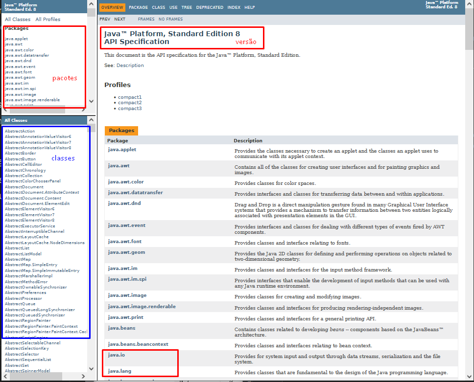
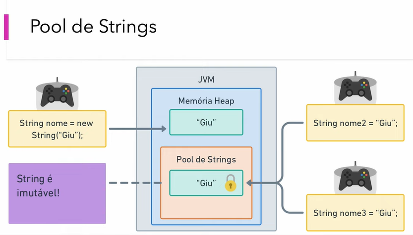
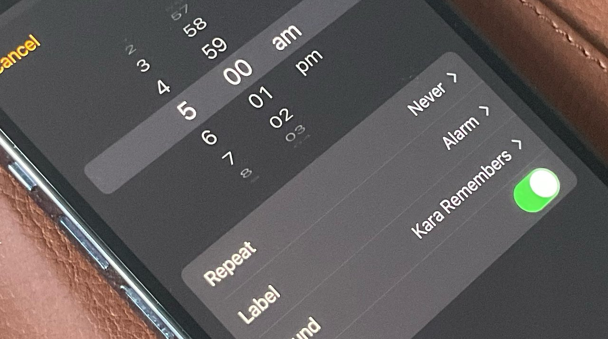

# Tudo são classes

## Classes essenciais

Não é nunuma surpresa que a linguagem Java é composta exclusivamente por classes que se tornarão objetos mediante o recurso de instanciação (criação de objetos).

> [!NOTE]
> Imagina agora, você precisar realizar a manutenção de um veículo sem saber quais são as ferramentas e aonde estariam localizadas, seria uma loucura, não? 🤪

Nesta jornada iremos conhecer as classes mais relevantes e o que elas podem oferecer ao longo de sua jornada em desenvolvimento.

### Documentação

A linguagem Java contém um arsenal poderosíssimo no que se refere a documentação de suas classes que compõem todo o seu ecossistema.

O que devemos compreender é que a cada versão, novas classes surgirão além de novos recursos nas classes já existentes.
Então, você deve estar ciente de qual versão do Java você irá utilizar em seus projetos.

Abaixo ilustraremos o modelo de documentação com base na versão 8 do Java.

<div align="center">
  
</div>

#### Principais pacotes

Chegou a hora de explorar e conhecer os principais pacotes e classes que são recorrentemente utilizados nos milhares de projetos já criados até os dias atuais.

|Pacote| Descrição                                                                             |
|------|---------------------------------------------------------------------------------------|
|java.lang| Pacote que contém as principais classes da linguagem, como Object, String, Long e etc |
|java.io|Pacote que centraliza todas as classes relacionadas a trabalhar com leitura e escrita de arquivos|
|java.time|Pacote introduzido recentemente para provê recursos de manipulação de datas e horas na linguagem|
|java.util|Pacote onde podemos encontrar classes úteis em sua maioria com recursos estáticos|

> [!TIP]
> A melhor maneira para você dominar uma linguagem como o Java, é explorando recorrentemente os recursos que cada classe pode oferecer associando à requisitos do dia-a-dia.

### Classes de sistema

A linguagem Java oferece classes nas quais nos ajudam a realizar uma interação em nosso programa em momento de sua execução com finalidades e recursos bem específicos.

#### java.lang.System

A classe `java.lang.System` oferece recursos relacionados a dados e interações em nosso programa em tempo de execução como por exemplo: listar as propriedades de ambiente, retornar o momento atual de alguma execução, exibir mensagens informativas ou de erro no console ou até mesmo encerrar o sistema.

Todos os seus métodos são estáticos (não podendo criar um objeto desta classe) onde os mais utilizados são:

| Método     | Descrição                                                                                                                                                 |
|------------|-----------------------------------------------------------------------------------------------------------------------------------------------------------|
| System.out | Este método retorna um objeto do tipo `java.io.PrintStream` para habilitar representações de impressão no console                                         |
| System.err | Este método retorna um objeto do tipo `java.io.PrintStream` para habilitar representações de impressão no console sinalizando um erro                     |
| System.in  | Este método retorna um objeto do tipo `java.io.PrintStream` capaz de ler as entradas digitadas pelo usuário, este recurso necessita do auxílio da classe `java.util.Scanner` |

Exemplos

<details>
  <summary>System.out</summary>

  ```java
  public class SystemApp {
    public static void main(String[] args) {
      System.out.print("Ola mundo");

      //imprime Ola mundo gerando uma nova linha
      System.out.println("Ola mundo");
    }
  }
  ```

</details>

<details>
  <summary>System.err</summary>

  ```java
  public class SystemApp {
    public static void main(String[] args) {
      //imprime a mensagem Erro com a fonte vermelha no console
      System.err.println("Erro");
    }
  }
  ```

</details>

<details>
  <summary>System.in</summary>

  ```java
  import java.util.Scanner;

  public class SystemApp {
    public static void main(String[] args) {
      Scanner scan = new Scanner(System.in);
      System.out.println ("Digite seu nome: ");
      String nome = scan.next();

      System.out.println ("Digite sua idade: ");
      Integer idade = scan.nextInt();

      System.out.println ("Seu nome é : " + nome);
      System.out.println ("Sua idade é : " + idade);
    }
  }
  ```

</details>

> [!WARNING]
> Evite criar complexidade utilizando a classe `java.util.Scanner` para simular testes de seu programa, prefira informar os valores literalmente e focar de fato no algorítimo em questão.

#### java.util.Scaner

No tópico anterior exploramos um pouco sobre a classe `java.util.Scanner` para auxiliar na interação do usuário através de console utilizando a classe `java.lang.System`, mas a classe possui outros recursos relacionados e algumas outras finalidades adicionais.

```java
// Continuando ...
import java.util.Scanner;
public class SystemApp {
  public static void main(String[] args) {
    Scanner scan = new Scanner(System.in);
    System.out.println ("Digite seu nome: ");
    String nome = scan.next();

    System.out.println ("Digite sua idade: ");
    Integer idade = scan.nextInt(); // converte o valor inserido para um Integer

    System.out.println ("Digite sua idade: ");
    Double peso = scan.nextDouble(); // converte o valor inserido para um Double

    System.out.println ("Seu nome é : " + nome);
    System.out.println ("Sua idade é : " + idade);
    System.out.println ("Sua peso é : " + peso);

    // scan.nextBigDecimal(); scan.nextBoolean(); -> já sacou o conceito, correto ?
  }
}
```

Vamos desfrutar um pouco mais nossa classe Scanner imaginando que agora você obteve o nome, idade e peso através de uma leitura de arquivo (simulação) separado por `;`, como seria o nosso algoritmo diante deste cenário?

```java
import java.util.Scanner;

public class SystemApp {
  public static void main(String[] args) {
    String nome = null;
    Integer idade = null;
    Double peso=null;

    // simulando uma linha existente em um arquivo txt
    String stringLinhaArquivo = "gleyson sampaio;32;1.59";
    Scanner scan = new Scanner(stringLinhaArquivo);
    scan.useDelimiter(";"); // definindo um delimitador
    // conhecendo novos recursos
    int index = 0;
    while (scan.hasNext()){ // olha um conceito de controle de repetição sendo aplicado, tudo está mais claro agora hein??
      if(index == 0) // Uuufa, sorte que eu aprendi sobre controle de fluxo e operadores anteriormente
        nome = scan.next();
      else if( index == 1)
        idade  = Integer.valueOf(scan.next());
      else
        peso = Double.valueOf(scan.next());

      index ++; // mais um conceito escondido bem aqui !!
    }

    System.out.println ("Seu nome é : " + nome);
    System.out.println ("Sua idade é : " + idade);
    System.out.println ("Sua peso é : " + peso);

    // scan.nextBigDecimal(); scan.nextBoolean(); -> já sacou o conceito, correto ?
  }
}
```

> [!NOTE]
> Com a classe Scanner podemos fazer uma variedade de coisas, mas vamos parar por aqui, lembre-se: Para ser um bom programador em Java, é necessário compreender o máximo possível dos recursos disponíveis.

#### java.io.PrintStream

A classe `java.io.PrintStream` não é convenientemente declarada de forma explícita no dia-a-dia, pois ela sempre está "escondida" na execução do método `System.out`.
Já exploramos anteriormente a finalidade de usar os métodos da classe PrintStream para imprimir dados no console, porém agora, vamos explorar um recurso extremamente relevante e recorrente em qualquer projeto, a formatação de textos para serem impressos na tela do seu console.

```java
public class SystemApp {
  public static void main(String[] args) {
    String nome = "gleyson";
    int idade = 32;
    double peso = 1.58;
    double renda = 3234.56;

    // vamos imprimir os dados acima aplicando uma formatação no console

    // System.out.printf(formato, array de parâmetros (,,,) );

    System.out.printf("Nome: %s Idade: %d Peso: %.2f Renda: R$ %,.2f", nome, idade, peso, renda);

    // Resultado no console: Nome: gleyson Idade: 32 Peso: 1,58 Renda: R$ 3.234,56

    //%s ->     parâmetros do tipo String
    //%d ->     parâmetros do tipo Integer / Long
    //%f ->     parâmetros do tipo Double / Float
    //.2 ->     quer dizer que serão dois dígitos decimais
    //,.2 ->    quer dizer que serão dois dígitos decimais e informando o (.) de milhar
  }
}
```

> [!TIP]
> Tire um tempo e explore um pouco mais os recursos oferecidos em cada classe apresentada 🚀

### Classes de texto

Em linguagem de programação, textos são compostos por um conjunto de caracteres, números e símbolos com a proposta de resultar em conteúdo e informação.

Em se tratando de classes na linguagem Java responsáveis para representar conteúdos de tipo texto, podemos citar inicialmente três delas:

- [String](https://docs.oracle.com/javase/8/docs/api/java/lang/String.html)
- [StringBuilder](https://docs.oracle.com/javase/8/docs/api/java/lang/StringBuilder.html)
- [StringBuffer](https://docs.oracle.com/javase/8/docs/api/java/lang/StringBuffer.html)

> [!NOTE]
> Se as três possuem a mesma proposta, como e quando usar cada uma delas ?

#### java.lang.String

A classe `java.lang.String` representa cadeias de caracteres. Todos os literais de string em programas Java, como "abc", são implementados como instâncias dessa classe.

Strings são constantes; seus valores não podem ser alterados depois de criados. Buffers de string suportam strings mutáveis. Como os objetos String são imutáveis, eles podem ser compartilhados, por exemplo:

A classe String inclui métodos para examinar caracteres individuais da sequência, comparar strings, pesquisar strings, extrair substrings (pedaços) e criar uma cópia de uma string com todos os caracteres traduzidos para letras maiúsculas ou minúsculas. O mapeamento no caso é baseado na versão Unicode Standard especificada pela classe `java.lang.Character`.

Vamos aos exemplos:

```java
public class StringApp {
  public static void main(String[] args) {
    String str = "abc";

    // é equivalente a:
    char data[] = {'a', 'b', 'c'};
    String str1 = new String(data);

    // aqui mais alguns recursos oferecidos pela classe String
    System.out.println("abc");
    String cde = "cde";
    System.out.println("abc" + cde);
    String c = "abc".substring(2,3);
    String d = cde.substring(1, 2);

    String password = "Sup3rP@ss!$%*&";
  }
}
```

Percebemos acima que um tipo texto (string) suporta qualquer tipo de caractere, mas devemos ter consciência que linguagens de tipagem rígida como o Java possui relevância quanto aos tipos definidos.

<div align="center">
  
</div>

> [!WARNING]
> Evite usar a classe String como se fosse um canivete suiço, veja o cenário abaixo ☠️.

```java
public class StringApp {
  public static void main(String[] args) {
    String cep          = "64000020";       // -> Integer
    String celular      = "11954360978";    // -> Long


    String cpf          = "03387634509";    // ?
    String estadoCivil  = "SOLTEIRO";       // Enum
  }
}
```

<!-- > [!TIP]
> Quer conhecer todo o poder da classe String? [Clique aqui!](/topicos/linguagens/java/classes/string) -->

#### java.lang.StringBuilder

Chegou a hora de conhecer as irmãs da classe String, a `java.lang.StringBuilder` e `java.lang.StringBuffer`, mas afinal por que tantas classes para utilizar em uso de caracteres na linguagem Java?

Primeiramente precisamos entender um fundamento extremamente relevante quando falamos em programação como um todo, o consumo de recurso de memória e como a linguagem Java define uma estratégia que melhor responde à este requisito que conhecemos como o princípio da **imutabilidade** e o **Poll Strings**, conceitos estes apresentados majestosamente pela [Giuliana Bezerra](https://www.youtube.com/watch?v=cSLNV2CZ8j4).

<div align="center">
  
</div>

Diferentemente da classe String, as classes StringBuilder e StringBuilder podem sofrer alterações em seus conteúdos realizando operações conforme listagem abaixo:

- append (acrescentar)
- insert (inserir)
- replace (substituir)
- delete (remover)

```java
public class StringApp {
  public static void main(String[] args) {
    StringBuilder stringAlteravel = new StringBuilder("gleyson ");

    // acrescentando o conteúdo sampaio
    stringAlteravel.append("sampaio");

    // substituindo o nome gleyson (os 7 digitos) para izabelly
    stringAlteravel.replace(0,7,"izabelly");

    // removendo o nome sampaio com um espaço no início
    stringAlteravel.delete(8,16);

    /*
      inserindo o conteúdo sampaio novamente
      a diferença entre insert e append é que o insert possibilita informar a posição
      inclusive no início do conteúdo
    */
    stringAlteravel.insert(8," sampaio");
    stringAlteravel.insert(0,"Miss ");

    System.out.println(stringAlteravel.toString());
  }
}
```

> [!NOTE]
> StringBuilder não é uma String mas sim um objeto que contém uma String
>
> ```java
> System.out.println(stringAlteravel.toString());
> ```

E quanto a StringBuffer o que eu preciso saber? Pouca coisa, só que ela é um clone da StringBuilder e que proporciona segurança em contexto de Multi-thread reduzindo um pouco a performance.

```java
public class StringApp {
  public static void main(String[] args) {
    StringBuffer builder = new StringBuffer();
    int start = LocalDateTime.now().getNano();
    for(int caractere = 1; caractere<=1000000; caractere++){
      builder.append(caractere);
      builder.append("\n");
    }
    //System.out.println(builder.toString());
    System.out.println("Nano:" + (LocalDateTime.now().getNano() - start));
  }
}
```

> [!TIP]
> Agora que você sabe o uso das classes String, StringBuilder e StringBuffer exercite um pouco mais cada uma delas para tirar de letra os desafios do dia-a-dia.

### Classes de número

Na linguagem Java, nos deparamos com tipos primitivos e valores literais mas também com objetos que representam números inteiros e fracionários. Os tipos numéricos que mais são utilizados nos milhares de projetos construídos são:

- [java.lang.Integer](https://docs.oracle.com/javase/8/docs/api/java/lang/Integer.html)
- [java.lang.Long](https://docs.oracle.com/javase/8/docs/api/java/lang/Long.html)
- [java.lang.Double](https://docs.oracle.com/javase/8/docs/api/java/lang/Double.html)
- [java.math.BigDecimal](https://docs.oracle.com/javase/8/docs/api/java/math/BigDecimal.html)

> [!TIP]
> Explore cada uma delas e tenha em mãos um conjunto de recursos para trabalhar com números na linguagem.

#### java.lang.Integer

A classe Integer representa números inteiros que vão de `-2147483648` a `2147483647` e que oferece os recursos conforme abaixo:

```java
Integer.MIN_VALUE // retorna o menor número suportado
Integer.MIN_VALUE // retorna o maior número suportado
Integer.valueOf("123"); // Converte um número em forma de texto (string) para número
Integer.toString(123); // Converte um número para texto (string)
```

##### Comparando números inteiros

Pode parecer simples até mesmo óbvio nesta etapa que estudos que comparar números utiliza-se o operador de `==`, é até possível, mas muito cuidado com esta afirmação.

```java
public class NumberApp {
  public static void main(String[] args) {
    Integer numero1 = 100;
    Integer numero2 = 100;

    System.out.println(numero1==numero2);
    System.out.println(numero1.equals(numero2));

    numero1 = 128;
    numero2 = 128;

    // acima de 127, internamente o Java cria um novo objeto do tipo Integer -> Integer numero1/2 = new Integer(128)
    // logo estamos agora nos referindo a dois objetos na aplicação.
    System.out.println(numero1==numero2);
    System.out.println(numero1.equals(numero2));
    System.out.println(numero1.intValue()==numero2.intValue());
  }
}
```

#### java.lang.Long

A classe Long representa números inteiros de uma escala elevada de valores que vão de `-9223372036854775808` a `9223372036854775807` oferecendo recursos semelhantes à classe Integer.

> [!NOTE]
> Hoje devido não termos mais limitações de espaço e processamento em nossos computadores em relação à 20 anos atrás,
> usar Long para atribuir a tipos inteiros tem sido um hábito recorrente.
> Já pensou seu sistema possuir mais 2.147.483.647 clientes?

Cenários comuns para se utilizar Long:

```java
public class NumberApp {
  public static void main(String[] args) {
    // considerar NÃO existir probabilidade de zero à esquerda
    Long celular;
    Long codigoBarras;

    /*
      Literais numéricos por padrão são convertidos para Integer
      Logo, é necessário acrescentar o sufixo L para determina-lo com Long
    */
    Long numero = 130L;
  }
}
```

#### java.lang.Double

A classe Double representa números decimais em grande escala, onde a mesma é mais indicada do que a classe Float.

O que devemos considerar de agora em diante é que valores decimais, seguem a convenção americana conforme ilustrações abaixo:

```java
public class NumberApp {
  public static void main(String[] args) {
    Double numeroDecimal = 1234.5678;
    // representação BR -> 1.234,5678
  }
}
```

> [!WARNING]
> Existe uma enorme diferença entre o valor atribuído à uma variável, versus o valor exibido após uma formatação.
> Veja formatação de números decimais com **NumberFormat** e **DecimalFormat**.

Não é comum, mas é possível obtermos somente o valor inteiro de um Double através do método `intValue()`;

```java
public class NumberApp {
  public static void main(String[] args) {
    Double numeroDecimal =1234.5678;

    Integer numeroInteiro = numeroDecimal.intValue();
  }
}
```

#### java.math.BigDecimal

A classe BigDecimal vem com uma proposta de nos auxiliar na realização de operações matemáticas garantido resultados consistentes diante de inúmeros e complexos cálculos.

Formas de criar objetos tipo BigDecimal

```java
public class NumberApp {
  public static void main(String[] args) {
    // Constantes
    BigDecimal zero = BigDecimal.ZERO;
    BigDecimal dez = BigDecimal.TEN;

    BigDecimal decimal = BigDecimal.valueOf(1234.5678);
    BigDecimal numeroString = new BigDecimal("1234.5678");
  }
}
```

Todas as operações matemáticas utilizando BigDecimal, necessitam de argumentos do tipo BigDecimal e retornam um novo BigDecimal imutável.

```java
public class NumberApp {
  public static void main(String[] args) {
    BigDecimal um = BigDecimal.ONE;
    BigDecimal dez = BigDecimal.TEN;

    BigDecimal resultado = dez.add(um); // 9

    BigDecimal calculoComplexo = dez.subtract(um).divide(new BigDecimal(3));

    System.out.println(calculoComplexo); // ???

    /*
      add -> somar
      subtract -> subtrair
      multiply -> multiplicar
      divide -> dividir
    */
  }
}
```

##### Scala

Uma das principais vantagens em se utilizar BigDecimal é no aspecto de conseguirmos definir uma escala diante das nossas operações, exemplo:

```java

public class NumberApp {
  public static void main(String[] args) {
    BigDecimal resultado = BigDecimal.TEN.divide(BigDecimal.valueOf(3));
    // Exceção:  Non-terminating decimal expansion; no exact representable decimal result.
  }
}
```

> [!CAUTION]
> Matematicamente dividir 10 por 3 gera uma dízima periódica ou mais conhecido como número infinito

```java
public class NumberApp {
  public static void main(String[] args) {
    BigDecimal divisor = BigDecimal.valueOf(3);
    BigDecimal resultado = BigDecimal.TEN.divide(divisor,3, RoundingMode.HALF_EVEN);
    System.out.println(resultado); // 3.333
  }
}
```

##### Arredondamento

Na matemática e muito menos na programação nem tudo são flores, veja a imagem ilustrativa abaixo:

<div align="center">
  
</div>

Temos a necessidade em exibir a multiplicação entre o valor preço por litro vezes a quantidade de litros apresentada.

```java
public class NumberApp {
  public static void main(String[] args) {
    BigDecimal precoLitro = BigDecimal.valueOf(5.799);
    BigDecimal listrosUtilizados = BigDecimal.valueOf(21.752);
    BigDecimal valorPagar = listrosUtilizados.multiply(precoLitro);
    System.out.println(valorPagar); // 126.139848

    // arredondando ...
    BigDecimal valorPagarArredondado = valorPagar.setScale(2, RoundingMode.HALF_EVEN);
    System.out.println(valorPagarArredondado); // 126.14
  }
}
```

> [!IMPORTANT]
> Mais um vez, não confunda arredondamento com formatação, arrendondar altera o valor real da variável enquanto que formatar gerar uma representação (string) do valor real.

##### Modos de arredondamento

Podemos sentir a necessidade de especificar alguns modos de arredondamento e para isso o Java provê a classe `java.math.RoundingMode` contendo opções pré-definidas (enum) de arredondamento, veja o exemplo abaixo:

```java
public class NumberApp {
  public static void main(String[] args) {
    BigDecimal numero = BigDecimal.valueOf(1.5456);

    for(RoundingMode mode: RoundingMode.values()){
      if(mode == RoundingMode.UNNECESSARY)
        continue;

      System.out.println("Mode:" + mode.name() + " = "  +  numero.setScale(2, mode));
    }
    /*
      Mode:UP = 1.55
      Mode:DOWN = 1.54
      Mode:CEILING = 1.55
      Mode:FLOOR = 1.54
      Mode:HALF_UP = 1.55
      Mode:HALF_DOWN = 1.55
      Mode:HALF_EVEN = 1.55 **
    */
  }
}
```

#### java.text.NumberFormat

A classe NumberFormat oferece recursos para conversão de números inteiros e decimais com base uma `java.util.Locale` (localização) informada retornando o número formatado em uma representação String.

Para criar uma instância de NumberFormat é necessário executar alguns de seus métodos de inicialização.

- `NumberFormat.getIntegerInstance()` -> Retorna um formatador de números inteiros
- `NumberFormat.getNumberInstance()` -> Retorna um formatador de números decimais sem o símbolo monetário
- `NumberFormat.getCurrencyInstance()` -> Retorna um formatador de números decimais com o símbolo monetário
- `NumberFormat.getPercentInstance()` -> Retorna um formatador de números decimais para representar a porcentagem de um valor entre `0.0` a `1.0`

```java
public class NumberApp {
  public static void main(String[] args) {
    // Testando em uma JVM com Locale pt-BR
    Integer inteiro = 12345678;
    NumberFormat formatador = NumberFormat.getIntegerInstance();
    String inteiroFormatado = formatador.format(inteiro);
    System.out.println(inteiroFormatado); // 12.345.678

    Double decimal = 123456.78;
    formatador = NumberFormat.getNumberInstance();
    System.out.println(formatador.format(decimal)); // 123.456,78

    formatador = NumberFormat.getCurrencyInstance();
    System.out.println(formatador.format(decimal)); // R$ 123.456,78

    Double porcentagem = 0.5;
    System.out.println(NumberFormat.getPercentInstance().format(porcentagem)); // 50%
  }
}
```

> [!WARNING]
> Quando necessitamos formatar valores numéricos inteiros ou decimais, devemos sempre considerar o idioma (localização) mencionando uma instância de `java.util.Locale`

```java
public class NumberApp {
  public static void main(String[] args) {
    Double decimal = 123456.78;

    Locale ptBr = new Locale("pt","BR");
    NumberFormat formatadorBrasileiro = NumberFormat.getCurrencyInstance(ptBr);
    System.out.println(formatadorBrasileiro.format(decimal)); // R$ 123.456,78

    NumberFormat formatadorFrances = NumberFormat.getCurrencyInstance(Locale.FRANCE);
    System.out.println(formatadorFrances.format(decimal)); // 123 456,78 €

    NumberFormat formatadorAmericano = NumberFormat.getCurrencyInstance(new Locale("en", "US"));
    System.out.println(formatadorAmericano.format(decimal)); // $123,456.78
  }
}
```

#### java.text.DecimalFormat

A classe DecimalFormat permite que você controle o formato dos números a serem apresentados após a formatação incluindo símbolo monetário, zeros à esquerda, agrupamentos decimais e etc.

Entendemos que a classe DecimalFormat permite formatar valores em diferentes padrões, dessa forma existe uma maior liberdade.

Veja a tabela abaixo:

|Símbolo|Descrição|
|-------|---------|
|0|Um dígito|
|#|um dígito, zero mostra como ausente|
|.|espaço reservado para separador decimal|
|,|espaço reservado para separador de grupo|
|¤|Símbolo monetário|

Agora vamos para alguns exemplos conforme tabela abaixo:

<details>
  <summary>Zeros a esquerda</summary>

  ```java
  public class NumberApp {
    public static void main(String[] args) {
      String formato = "00000"; // 5 dígitos
      DecimalFormat formatador = new DecimalFormat(formato);

      for(int x=10; x<= 1000; x = x * 10) { // controle de fluxo mega power emmm ??
        System.out.println(formatador.format(x));
      }
      /* Resultado no console respectivamente
        00010
        00100
        01000
      */
    }
  }
  ```

</details>

<details>
  <summary>Decimal</summary>

  ```java
  public class NumberApp {
    public static void main(String[] args) {
      String formato = "#,##0.00"; // decimal contendo sempre dois dígitos após a vírgula
      DecimalFormat formatador = new DecimalFormat(formato);

      for(double x=12.3456; x<= 9999999; x =x * 10) { // controle fluxo mega power emmm ??
        System.out.println(formatador.format(x));
      }
      /* Resultado no console respectivamente
        12,35
        123,46
        1.234,56
        12.345,60
        123.456,00
        1.234.560,00
      */
    }
  }
  ```

</details>

<details>
  <summary>Customizado</summary>
</details>

```java []
public class NumberApp {
  public static void main(String[] args) {
    String formato = "R$ #,##0.00"; // decimal contendo sempre dois dígitos após a vírgula

    DecimalFormatSymbols symbols= DecimalFormatSymbols.getInstance();
    symbols.setDecimalSeparator('*'); // ,
    symbols.setGroupingSeparator('?'); // .
    DecimalFormat formatador = new DecimalFormat(formato);
    formatador.setDecimalFormatSymbols(symbols);

    for(double x=12.3456;x<=9999999; x =x * 10) { // controle fluxo mega power emmm ??
      System.out.println(formatador.format(x));
    }
    /* Resultado no console respectivamente
      R$ 12*35
      R$ 123*46
      R$ 1?234*56
      R$ 12?345*60
      R$ 123?456*00
      R$ 1?234?560*00
    */
  }
}
```

> [!TIP]
> Concluímos que: Quando sua aplicação precisar realizar formatações com base na localização (idioma) é recomendado usar NumberFormat, caso não seja necessário, e sim, uma formatação única ou customizada, usa-se DecimalFormat.

### Classes de data

Trabalhar com datas na linguagem Java é uma jornada que inicialmente pode parecer um tanto complexa.

Um calendário é um sistema que permite medir e representar graficamente o passar do tempo. Com origem etimológica no vocábulo latino calendarium, o calendário recorre à divisão temporária em unidades como anos, meses, semanas e dias.

Este calendário, instaurado pelo papa Gregório XIII em 1582, divide o ano em doze meses, compostos por sua vez entre 28 a 31 dias conforme o caso. O ano do calendário gregoriano começa a 1 de Janeiro e termina a 31 de Dezembro.

Outros calendários são o calendário juliano (que regia até à implementação do gregoriano), o calendário hebreu (também chamado de calendário judaico e qual é usado dentro do judaísmo), o calendário chinês e o calendário muçulmano, os quais se baseiam em diversos dados astronômicos.

<div align="center">
  
</div>

O mais fascinante na linguagem Java é a estruturação de classes que representam perfeitamente esta classificação do tempo.

Vamos apresentar as classes que você não poderá deixar de conhecer:

- [Calendar](https://docs.oracle.com/javase/7/docs/api/java/util/Calendar.html)
- [GregoriamCalendar](https://docs.oracle.com/javase/7/docs/api/java/util/GregorianCalendar.html)
- [Date](https://docs.oracle.com/javase/7/docs/api/java/util/Date.html)

> [!TIP]
> Quando compreendemos que data não é string já é um bom começo.

#### java.util.Calendar

A classe Calendar é uma classe abstrata que representa um instante de tempo distribuída em ANO, MES, DIA, HORA, MINUTO, SEGUNDO e MILISSEGUNDO.

Para criar uma instância de Calendar na sua aplicação, é necessário executar o método estático `Calendar.getInstance()` retornando um objeto do tipo `java.util.GregorianCalendar`.

```sh
java.util.GregorianCalendar[time=1677545679000,areFieldsSet=true,areAllFieldsSet=true,lenient=true,
zone=sun.util.calendar.ZoneInfo[id="America/Sao_Paulo",offset=-10800000,
dstSavings=0,useDaylight=false,transitions=93,lastRule=null],firstDayOfWeek=1,
minimalDaysInFirstWeek=1,
ERA=1,YEAR=2023,MONTH=1,WEEK_OF_YEAR=9,WEEK_OF_MONTH=5,DAY_OF_MONTH=27,DAY_OF_YEAR=58,DAY_OF_WEEK=2,
DAY_OF_WEEK_IN_MONTH=4,AM_PM=1,HOUR=9,HOUR_OF_DAY=21,MINUTE=54,SECOND=39,
MILLISECOND=0,ZONE_OFFSET=-10800000,DST_OFFSET=0]
```

> [!NOTE]
> Sim, mas como iremos obter uma estrutura de data e hora em que estamos acostumados a compreender?

O primeiro ponto relevante de um calendário é que ele retorna objetos que representam data e hora na aplicação, e este objeto é do tipo `java.util.Date`.

```java
public class CalendarApp {
  public static void main(String[] args) {
    Calendar agora = Calendar.getInstance();

    Date data = agora.getTime();

    System.out.println(data);
    // Mon Feb 27 22:04:29 BRT 2023
  }
}
```

> [!WARNING]
> Assim como números, a representação de dados exige uma compreensão de valor literal versus a formatação aplicada com base é um idioma (locale).

Mas se é mais comum utilizar Date ao invés de Calender, quando instanciar Calendar faz sentido no dia-a-dia? E a resposta é: Quando você precisa realizar alterações no tempo ou obter informações de forma isolada, exemplo:

Vamos imaginar que com base no instante atual você gostaria aumentar em 30 dias e zerar os campos hora, minuto e segundo ?

```java
public class CalendarApp {
  public static void main(String[] args) {
    Calendar agora = Calendar.getInstance();

    // adicionado um mês
    agora.add(Calendar.MONTH,1);

    // ou adicionando 30 dias corridos
    // agora.add(Calendar.DAY_OF_MONTH,30);

    //set = definir valores
    agora.set(Calendar.HOUR,0);
    agora.set(Calendar.MINUTE,0);
    agora.set(Calendar.SECOND,0);
    // são necessários, afinal o tempo é muiiiito específico
    agora.set(Calendar.MILLISECOND,0);
    agora.set(Calendar.AM_PM, Calendar.AM);

    System.out.println(agora.getTime());

    // Obtém o ano, dia do mês e semana do mês respectivamente
    System.out.println(calendar.get(Calendar.YEAR));
    System.out.println(calendar.get(Calendar.DAY_OF_MONTH));
    System.out.println(calendar.get(Calendar.WEEK_OF_MONTH));
  }
}
```

> [!WARNING]
> Cuidado com a pegadinha ao definir (`set`) mês em um calendar:
>
> ```java
> calendar.set(Calendar.MONTH,6);
> // aqui será Julio e não Junho, pois mês em Calendar começa com zero (0)
> ```

Sabemos que manipular o tempo exige uma certa pré-definição de valores, afinal não existem mês 13, dia 32, hora 25 e etc.
Por isso, quando for manipular um calendário com base em fluxo de repetição onde um campo não deva modificar outro campo, opte por usar o método `roll` ao invés do `add` conforme ilustração abaixo:

<div align="center">
  
</div>

```java
public class CalendarApp {
  public static void main(String[] args) {
    Calendar calendar = Calendar.getInstance();
    System.out.println(calendar.getTime());

    // executa primeiro com esta linha
    calendar.add(Calendar.SECOND,65);

    // em seguida, comente a linha acima
    // e execute a linha abaixo
    // calendar.roll(Calendar.SECOND,65);

    System.out.println(calendar.getTime());

    // Mon Feb 27 22:48:23 BRT 2023
    // Mon Feb 27 22:48:28 BRT 2023
  }
}
```

#### java.util.GregorianCalendar

GregorianCalendar é uma implementação concreta da classe abstrata `java.util.Calendar`. Não surpreendentemente, o calendário gregoriano é o calendário civil mais utilizado no mundo.

Existem duas opções disponíveis para obter uma instância de GregorianCalendar: `Calendar.getInstance()` e usar um dos construtores.

> [!NOTE]
> Usar o método de fábrica estático `Calendar.getInstance()` não é uma abordagem recomendada, pois retornará uma instância subjetiva para a localidade padrão.

```java
public class CalendarApp {
  public static void main(String[] args) {
    GregorianCalendar gregorianCalendar = new GregorianCalendar();
    System.out.println(gregorianCalendar.getTime());

    // 05 de março de 2023 00:00:00 (lembra que o mês começa com zero)
    gregorianCalendar = new GregorianCalendar(2023, 2, 5);
    System.out.println(gregorianCalendar.getTime());

    // 05 de março de 2023 23:17:14 (lembra que o mês começa com zero)
    gregorianCalendar = new GregorianCalendar(2023, 2, 5, 23, 17, 14);
    System.out.println(gregorianCalendar.getTime());

    /*
      Resultado no console respectivamente

      Tue Feb 28 09:40:51 BRT 2023
      Sun Mar 05 00:00:00 BRT 2023
      Sun Mar 05 23:17:14 BRT 2023
    */

  }
}
```

##### Fuso horário

Devemos levar em consideração que exibir data e hora também devemos nos preocupar com a localização relacionada ao meridiano.

No Brasil, existem 4 fusos horários e estão localizados a oeste do Marco Zero (Meridiano de Greenwich), incluindo as ilhas oceânicas e variando de duas a cinco horas a menos em relação ao meridiano principal.
Como são medidos a partir de Greenwich, os fusos do Brasil são os fusos -2 GMT, -3 GMT, -4 GMT e -5 GMT, sendo o fuso -3 GMT o Horário Oficial de Brasília.

```java
public class CalendarApp {
  public static void main(String[] args) {
    GregorianCalendar gregorianCalendar = new GregorianCalendar();
    DateFormat formatter = new SimpleDateFormat("yyyy-MM-dd HH:mm:ss z");

    int f = 5;
    while(f>=2){
      formatter.setTimeZone(TimeZone.getTimeZone("GMT-" + f--));
      System.out.println(formatter.format(gregorianCalendar.getTime()));
    }
    /*
      2023-02-28 09:54:07 GMT-05:00
      2023-02-28 10:54:07 GMT-04:00
      2023-02-28 11:54:07 GMT-03:00
      2023-02-28 12:54:07 GMT-02:00
    */
  }
}
```

#### java.util.Date

A classe Date é a representação fiel de uma data na linguagem Java, após explorarmos Calendar e GregorianCalender, é necessário estar convicto que tudo tem a finalidade de retornar uma data em nossa aplicação.

```java
public class CalendarApp {
  public static void main(String[] args) {
    Calendar calendar = Calendar.getInstance();
    GregorianCalendar gregorianCalendar = new GregorianCalendar();

    Date dateCalendar = calendar.getTime();
    Date dateGregorianCalender = gregorianCalendar.getTime();

    Date dateDefault = new Date();
    // evite usar
    Date date = new Date(2023,3,1);

    System.out.println(dateDefault.getTime());
    // retorna um número longo representado em milissegundos
  }
}
```

> [!WARNING]
> Atualmente a classe Date está depreciada (descontinuada, sem manutenções e melhorias )☠️.
> Opte por utilizar a LocalDate e LocalDateTime

#### java.text.DateFormat

A classe DateFormat é responsável por formatar objetos do tipo Date considerando um padrão baseado na localização (locale) da aplicação.

Para criar uma instância de NumberFormat é necessário executar alguns de seus métodos de inicialização.

- `DateFormat.getDateInstance()` -> Retorna um formatador de data exibindo somente dia, mês e ano de acordo com sua localização.
- `DateFormat.getTimeInstance()` -> Retorna um formatador de data exibindo somente hora, minuto e segundo de acordo com sua localização.
- `DateFormat.getDateTimeInstance()` -> Retorna um formatador de data\hora de acordo com sua localização.

```java
public class CalendarApp {
  public static void main(String[] args) {
    // iniciando um formatador de datas
    DateFormat formatador = DateFormat.getDateInstance();
    // criando um objeto calendar
    Calendar calendario = Calendar.getInstance();
    // Obtendo o objeto date para ser formatado
    Date data = calendario.getTime();
    System.out.println("Formato original da data é: " + data);
    // Usando um formatador para exibir a data formatada
    String dataFormatada = formatador.format(data);
    System.out.println("A data formatada é: " + dataFormatada);

    /*
      Formato original da data é: Tue Feb 28 13:33:34 BRT 2023
      A data formatada é: 28 de fev. de 2023
    */
  }
}
```

##### Estilos de formatação

Já pensou que você tenha a necessidade de exibir a mesma data com estilos diferentes?

Exemplo de uma data\hora explorando os estilos de formatação pré-definidos.

Data\hora: 28/02/2023 13:55:17

| Estilo |Resultado|
|--------|--------|
| FULL   |terça-feira, 28 de fevereiro de 2023 13:55:17 Horário Padrão de Brasília|
| LONG   |28 de fevereiro de 2023 13:55:17 BRT|
| MEDIUM |28 de fev. de 2023 13:55:17|
| SHORT  |28/02/2023 13:55|

```java
public class CalendarApp {
  public static void main(String[] args) {
    Calendar calendario = new GregorianCalendar(2023,1,28,13,55,17);
    for(int estilo=0; estilo<=3; estilo++){
      String style = estilo==0?"FULL":estilo==1?"LONG":estilo==2?"MEDIUM":"SHORT";

      DateFormat formatador = DateFormat.getDateTimeInstance(estilo,estilo);

      System.out.println("A data formatada com o estilo: " + style + " é: " + formatador.format(calendario.getTime()));
    }
  }
}
```

##### Formatação por região

Aprendemos que existem quatro estilos de formatação, porém ainda assim gostaríamos de aplicar uma formatação com base no idioma (localização) do usuário. Diante deste cenário, aplicamos a devida formatação considerando uma instância de Locale.

```java
public class CalendarApp {
  public static void main(String[] args) {
    Calendar calendario = new GregorianCalendar(2023,1,28,13,55,17);

    for(int estilo=0; estilo<=3; estilo++){
      String style = estilo==0?"FULL":estilo==1?"LONG":estilo==2?"MEDIUM":"SHORT";

      Locale locale = Locale.US;
      //Locale localeBr = new Locale("pt","BR");
      DateFormat formatador = DateFormat.getDateTimeInstance(estilo,estilo, locale);
      System.out.println("A data formatada com o estilo: " + style + " é: " + formatador.format(calendario.getTime()));

      /*
        A data formatada com o estilo: FULL é: Tuesday, February 28, 2023 at 1:55:17 PM Brasilia Standard Time
        A data formatada com o estilo: LONG é: February 28, 2023 at 1:55:17 PM BRT
        A data formatada com o estilo: MEDIUM é: Feb 28, 2023, 1:55:17 PM
        A data formatada com o estilo: SHORT é: 2/28/23, 1:55 PM
      */
    }
  }
}
```

#### java.text.SimpleDateFormat

Já pensou agora o usuário solicitar que uma mesma data fosse apresentada conforme abaixo?

Data\hora: 28/02/2023 13:55:17

| Solicitação            | Exemplo           |
|------------------------|-------------------|
| Ano abreviado          | 28/02/23         |
| Somente ano-mês        | 2023-02           |
| Mês legendado abreviado | 28/fev./2023      |
| Mês legendado completo | 28/fevereiro/2023 |

```java
public class CalendarApp {
  public static void main(String[] args) {
    Calendar calendario = new GregorianCalendar(2023,1,28,13,55,17);

    // Ano abreviado
    SimpleDateFormat simpleDateFormat = new SimpleDateFormat("dd/MM/yy");
    System.out.println(simpleDateFormat.format(calendario.getTime()));

    // Somente ano e mês
    simpleDateFormat = new SimpleDateFormat("yyyy/MM");
    System.out.println(simpleDateFormat.format(calendario.getTime()));

    // Mês legendado abreviado
    simpleDateFormat = new SimpleDateFormat("dd/MMM/yyyy");
    System.out.println(simpleDateFormat.format(calendario.getTime()));

    // Mês legendado completo
    simpleDateFormat = new SimpleDateFormat("dd/MMMM/yyyy");
    System.out.println(simpleDateFormat.format(calendario.getTime()));
  }
}
```

> [!TIP]
> Já que você aprendeu como formatar datas para string, qual praticar como converter (`parse`) string para datas ?

|Letra| Campo|Exemplo|
|----|------|-------|
|G	|Era designator	|AD|
|y	|Year	|2018 (yyyy), 18 (yy)|
|M	|Month in year	|July (MMMM), Jul (MMM), 07 (MM)|
|w	|Results in week in year	|16|
|W	|Results in week in month	|3|
|D	|Gives the day count in the year	|266|
|d	|Day of the month	|09 (dd), 9(d)|
|F	|Day of the week in month	|4|
|E	|Day name in the week	|Tuesday, Tue|
|u	|Day number of week |where 1 represents Monday, 2 represents Tuesday and so on	2|
|a	|AM or PM marker	|AM|
|H	|Hour in the day |(0-23)	12|
|k	|Hour in the day |(1-24)	23|
|K	|Hour in am/pm |for 12 hour format (0-11)	0|
|h	|Hour in am/pm |for 12 hour format (1-12)	12|
|m	|Minute in the hour	|59|
|s	|Second in the minute	|35|
|S	|Millisecond in the minute	|978|
|z	|Timezone	Pacific Standard| Time; PST; GMT-08:00|
|Z	|Timezone offset in hours (RFC pattern)	|-0800|
|X	|Timezone offset in ISO format	|-08; -0800; -08:00|

> [!TIP]
> A nossa jornada em trabalhar com Data na linguagem não para por aqui, conheça sobre o [Java Time](./java-time.md), um recurso super poderoso e repleto de novas funcionalidades.

### Classes de arquivo

Para trabalhar com arquivos em uma linguagem baseada na orientação a objetos necessariamente precisaremos compreender que deveremos tratá-los como objetos mas tendo em mente que a estrutura de diretórios em seu sistema operacional é o ponto central em nosso desenvolvimento.

<div align="center">
  
</div>

#### java.io.File

A classe File representa na linguagem Java tanto um arquivo quanto um diretório, a sua ligação com um arquivo\diretório físico em seu sistema operacional é definido no que chamamos de construtor de objetos conforme exemplo abaixo:

Vamos imaginar que em seu disco rígido HD exista o diretório\arquivo conforme o sistema operacional:

| S.O     | Diretório     |Arquivo|
|---------|---------------|-------|
| Windows | C:\arquivos   |aula1.txt|
| Linux   | /home/arquivos |aula1.txt|

Como poderemos referenciar este arquivo dentro do nosso programa?

```java
public class FileApp {
  public static void main(String[] args) {
    // O java necessita de uma barra dupla
    File fileWindows = new File("C:\\arquivos\\aula1.txt");
    // ou
    // File fileWindows = new File("C:/arquivos/aula1.txt");
    File fileLinux = new File("/home/arquivos/aula1.txt");
  }
}
```

Ao executarmos o nosso programa nenhum erro aconteceu, mas sabemos que: Se estivermos executando uma tentativa de ler ou escrever neste arquivo dependendo do sistema operacional, um erro poderá ser exibido algo do tipo: Arquivo não localizado.

Por ser um objeto originada do classe File, este objeto terá métodos úteis conforme ilustração a seguir:

```java
public class FileApp {
  public static void main(String[] args) {
    File fileWindows = new File("C:/arquivos/aula1.txt");
    File fileLinux = new File("/home/arquivos/aula1.txt");

    // O método exists() retorna true ou false em caso da existência do arquivo
    System.out.println(fileWindows.exists());
    System.out.println(fileLinux.exists());

    // O método isFile() retorna true ou false caso estejamos nos referindo a um arquivo ou diretório
    System.out.println(fileWindows.isFile());

    // O método isDirectory() é o oposto de isFile()
    System.out.println(fileWindows.isDirectory());
  }
}
```

##### Métodos avançados

Vamos imaginar que o nosso diretório `/arquivos` quanto o arquivo `aula1.txt` ainda não existe em nosso sistema operacional, a classe File contém métodos capazes de realizar a criação de ambos correspondentemente.

```java
public class FileApp {
  public static void main(String[] args) {
    File diretorio = new File("C:/arquivos");
    // criando o diretório no sistema operacional correspondente
    diretorio.mkdir();

    // teste o mkdirs()
    // diretorio.mkdirs();

    try {
      File aula1 = new File(diretorio, "aula1.txt");
      /*
        Criando o arquivo aula.txt no diretório mencionado no primeiro parâmetro
        com a necessidade de tratar uma exceção em caso de não existir o(s) diretório(s) mencionado(s)
      */
      aula1.createNewFile();
    } catch (IOException e) {
      e.printStackTrace();
    }
  }
}
```

> [!TIP]
> Bem se já chegamos até aqui, isto já um bom sinal. Mesmo com arquivo completamente vazio, já temos o caminho de como a partir de agora aprender a ler e escrever na linguagem Java.

#### java.io.FileWriter

A classe Java FileWriter é usada para gravar dados orientados a `caracteres` em um arquivo.

- Esta classe herda da classe `OutputStreamWriter` que, por sua vez, herda da classe Writer.
- Os construtores dessa classe assumem que a codificação de caracteres padrão e o tamanho do buffer de bytes padrão são aceitáveis. Para especificar você mesmo esses valores, construa um OutputStreamWriter em um FileOutputStream.
- FileWriter destina-se a escrever fluxos de caracteres. Para gravar fluxos de bytes brutos, considere usar um FileOutputStream.
- FileWriter cria o arquivo de saída se ainda não estiver presente.

##### Vamos abordar alguns cenários:

1. FileWriter(File file): Constrói um objeto FileWriter dado um objeto File, ele cria o arquivo com conteúdo inserido.

    ```java
    public class FileApp {
      public static void main(String[] args) {
        try {
          File aula1 = new File("C:/arquivo/aula1.txt");
          FileWriter writer = new FileWriter(aula1);

          String conteudo = "gleyson";

          // cada caractere será escrito no arquivo
          for (int i = 0; i < conteudo.length(); i++)
            writer.write(conteudo.charAt(i));

          System.out.println("Escrita no arquivo realizada com sucesso!! ");

          // fechando o arquivo
          writer.close();

        } catch (IOException e) {
          e.printStackTrace();
        }
      }
    }
    ```

> [!WARNING]
> Em caso diretório de destino não existir ou houver algum erro de permissão de escrita, uma IOException será lançada.
> java.io.FileNotFoundException: C:\arquivo\aula1.txt (O sistema não pode encontrar o caminho especificado)

2. FileWriter(File file, boolean append): Constrói um objeto FileWriter permitindo acrescentar novos conteúdos.

    ```java
    public class FileApp {
      public static void main(String[] args) {
        try {
          File aula1 = new File("C:/arquivos/aula1.txt");
          FileWriter writer = new FileWriter(aula1,true);
          String conteudo = "sampaio";
          // cada caractere será escrito no arquivo
          for (int i = 0; i < conteudo.length(); i++)
            writer.write(conteudo.charAt(i));
          System.out.println("Escrita no arquivo realizada com sucesso!! ");
          // fechando o arquivo
          writer.close();
        } catch (IOException e) {
          e.printStackTrace();
        }
      }
    }
    ```

#### java.io.FileReader

A classe FileReader do pacote java.io pode ser usada para ler dados (em caracteres) de arquivos, ela estende a classe `InputSteamReader`.

##### Vamos abordar alguns cenários:

1. FileReader(File file): Constrói um objeto FileReader pronto para compartilhar os `caracteres` existentes em um arquivo.

```java
import java.io.File;
import java.io.FileReader;
import java.io.IOException;
public class FileApp {
  public static void main(String[] args) {
    try {
      File aula1 = new File("C:/arquivos/aula1.txt");
      FileReader reader = new FileReader(aula1);

      // Aprendemos que mutação de texto é melhor usar StringBuilder
      StringBuilder conteudo = new StringBuilder();

      // considerando que arquivo contenha conteúdos
      // e enquanto houver caracteres para ser lido
      while (reader.ready()){
        // o método read retorna o caractere em forma de inteiro
        //necessitando uma conversão explícita para char
        conteudo.append( (char) reader.read());
      }
      System.out.println("Leitura do arquivo realizada com sucesso !! ");
      System.out.println(conteudo.toString());
      // fechando o arquivo
      reader.close();
    } catch (IOException e) {
      e.printStackTrace();
    }
  }
}
```

> [!TIP]
> Quanto a trabalhar com arquivos, a linguagem Java evoluiu de forma bem significativa proporcionando o que conhecemos como [Java N-IO](./java-nio.md)
