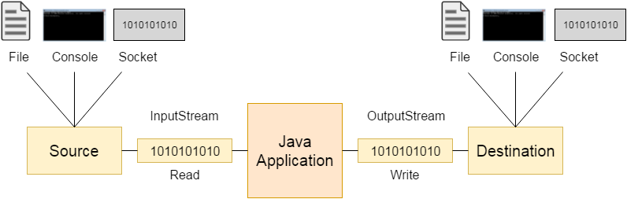
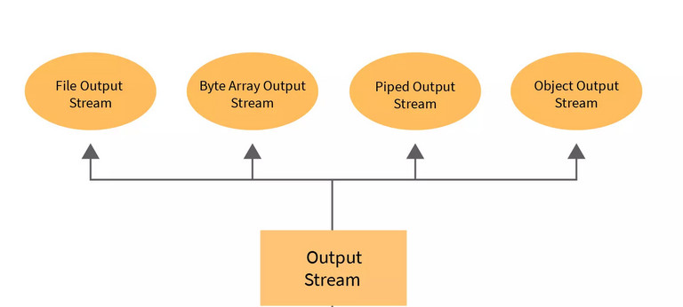
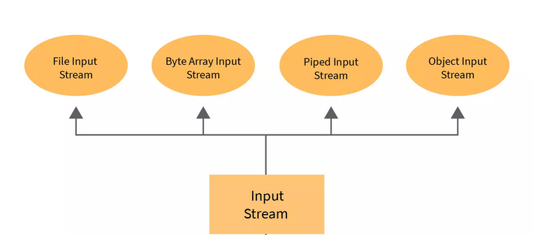
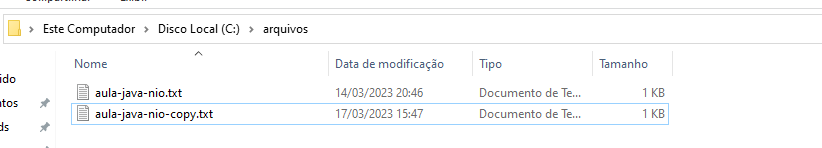

# Arquivos e Layouts

## Java N-IO

Sua nova forma de manipular arquivos na linguagem Java.

### Introdução

Uma das coisas mais fascinante na linguagem Java é o quanto ela vem evoluindo nos últimos anos, a Oracle Inc.
vem aprimorando periodicamente recursos extremamente relevantes de forma pontual e proporcionando cada vez mais uma melhor facilidade em implementar funcionalidades até então complexas e verbosas.

<div align="center">
  
</div>

> [!NOTE]
> No tópico Classes Essenciais, abordamos um pouco sobre como era trabalhar com manipulação de arquivos na linguagem, confira [aqui](./classes-essenciais.md).

Antes de começar a explorar os novos recursos oferecidos pela linguagem, precisamos compreender a proposta principal no que se refere a manipular arquivos e diretórios. Você precisa dominar os requisitos abaixo:

- Criar arquivos e diretórios
- Ler arquivos
- Escrever em arquivos
- Definir conteúdos: textos, imagens, bytes
- Compreender layouts: delimitado e posicional
- **E principalmente, como a linguagem vem evoluindo diante deste objetivo.**

> [!TIP]
> Esta nossa jornada será dividida em duas abordagem: 1° `java.io` e 2° `java.nio`

### Java IO

Java usa o conceito de `Stream` (fluxo) para tornar a operação de E/S rápida. O pacote java.io contém todas as classes necessárias para operações de entrada e saída.

O pacote java.io contém o sistema de I/O original do Java. Nesse sistema, as operações de entrada e saída são realizadas com a utilização de fluxos (streams). Um fluxo é uma entidade associada a um dispositivo de I/O que enxerga esse dispositivo como uma sequência de bytes ou caracteres, que só podem ser lidos/escritos de forma sequencial. Os fluxos em Java são divididos em fluxos de entrada e fluxos de saída. Ou seja, um fluxo de entrada é capaz de ler os dados de um dispositivo de entrada sequencialmente, um byte por vez, sem armazená-los internamente (a não ser que seja um fluxo específico para buffer, como um BufferedInputStream). Analogamente, um fluxo de saída escreve sequencialmente no dispositivo ao qual está associado, um byte de cada vez.

#### Stream

Uma Stream é uma sequência de dados. Em Java, uma stream é composta de bytes. É chamado de stream (stream) porque é como um riacho de água que continua a fluir

#### Input vs Output

A explicação das classes [OutputStream](https://docs.oracle.com/javase/7/docs/api/java/io/OutputStream.html) e [InputStream](https://docs.oracle.com/javase/7/docs/api/java/io/InputStream.html) são fornecidas abaixo:

Vamos entender o funcionamento do Java `OutputStream` e `InputStream` pela figura abaixo.

<div align="center">
  
</div>

#### OutputStream

O aplicativo Java usa um fluxo de saída para gravar dados em um destino; pode ser um arquivo, uma matriz, dispositivo periférico ou soquete.

A classe `OutputStream` é uma classe abstrata. É a superclasse de todas as classes que representam um fluxo de saída de bytes. Um fluxo de saída aceita bytes de saída e os envia para algum coletor.

<div align="center">
  
</div>

Vamos explorar os principais métodos da classe e sub-classes de `OutputStream`.

<details>
  <summary>public <code>void close()</code> throws IOException</summary>

  Esse método fecha o fluxo de saída atual e libera todos os recursos do sistema associados a ele. O fluxo fechado não pode ser reaberto e as operações não podem ser executadas dentro dele.
</details>

<details>
  <summary>public <code>void flush()</code> throws IOException</summary>

  Ele libera o fluxo de saída atual e força qualquer saída armazenada em buffer a ser gravada.
</details>

<details>
  <summary>public <code>void write(byte[ ] b)</code> throws IOException</summary>

  Esse método grava os bytes `bytes.length` da matriz de bytes especificada no fluxo de saída.
</details>

<details>
  <summary>public <code>void write(byte[ ] b ,int off ,int len)</code> throws IOException</summary>

  Ele grava até `len` bytes de dados no fluxo de saída. Aqui, o `off` é o deslocamento inicial na matriz de buffer b, e o `len` representa o número máximo de bytes a serem gravados no fluxo de saída.
</details>

<details>
  <summary>public abstract <code>void write(int b)</code> throws IOException</summary>

  O método acima grava os bytes específicos no fluxo de saída. Não retorna um valor.
</details>

**Escrevendo em arquivos**

Abaixo iremos demonstrar como escrever byte a byte de um conteúdo no formato String.

```java
import java.io.File;
import java.io.FileOutputStream;
import java.io.IOException;

public class JavaNIO {
  public static void main(String[] args) {
    try {
      // antes de pensar em escrever, elabore e confira o conteúdo
      String conteudo = "Hoje aprendemos sobre Java IO - OutputStream e escrita em arquivos físicos no sistema operacional";

      // O java necessita de uma barra dupla para windows
      File aulaFile = new File("C:\\arquivos\\","aula-java-nio.txt");
      // Observe acima que File está recebendo dois parâmetros: diretório e nome do arquivo

      /**
       * Se preferir crie um objeto file somente para o diretório e verifique se o existe, e crie caso necessário
       */

      FileOutputStream output = new FileOutputStream(aulaFile); //poderia ser a String do endereço completo do arquivo

      char [] caracteres = conteudo.toCharArray();
      // inicializa x to 0
      int x = 0;
      // enquanto houver caracteres na string com base na posição
      while (x < conteudo.length()) {
        // escreve caractere por caractere
        output.write(caracteres[x++]);
      }
      // fecha o arquivo
      output.close();
    } catch (IOException e) {
      // um erro acontecerá se o diretório não existir previamente
      // certifique-se de complementar com a lógica de criar o diretório previamente.
      e.printStackTrace();
    }
  }
}

```

Percebemos que para uma operação simples foram necessárias algumas linhas de códigos para ser possível cada caractere do conteúdo por vez. Para melhorar o nosso programa iremos desfrutar da combinação das classes `FileOutputStream` com a `ByteArrayOutputStream`.

```java
try {
  String conteudo = "Hoje aprendemos sobre Java IO - OutputStream e escrita em arquivos físicos no sistema operacional";
  File aulaFile = new File("C:\\arquivos\\","aula-java-nio.txt");
  FileOutputStream output = new FileOutputStream(aulaFile); //poderia ser a String do endereço completo do arquivo

  ByteArrayOutputStream byteOutput = new ByteArrayOutputStream();
  byteOutput.write(conteudo.getBytes());
  byteOutput.writeTo(output);

  output.close();
} catch (IOException e) {
  e.printStackTrace();
}
```

#### InputStream

O aplicativo Java usa um fluxo de entrada para ler dados de uma origem; pode ser um arquivo, uma matriz, dispositivo periférico ou soquete.

<div align="center">
  
</div>

> [!WARNING]
> Nesta nossa abordagem estamos explorando o conceito de Stream somente no contexto em trabalhar com arquivos físicos em seu sistema operacional.
>
> Recomendamos explorar de acordo com as hierarquias citadas acima cada alternativa correspondentemente.

Anteriormente conseguimos escrever um conteúdo em arquivo `C:\arquivos\aula-java-nio.txt`, chegou a hora de ler o conteúdo que está no arquivo e realizar as operações de acordo com os requisitos da sua aplicação.

A classe `InputStream` é uma superclasse abstrata do pacote `java.io` e é usada para ler os dados de uma fonte de entrada. Em outras palavras, lendo dados de arquivos ou de um teclado, etc.

Vamos explorar os principais métodos da classe e sub-classes de `InputStream`.

<details>
  <summary>public abstract <code>int read()</code> throws IOException</summary>
  O método acima ajuda a retornar os dados do próximo byte no fluxo de entrada. O valor retornado está entre 0 a 255. Se nenhum byte for lido, o código retorna -1, que indica o fim do arquivo.
</details>

<details>
  <summary>public <code>int available()</code> throws IOException</summary>
  O método acima retorna o número de bytes que podem ser lidos do fluxo de entrada.
</details>

<details>
  <summary>public <code>void close()</code> throws IOException</summary>
  O método acima fecha o fluxo de entrada atual e libera quaisquer recursos do sistema associados a ele.
</details>

<details>
  <summary>public <code>int read(byte[ ] b)</code> throws IOException</summary>
  O método acima lê os bytes do fluxo de entrada e armazena cada byte na matriz do buffer. Ele retorna o número total de bytes armazenados na matriz do buffer. Se não houver nenhum byte no fluxo de entrada, ele retornará -1, pois o fluxo está no final do arquivo.
</details>

<details>
  <summary>public <code>void reset()</code> throws IOException</summary>
  Ele reposiciona o fluxo para a última posição de marca chamada. O método reset não faz nada para a classe de fluxo de entrada, exceto lançar uma exceção.
</details>

<details>
  <summary>public <code>long skip(long n)</code> throws IOException</summary>
  Este método descarta n bytes de dados do fluxo de entrada.
</details>

Podemos criar um objeto da classe de fluxo de entrada usando a palavra-chave new. Como estamos em contexto de ler um arquivo, A classe de `FileInputStream` tem vários tipos de construtores.

O código a seguir usa o nome do arquivo como uma string para ler os dados armazenados no arquivo `C:\arquivos\aula-java-nio.txt`.

<details>
  <summary>Alternativa A</summary>

  ```java
  public class JavaNIO {
    public static void main(String[] args) {
      try {
        InputStream conteudoArquivo = new FileInputStream("C:\\arquivos\\aula-java-nio.txt");
        // inicializando a variável caractere
        int caractere = 0;
        // enquanto houver caractere após cada desclocamento

        StringBuilder conteudo = new StringBuilder();
        while ((caractere = conteudoArquivo.read()) != -1) {
          //capturando cada caractere e atualizando a variável conteúdo
          conteudo.append ((char) caractere);
        }
        // fechando o fluxo
        conteudoArquivo.close();

        System.out.println(conteudo.toString());
      } catch (IOException e) {
        e.printStackTrace();
      }
    }
  }
  ```

</details>

<details>
  <summary>Alternativa B</summary>

  ```java
  try {
    InputStream conteudoArquivo = new FileInputStream("C:\\arquivos\\aula-java-nio.txt");

    byte data[] = new byte[conteudoArquivo.available()];

    conteudoArquivo.read(data);
    conteudoArquivo.close();

    String conteudo = new String(data);
    System.out.println(conteudo);

  } catch (IOException e) {
    e.printStackTrace();
  }
  ```

</details>

> [!TIP]
> Acabamos de chegar a conclusão que para atender um requisito relativamente simples, faz-se necessário, compreender a partir de agora conceitos e fundamentos da linguagem como dominar o [essencial](/topicos/linguagens/java/basico/classes-essenciais) de cada classe

### Java N-IO

Uma nova era chegou!

Conforme você viu anteriormente, para trabalhar com I/O em Java, nos deparamos com uma grande variedade de classes e pacotes a nossa disposição. O sistema original de I/O do Java foi lançado nas primeiras versões do JDK no pacote java.io. Mais tarde, surgiu o subsistema NIO (New I/O) no JDK 1.4, trazendo novos pacotes e uma nova API para executar as operações de entrada e saída. Mais recentemente no JDK 7 o Java NIO foi extendido, ganhando novos pacotes e recursos. Essas extensões foram tão significativas que essa versão é conhecida como NIO.2.

<div align="center">
  
</div>

> [!WARNING]
> Antes de prosseguirmos, você precisa ter ciência que existirão pela frente inúmeros projetos que realizam leitura e escrita de arquivos ainda de forma **convencional** por vários fatores já identificados.

#### Java NIO.2

A partir do JDK 7 o NIO foi consideravelmente estendido, passando a contar com os pacotes java.nio.file e java.nio.file.attribute. Esses pacotes oferecem um suporte completo à manipulação de arquivos e diretórios, centralizados na classe Files e na interface Path.

De maneira geral, o NIO e o NIO.2 não tem a intenção de substituir a antiga API Java IO, mas sim de complementá-la, oferecendo uma alternativa escalável para aplicações que necessitam fazer uso intenso de I/O de maneira concorrente. No entanto, os novos recursos referentes a arquivos e diretórios do NIO.2 oferecem uma alternativa simples e mais completa do que a API original, devendo obter uma adoção cada vez maior em código novo.

> [!NOTE]
> Os exemplos explorados a seguir estão direcionados ao uso do Java NIO somente com a proposta da leitura e escrita de arquivos de forma mais simplificada.

Vamos conhecer a principais classes para leitura e escrita de arquivos:

| Classe              | Descrição                                                                           |
|---------------------|-------------------------------------------------------------------------------------|
| java.nio.file.Path  | Interface que representa um diretório de nosso sistema operacional                  |
| java.nio.file.Paths | Classe que contém o recurso de criar um objeto que represente o diretório informado |
| java.nio.file.Files | Classe que contém os recursos de leitura e escrita de arquivos de forma estática    |

```java
public class JavaNIO {
  public static void main(String[] args) {
    try {

      // Primeiro utilize o Path para localizar o arquivo
      // linux:"/home/arquivos/aula-java-nio.txt"
      Path path = Paths.get("C:\\arquivos\\aula-java-nio.txt");

      // Lendo o path e convertendo todos os caracteres (bytes) de uma só vez
      byte[] bytesArquivo =  Files.readAllBytes(path);

      // Como são bytes podemos criar uma String a partir de agora
      String conteudo = new String(bytesArquivo);
      System.out.println(conteudo);

      // Agora veja como também é simples escrever arquivos textos.
      Path pathTo = Paths.get("C:\\arquivos\\aula-java-nio-copy.txt");
      Files.write(pathTo, bytesArquivo);

    } catch (IOException e) {
      throw new RuntimeException(e);
    }
  }
}
```

<div align="center">
  
</div>

> [!TIP]
> Curtiu, né? É importante compreender que ao longo dos anos a linguagem Java vem evoluindo significativamente quanto aos seus recursos essenciais como leitura e escrita de arquivos.
>
> É importante ter a ciência que você pode se deparar com inúmeras maneiras de realizar o mesmo procedimento.

#### Mão na massa

Chegou a hora de explorar o máximo dos recursos disponíveis diante de uma ilustração bem comum e recorrente em projetos reais.

Um escritor pediu ao nosso suporte coletarmos dados de telefone e nome para que ele possa entrar em contato e divulgar o seu novo livro de romance.

Diante desta solicitação, nós consultamos a nossa base de dados de clientes e exportamos uma lista de nomes e telefones conforme lista ou array abaixo:

```txt
(83) 2148-5886 Joemia Giron Lyrio Monnerat
(21) 2705-6726 Reginaldo Folly Barboza Brito
(91) 2416-8455 Mariza Gadelha Bastida Carneiro
(68) 3259-8389 Mirian Venancio Portela Ignacia
```

Agora que já temos nossa lista (array) de contatos, podemos ir escrevendo linha a linha em um arquivo ou montar uma única string como todo o conteúdo para ser escrito no final.

> [!WARNING]
> Definir escrever linha a linha ou montar uma única string e depois gravar no arquivo as vezes necessita de um alinhamento com time de arquitetura.

<details>
  <summary>Linha a linha</summary>

  ```java
  public class JavaNIO {
    public static void main(String[] args) {
      try {
        // ainda não falamos de arrays e coleções
        // é só para ilustrar a escrita de várias linhas em um arquivo
        List<String> contatos = new ArrayList<>();
        contatos.add("(83) 2148-5886 Joemia Giron Lyrio Monnerat");
        contatos.add("(21) 2705-6726 Reginaldo Folly Barboza Brito");
        contatos.add("(91) 2416-8455 Mariza Gadelha Bastida Carneiro");
        contatos.add("(68) 3259-8389 Mirian Venancio Portela Ignacia");

        // arquivo de destino
        Path arquivoDestino = Paths.get("C:\\arquivos\\lista-contatos.txt");

        for(String linhaContato:contatos){
          String conteudo = linhaContato + System.lineSeparator();
          Files.write(arquivoDestino, conteudo.getBytes(StandardCharsets.UTF_8), StandardOpenOption.CREATE, StandardOpenOption.APPEND);
        }
      } catch (IOException e) {
        throw new RuntimeException(e);
      }
    }
  }
  ```

</details>

<details>
  <summary>String geral</summary>

  ```java
  List<String> contatos = new ArrayList<>();
  contatos.add("(83) 2148-5886 Joemia Giron Lyrio Monnerat");
  contatos.add("(21) 2705-6726 Reginaldo Folly Barboza Brito");
  contatos.add("(91) 2416-8455 Mariza Gadelha Bastida Carneiro");
  contatos.add("(68) 3259-8389 Mirian Venancio Portela Ignacia");

  // arquivo de destino
  Path arquivoDestino = Paths.get("C:\\arquivos\\lista-contatos.txt");

  StringBuilder conteudoGeral = new StringBuilder();
  for(String linhaContato:contatos){
    String conteudo = linhaContato + System.lineSeparator();
    conteudoGeral.append(conteudo);
  }
  Files.write(arquivoDestino, conteudoGeral.toString().getBytes(StandardCharsets.UTF_8), StandardOpenOption.CREATE);
  // Não foi necessário habilitar a re-escrita no arquivo, afinal, já temos a String completa
  ```

</details>

Vamos analisar alguns detalhes explicados abaixo:

1. `System.lineSeparator()` -> Método que retorna um caractere que representa uma quebra de linha.
2. `linhaContato.getBytes(StandardCharsets.UTF_8)` -> aplica o encode UTF-8.
3. `StandardOpenOption.CREATE` -> Criará o arquivo caso o mesmo não exista.
4. `StandardOpenOption.APPEND` -> esta propriedade determina que o arquivo permita incrementar seu conteúdo.

> [!WARNING]
> O conteúdo que você irá escrever em um arquivo previamente poderá ser um objeto ou uma lista de objetos, logo lembre-se, antes de pensar em escrever gere o conteúdo. 👍

Agora que você já praticou escrever um arquivo com várias linhas, ler este arquivo não deverá ser tão difícil assim, vamos comprovar ?

```java
try {
  Path arquivoOrigem = Paths.get("C:\\arquivos\\lista-contatos.txt");

  List<String> contatos = Files.readAllLines(arquivoOrigem);

  // imprimindo cada linha obtida no arquivo
  for(String linhaContato:contatos){
    System.out.println(linhaContato);
  }
} catch (IOException e) {
  throw new RuntimeException(e);
}
```

### Layouts

É muito comum em projetos reais sermos solicitados para converter nossos objetos em conteúdo texto para após serem escritos em um arquivo `.txt` ou `.csv`, e também o inverso, ler as linhas de um arquivo e converter em um ou uma lista de objetos.

Para ilustrar o uso de layouts para geração de arquivos texto utilizando uma linguagem orientada a objetos como o Java, iremos ampliar o contexto do exemplo citado acima:

O nosso sistema já tem disponível dados de contatos com base numa lista de objetos derivados da classe `Cadastro.java` com as características que deverão ser escritas em um arquivo:

<details>
  <summary>Classe Cadastro</summary>

  ```java []
  public class Cadastro {
    String  nome;
    String  sexo;
    Long    telefone;
    LocalDate dataNascimento;
    Double valorSugerido;
    boolean cliente;

    // este construtor é somente para ilustrar este exemplo
    // evite propagar esta estratégia ao longo dos seus estudos e projetos
    public Contato(String nome, String sexo, Long telefone, LocalDate dataNascimento, Double valorSugerido, boolean cliente) {
      this.nome = nome;
      this.sexo = sexo;
      this.telefone = telefone;
      this.dataNascimento = dataNascimento;
      this.valorSugerido = valorSugerido;
      this.cliente = cliente;
    }

    // métodos getters para obter os dados dos objetos
  }
  ```

</details>

<details>
  <summary>Lista de cadastros</summary>

  ```java
  public class SistemaCadastro {
    public static void main(String[] args) {
      //nossos cadastros na forma de objetos

      List<Cadastro> cadastros = new ArrayList<>();
      cadastros.add(new Cadastro("Joemia Giron Lyrio Monnerat","F", 8321485886L, LocalDate.of(1984,6,30),35.0, false));
      cadastros.add(new Cadastro("Reginaldo Folly Barboza Brito","M", 2127056726L, LocalDate.of(1990,3,17),40.0, true));
      cadastros.add(new Cadastro("Mariza Gadelha Bastida Carneiro","F", 9124168455L, LocalDate.of(1889,8,18),40.0, false));
      cadastros.add(new Cadastro("Mirian Venancio Portela Ignacia","M", 6832598389L, LocalDate.of(1975,11,21),29.0, true));

      escreverLayoutDelimitado(cadastros);

      escreverLayoutPosicional(cadastros);

    }
    public static void escreverLayoutDelimitado(List<Cadastro> cadastros){
      System.out.println("***** - LAYOUT DELIMITADO - *****");

      System.out.println("EM BREVE ...");
    }

    public static void escreverLayoutPosicional(List<Cadastro> cadastros){
      System.out.println("***** - LAYOUT POSICIONAL - *****");

      System.out.println("EM BREVE ...");
    }
  }
  ```

</details>

#### Delimitado

Um arquivo com layout delimitado utiliza um delimitador (separador de características) diante de uma linha no arquivo. Este delimitador costuma ser `,` vírgula, `;` ponto e vírgula ou `|` pipe onde grande maioria dos cenários utilizam o padrão de arquivo `.csv`.

Vamos iniciar a conversão da nossa lista de objetos para uma lista de strings com colunas delimitadas utilizando `;`;

```java
public static void escreverLayoutDelimitado(List<Cadastro> cadastros){
  System.out.println("***** - LAYOUT DELIMITADO - *****");

  try {
    StringBuilder conteudo = new StringBuilder();

    for (Cadastro cadastro : cadastros) {
      conteudo.append(cadastro.getNome() + ";");
      conteudo.append(cadastro.getSexo() + ";");
      conteudo.append(cadastro.getTelefone() + ";");
      conteudo.append(cadastro.getDataNascimento() + ";");
      conteudo.append(cadastro.getValorSugerido() + ";");
      conteudo.append(cadastro.isCliente());
      conteudo.append(System.lineSeparator());
    }
    System.out.println(conteudo.toString());

    Path arquivoDestino = Paths.get("C:\\arquivos\\lista-contatos-modelo-delimitado.csv");

    Files.write(arquivoDestino, conteudo.toString().getBytes(StandardCharsets.UTF_8), StandardOpenOption.CREATE);

  } catch (Exception ex){
    ex.printStackTrace();
  }
}
```

```shell
***** - LAYOUT DELIMITADO - *****
Joemia Giron Lyrio Monnerat;F;8321485886;1984-06-30;35.0;false
Reginaldo Folly Barboza Brito;M;2127056726;1990-03-17;40.0;true
Mariza Gadelha Bastida Carneiro;F;9124168455;1889-08-18;40.0;false
Mirian Venancio Portela Ignacia;M;6832598389;1975-11-21;29.0;true
```

> [!TIP]
> O conteúdo acima não será mais nenhum mistério para você. 😄

Vamos inverter o nosso cenário? Que tal lermos o arquivo `.csv`e gerar os objetos de cadastro?

```java
public static List<Cadastro>  lerLayoutDelimitado(){
  List<Cadastro> cadastros = new ArrayList<>();

  try {
    Path arquivoOrigem = Paths.get("C:\\arquivos\\lista-contatos-modelo-delimitado.csv");

    List<String> linhas = Files.readAllLines(arquivoOrigem);
    // imprimindo cada linha obtida no arquivo
    for(String linha:linhas){
      String[] colunas = linha.split("\\;"); // -> quebra uma linha em colunas com base no delimitador;
      String nome = colunas[0];
      String sexo = colunas[1];
      Long telefone = Long.valueOf(colunas[2]);
      LocalDate dataAniversario = LocalDate.parse(colunas[3]);
      Double valorSugerido = Double.valueOf(colunas[4]);
      boolean cliente = Boolean.valueOf(colunas[5]);

      // criando um novo cadastro e adicionando na lista de acordo com os valores de cada coluna
      cadastros.add(new Cadastro(nome,sexo,telefone,dataAniversario,valorSugerido,cliente));
    }
  }catch (Exception ex){
    ex.printStackTrace();
  }

  // ao retornar a lista de objetos
  // você poderá realizar qualquer ação com a lista retornada

  return cadastros;
}
```

#### Posicional

Um arquivo com layout posicional realiza um controle das colunas com base em um estrutura de comprimento `(m,n)` previamente definida resultando em realizar o particionamento `(subtring)` dos caracteres em uma linha.

Vamos ilustrar uma simulação de layout posicional que seria aderente ao nosso cenário atual:

|Nome| Tam. |Observação|
|---|------|----------|
|Nome| 30   |Preencher com espaço em branco à esquerda ou cortar os caracteres após a posição 30|
|Sexo| 1    |salvar M ou F|
|Telefone| 10   |Somente números|
|Aniversário| 10   |Salvar no formato dd-MM-aaaa|
|Valor Sugerido| 7    |Salvar no formato 0000.00|
|Cliente|1|Salvar 1 para true e zero para false|

> [!WARNING]
> O Layout acima é somente uma ilustração do que você pode se deparar em projetos reais, a proposta aqui é ter um direcionamento inicial de como interagir em requisitos iguais a estes.
>
> Recomendamos se desafiar e implementar layouts mais complexos com requisitos mais bem elaborados como no nosso repositório [Conta Rural](https://github.com/glysns/conta-rural).

```java
public static void escreverLayoutPosicional(List<Cadastro> cadastros) {
  try {
    System.out.println("***** - LAYOUT POSICIONAL - *****");

    StringBuilder conteudo = new StringBuilder();
    for (Cadastro cadastro : cadastros) {
      String nome = cadastro.getNome();
      // calma, não será assim para sempre
      if (nome.length() > 30)
      nome = nome.substring(0, 30);

      // pesquise sobre String.format
      if (nome.length() < 30)
      nome = String.format("%-30s", nome);

      conteudo.append(nome);
      conteudo.append(cadastro.getSexo().toUpperCase());
      conteudo.append(cadastro.getTelefone());
      conteudo.append(cadastro.getDataNascimento());

      DecimalFormat decimalFormat = new DecimalFormat("#0000.00");

      String valorFormatado = decimalFormat.format(cadastro.getValorSugerido());
      conteudo.append(valorFormatado.replaceAll("\\,", "\\.")); // -> troca , por .
      conteudo.append(cadastro.isCliente() ? "1" : "0");

      // nova linha
      conteudo.append(System.lineSeparator());
    }

    System.out.println(conteudo.toString());

    Path arquivoDestino = Paths.get("C:\\arquivos\\lista-contatos-modelo-posicional.txt");

    Files.write(arquivoDestino, conteudo.toString().getBytes(StandardCharsets.UTF_8), StandardOpenOption.CREATE);
  }catch (Exception ex){
    ex.printStackTrace();
  }
}
```

```shell
***** - LAYOUT POSICIONAL - *****
Joemia Giron Lyrio Monnerat   F83214858861984-06-300035.500
Reginaldo Folly Barboza Brito M21270567261990-03-170040.301
Mariza Gadelha Bastida CarneirF91241684551889-08-180040.700
Mirian Venancio Portela IgnaciM68325983891975-11-210029.501
```

Ler arquivos com layout posicional é muito semelhante ao layout posicional, precisamos obter uma lista de Strings mas desta vez iremos particionar `(substring)` cada linha de acordo o comprimento correspondente.

```java
public static List<Cadastro>  lerLayoutPosicional(){
  List<Cadastro> cadastros = new ArrayList<>();

  try {
    Path arquivoOrigem = Paths.get("C:\\arquivos\\lista-contatos-modelo-posicional.txt");

    List<String> linhas = Files.readAllLines(arquivoOrigem);
    // imprimindo cada linha obtida no arquivo
    for(String linha:linhas){
      String nome = linha.substring(0,30).trim(); // -> pego os caracteres da posição 0 a 30, trim() remove espaços laterias
      String sexo = linha.substring(30,31); // observe que sempre o primeiro parâmetro tem o valor que o segundo parâmetro anterior
      Long telefone = Long.valueOf(linha.substring(31,41)); // 41-31=10
      LocalDate dataAniversario = LocalDate.parse(linha.substring(41,51));
      Double valorSugerido = Double.valueOf(linha.substring(51,58));
      boolean cliente = linha.substring(58,59).equals("1");

      // criando um novo cadastro e adicionando na lista de acordo com os valores de cada coluna
      cadastros.add(new Cadastro(nome,sexo,telefone,dataAniversario,valorSugerido,cliente));
    }
  }catch (Exception ex){
      ex.printStackTrace();
  }

  // ao retornar a lista de objetos
  // você poderá realizar qualquer ação com a lista retornada

  return cadastros;
}
```
