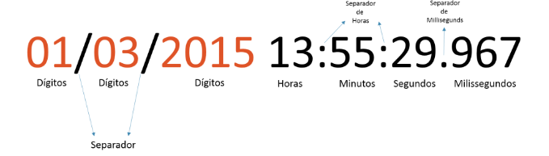
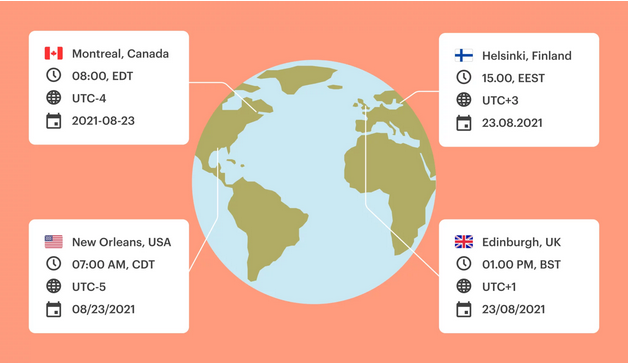
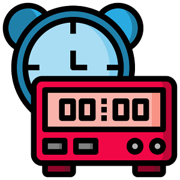

# Data, Hora e Instante

## Java Time

> [!NOTE]
> Antes de mergulhar nestes novos recursos da linguagem certifique-se de ter conhecimentos sobre os conceitos básicos de trabalhar com [Data e Hora](./classes-essenciais.md#classes-de-data) em Java.

### Introdução

Trabalhar com o tempo ou o instante atual é um dos requisitos mais complexos na área da programação onde exige uma compreensão no que se refere a criação, manipulação, comparação e formatação de data e hora.

<div align="center">
  
</div>

Aprendemos que a linguagem é composta para um conjunto de classes e métodos que representam datas e horas em um programa, mas a partir do Java 8 foi incorporado de forma nativa os recursos até então disponibilizados através de um projeto
denominado de [Joda Time](https://www.joda.org/joda-time/).

Assim, hoje a linguagem é composta por classes que representam respectivamente:

- [Data](https://docs.oracle.com/javase/9/docs/api/java/time/LocalDate.html)
- [Hora](https://docs.oracle.com/javase/9/docs/api/java/time/LocalTime.html)
- [Data e Hora](https://docs.oracle.com/javase/9/docs/api/java/time/LocalDateTime.html)
- [Instante](https://docs.oracle.com/javase/9/docs/api/java/time/Instant.html)

> [!TIP]
> Todas as operações relacionadas a data e hora retornam a um objeto (valor) imutável possibilitando maior segurança quanto as manipulações necessárias.

### LocalDate

O LocalDate representa uma data no formato ISO (aaaa-MM-dd) sem hora. Podemos usá-lo para armazenar datas como aniversários e dias de pagamento.

<div align="center">
  
</div>

#### Instanciação

Já aprendemos que instanciar refere-se a criar um novo objeto onde o meio mais tradicional é pelo uso de [Construtores](./orientacao-objetos.md#construtores), porém as classes citadas acima possuem métodos estáticos de criação de objetos correspondentemente.

Uma instância da data atual pode ser criada a partir do relógio do sistema:

```java
import java.time.LocalDate;

public class JavaTime {
  public static void main(String[] args) {
    LocalDate dataAtual = LocalDate.now();

    System.out.println(dataAtual);
    // Representação de um LocalDate: 2023-03-01
  }
}
```

Também é possível determinar os dígitos para dia, mês e ano em um LocalDate utilizando o método `of (year, month, dayOfMonth)`.

```java
LocalDate dataEspecifica1 = LocalDate.of(2023,1,12);

LocalDate dataEspecifica2 = LocalDate.of(2023, Month.JANUARY,12);
```

> [!WARNING]
> Dois itens devem ser analisados no exemplo acima:
>
> Primeiro: Java Time considera que meses começam com 1 (janeiro), 2 (fevereiro) e ...
>
> Segundo: Existe um enum denominado `Month` com os valores dos meses pré-definidos

Agora imagina que você tenha uma String onde seu conteúdo representa uma data, onde você gostaria de converter para um LocalDate correspondente? Simples, veja o código abaixo:

```java
// este conteúdo pode ser um argumento de seu programa via console
// ou toString() de algum componente visual
String stringData = "2023-01-17";

LocalDate dataConcreta = LocalDate.parse(stringData);
```

Até aqui já aprendemos variedades sobre Data utilizando Java Time, mas nós como bons brasileiros sabemos que o formato de uma data informada no sistemas desktops, web e aplicativos possuem um formato diferente. Então como converteríamos uma string de data vindo no formato `dd/mm/aaaa`? Este é um trabalho para a classe `java.time.format.DateTimeFormatter`

```java
String stringDataBr = "17/01/2023";

DateTimeFormatter formatter = DateTimeFormatter.ofPattern("dd/MM/yyyy");

LocalDate dataConcreta = LocalDate.parse(stringDataBr,formatter);
```

> [!CAUTION]
> Tentar converter uma String em um JavaTime que não tenha uma compatibilidade de conversão (parse) gerá uma exceção semelhante a esta:
>
> `java.time.format.DateTimeParseException: Text '17/01/23' could not be parsed`

#### Manipulação

Depois de um objeto LocalDate criado na sua aplicação, você poderá, manipulá-lo resultando na criação de novos objetos com os valores resultantes de operações como: adicionar dia, subtrair mês e etc.

<details>
  <summary>Data Especial</summary>

  ```java
  LocalDate aniversarioIzabelly = LocalDate.of(2023,5,3);
  ```

</details>

<details>
  <summary>Quando fará 15 anos?</summary>

  ```java
  LocalDate aniversarioIzabelly = LocalDate.of(2023,5,3);

  LocalDate dataQueTera15Anos = aniversarioIzabelly.plusYears(15);

  System.out.println(dataQueTera15Anos);
  ```

</details>

> [!TIP]
> Agora que já compreendeu grande parte dos recursos de um LocalDate, que tal explorar os demais métodos `plusXX` e `minusYY`?

#### Comparação

Outro aspecto extremamente relevante quando trabalhamos com data é realizar comparações entre duas datas com base no: ano, mes, dia, semana e etc.

```java
LocalDate data1 = LocalDate.of(2023,3,4);
LocalDate data2 = LocalDate.of(2024,4,3);

//data2 está após a data 1? true
System.out.println(data2.isAfter(data1));

//data2 está antes que data 1? flase
System.out.println(data2.isBefore(data1));

//data2 é igual a data 1? false
System.out.println(data2.isEqual(data1));
```

#### Formatação

Assim como explanamos formatação de datas utilizando DateFormat e SimpleDateFormat, agora o Java Time disponibiliza recursos para formatações de data e hora nesta nova abordagem da linguagem.

Abaixo iremos explorar formatações considerando um formato pré-estabelecido e em seguida formatos com base na Local e (idioma) configurado em sua aplicação.

```java
LocalDate data = LocalDate.of(2023,1,13);

DateTimeFormatter formatter = DateTimeFormatter.ofPattern("dd/MM/yyyy");

System.out.println(data); // 2023-01-13

// formatando a data criada acima
System.out.println(formatter.format(data)); // 13/01/2023
```

Se você pretende desenvolver uma aplicação no qual é necessário considerar a região em que o usuário acessará o sistema para formatar campos data adequadamente, é possível realizar esta formatação com quatro formatos pré-definidos:

```java
LocalDate data = LocalDate.of(2023,1,13);

String dataFormatada = data.format(DateTimeFormatter.ofLocalizedDate(FormatStyle.LONG));  // 13 de janeiro de 2023
dataFormatada = data.format(DateTimeFormatter.ofLocalizedDate(FormatStyle.MEDIUM));  // 13 de jan. de 2023
dataFormatada = data.format(DateTimeFormatter.ofLocalizedDate(FormatStyle.SHORT));  // 13/01/2023
dataFormatada = data.format(DateTimeFormatter.ofLocalizedDate(FormatStyle.FULL));  // sexta-feira, 13 de janeiro de 2023
```

> [!WARNING]
> A formatação apresentada acima poderá ter um comportamento diferente considerando as configurações de região e idioma em sistema operacional.
>
> Para definir uma formatação mediante uma seleção de um idioma em sua aplicação, recomendo explorar um pouco mais sobre o uso de [Locale](https://docs.oracle.com/javase/8/docs/api/java/util/Locale.html)
>

Considerando a imagem abaixo, vamos apresentar a mesma data `23/08/2021` nas respectivas formatações abaixo:

<div align="center">
  
</div>

```java
LocalDate data = LocalDate.of(2021,8,23);

Locale[] locales = {Locale.CANADA, Locale.US, new Locale("fi","FI"),Locale.UK};

for(Locale locale:locales){
  String dataFormatada = data.format(DateTimeFormatter.ofLocalizedDate(FormatStyle.SHORT).withLocale(locale));
  System.out.println(dataFormatada);
}

// 2021-08-23
// 8/23/21
// 23.8.2021
// 23/08/2021
```

#### Dados específicos

Depois de aprendermos a instanciar, manipular e formatar datas utilizando os recursos do Java Time, chegou a hora de obter alguns dados isoladamente através de métodos específicos:

```java
LocalDate data = LocalDate.of(2021,8,23);

System.out.println(data.getDayOfMonth());   // retorna o dia do mês -> 23
System.out.println(data.getYear());         // retorna o ano -> 2023
System.out.println(data.getMonth());        // retorna o elemento de enum java.time.Month -> AUGUST
System.out.println(data.getMonthValue());   // retorna o número do mês entre 1-12 -> 8
```

### LocalTime

O LocalTime representa a hora sem data.

Semelhante a LocalDate, podemos criar uma instância de LocalTime a partir do relógio do sistema ou usando os métodos parse e of.

Vamos agora dar uma olhada rápida em algumas das APIs comumente usadas.

Uma instância do LocalTime atual pode ser criada a partir do relógio do sistema:

<div align="center">
  
</div>

#### Instanciação

```java
LocalTime horaAtual = LocalTime.now();

LocalTime horaMinutoSegundoEspecifico = LocalTime.of(13,21,42); // 13:21:42

LocalTime horaMinutoEspecifico = LocalTime.of(13,21); // 13:21

LocalTime horaDeUmaString = LocalTime.parse("13:21:42");

DateTimeFormatter formatter = DateTimeFormatter.ofPattern("HHmmss");
LocalTime horaDeUmaStringDespadronizada = LocalTime.parse("132142", formatter); // 13:21:42
```

> [!WARNING]
> Memorize ao máximo esta tabelinha quando quiser converter / formatar data e hora com estruturas específicas:

|Letra| Campo|Exemplo|
|----|------|-------|
|G	|Era designator	|AD|
|y	|Year	|2018 (yyyy), 18 (yy)|
|M	|Month in year	|July (MMMM), Jul (MMM), 07 (MM)|
|w	|Results in week in year	|16|
|W	|Results in week in month	|3|
|D	|Gives the day count in the year	|266|
|d	|Day of the month	|09 (dd), 9(d)|
|F	|Day of the week in month	|4|
|E	|Day name in the week	|Tuesday, Tue|
|u	|Day number of week |where 1 represents Monday, 2 represents Tuesday and so on	2|
|a	|AM or PM marker	|AM|
|H	|Hour in the day |(0-23)	12|
|k	|Hour in the day |(1-24)	23|
|K	|Hour in am/pm |for 12 hour format (0-11)	0|
|h	|Hour in am/pm |for 12 hour format (1-12)	12|
|m	|Minute in the hour	|59|
|s	|Second in the minute	|35|
|S	|Millisecond in the minute	|978|
|z	|Timezone	Pacific Standard| Time; PST; GMT-08:00|
|Z	|Timezone offset in hours (RFC pattern)	|-0800|
|X	|Timezone offset in ISO format	|-08; -0800; -08:00|

#### Manipulação

```java
LocalTime horaAtual = LocalTime.now();
LocalTime horaAtualMais30Minutos = horaAtual.plusMinutes(30);
LocalTime horaAtualMenos2Horas = horaAtual.minusHours(2);

System.out.println(horaAtual);
System.out.println(horaAtualMais30Minutos);
System.out.println(horaAtualMenos2Horas);
```

#### Comparação

```java
LocalTime horaAtual = LocalTime.now();
LocalTime horaAtualMenos2Horas = horaAtual.minusHours(2);

boolean passado = horaAtual.isBefore(horaAtualMenos2Horas);

System.out.println(passado);
```

#### Formatação

```java{2}
LocalTime hora = LocalTime.of(13,21,42);
DateTimeFormatter formatter = DateTimeFormatter.ofPattern("ss-mm-HH");
String horaFormatada = hora.format(formatter);
System.out.println(horaFormatada); // 42-21-13
```

#### Dados específicos

```java
LocalTime hora = LocalTime.of(13,21,42);

System.out.println(hora.getHour());     // 13
System.out.println(hora.getMinute());   // 21
System.out.println(hora.getSecond());   // 42
System.out.println(hora.getNano());     // 0
```

### LocalDateTime

LocalDateTime é usado para representar uma combinação de data e hora. Essa é a classe mais usada quando precisamos de uma combinação de data e hora.

<div align="center">
  
</div>

#### Instanciação

```java
// 2023-06-25T16:25 -> data e hora sem segundo
LocalDateTime dataHora = LocalDateTime.of(2023,6,25, 16,25);

// 2023-06-25T16:25:33 -> data e hora com segundo
dataHora = LocalDateTime.of(2023,6,25, 16,25,33);
```

#### Manipulação

```java{7}
LocalDateTime dataHora = LocalDateTime.of(2023,6,25, 16,25);

LocalDateTime proximoMes = dataHora.plusMonths(1);

LocalDateTime dataHoraComMenos15Minutos = dataHora.minusMinutes(15);

LocalDateTime dataHoraDefinindoSegundoZero = dataHora.withSecond(33);
```

#### Comparação

```java
LocalDateTime dataHora1 = LocalDateTime.of(2023,6,25, 16,25);
LocalDateTime dataHora2 = LocalDateTime.of(2023,6,25, 16,25,17);

// comparando dois objetos data/hora em sua totalidade
boolean dataHoraIgual = dataHora1.equals(dataHora2); //false

// comparando dígito específico de uma data e hora
boolean dataHoraDigitoIgual = dataHora1.getDayOfMonth()==dataHora2.getDayOfMonth(); //true
```

#### Formatação

```java
LocalDateTime dataHora = LocalDateTime.of(2023,7,22,17,33);
DateTimeFormatter formatter = DateTimeFormatter.ofPattern("dd/MM/yy HH:mm:ss");
String dataHoraFormatada = dataHora.format(formatter);
System.out.println(dataHoraFormatada); // 22/07/23 17:33:00
```

### Instant

A classe Java Instant é usada para representar um momento específico na linha do tempo. Isso pode ser usado para registrar carimbos de data/hora do evento no aplicativo. Esta classe é imutável e thread-safe.

Ao contrário do antigo java.util.Date que tem precisão de milissegundos, um Instant tem precisão de nanossegundos. Representar um ponto no tempo usando precisão de nanossegundos requer o armazenamento de um número maior que um longo. Para conseguir isso, a classe armazena um long que representa os segundos de época e um int que representa nanossegundos de segundo, que sempre estará entre 0 e 999.999.999. Os segundos da época são medidos a partir da época Java padrão de 1970-01-01T00:00:00Z, onde os instantes após a época têm valores positivos e os instantes anteriores têm valores negativos.

<div align="center">
  
</div>

#### Instanciação

```java
// 1970-01-01T00:00:00Z até 2023-03-13T13:18:00Z
long milisegundos = 1678713480000l;
Instant instant = Instant.ofEpochMilli(milisegundos);
System.out.println(instant);

long segundos = milisegundos / 1000;
instant = Instant.ofEpochSecond(segundos);
System.out.println(instant);
```

#### Manipulação

```java
Instant instant = Instant.parse("1984-08-13T10:15:30.345Z");

System.out.println("Instant             : " + instant);

// Adding/subtracting seconds
System.out.println("15 seconds before   : " + instant.minusSeconds(15));
System.out.println("10 seconds after    : " + instant.plusSeconds(10));

// Adding/subtracting millis
System.out.println("Minus 45000 millis  : " + instant.minusMillis(45000));
System.out.println("Plus 10000 millis   : " + instant.plusMillis(10000));

// Adding/subtracting nanos
System.out.println("Minus 45123456 nanos: " + instant.minusNanos(45123456));
System.out.println("Plus 111234567 nanos: " + instant.plusNanos(111234567));

// Using MINUTES
System.out.println("45 minutes before   : " + instant.minus(45, ChronoUnit.MINUTES));
// Using HOURS
System.out.println("3 hours before      : " + instant.minus(3, ChronoUnit.HOURS));
// Using MILLIS also supported
System.out.println("30000 millis later  : " + instant.plus(30000, ChronoUnit.MILLIS));
// Using DAYS
System.out.println("10 days later       : " + instant.plus(10, ChronoUnit.DAYS));

// Using TemporalAmount - Duration
System.out.println("10 seconds before   : " + instant.minus(Duration.ofSeconds(10)));
// Using TemporalAmount - Period
System.out.println("5 days later        : " + instant.plus(Period.ofDays(5)));
```

#### Comparação

```java
Instant instant1 = Instant.parse("1984-08-13T10:15:30.345Z");
Instant instant2 = Instant.now();

System.out.println(instant1.isAfter(instant2)); // false
System.out.println(instant1.equals(instant2)); // false
```

#### Formatação

```java
DateTimeFormatter formatter = DateTimeFormatter.ofPattern("dd.MM.yyyy").withZone(ZoneId.systemDefault());

Instant instant = Instant.parse("2022-02-15T18:35:24.00Z");
String formattedInstant = formatter.format(instant);

System.out.println(formattedInstant); // 15.02.2022
```

#### Dados específicos

```java
Instant instant = Instant.now();
System.out.println("Instant    : " + instant);

long epochSecond = instant.getEpochSecond();
System.out.println("EpochSecond: " + epochSecond);

int nano = instant.getNano();
System.out.println("Nano       : " + nano);
```

> [!TIP]
> Aprendemos que trabalhar com data e hora na linguagem Java é uma tarefa que exige muita compreensão e entendimento de conceitos essenciais, porém, procure focar e explorar um pouco mais o recursos de `instanciação`, `manipulação`, `parse` e `formatação` para estar mais que preparado para os desafios dos dia-a-dia.

### Period e Duration

#### Period

A classe `Period` usa as unidades ano, mês e dia para representar um período de tempo.

Podemos obter um objeto Período como a diferença entre duas datas usando o método `between()`:

```java
LocalDate hoje = LocalDate.of(2023, 2, 20);
LocalDate natal = LocalDate.of(2023, 12, 25);

Period period = Period.between(hoje, natal);

System.out.println(period.getYears());  // anos
System.out.println(period.getMonths()); // meses
System.out.println(period.getDays());   // dias
```

#### Duration

A classe `Duration` representa um intervalo de tempo em segundos ou nanossegundos e é mais adequada para lidar com períodos de tempo menores, em casos que exigem mais precisão.

Podemos determinar a diferença entre dois instantes como um objeto Duration usando o método `between()`:

```java
LocalTime inicíoTreino = LocalTime.of(6,30,33);
LocalTime fimTreino = LocalTime.of(7,16,14);

Duration duration = Duration.between(inicíoTreino, fimTreino);

System.out.println(duration.getSeconds()); // 2741 segundos

// convertendo para um LocalTime com base na duração
LocalTime tempoAtividade = LocalTime.ofSecondOfDay(duration.getSeconds());
System.out.println(tempoAtividade); // 00:45:41
```

### Transformação

Chegou o momento mais temido quando estamos trabalhando com data e hora em nossa a aplicação, a transformação de objetos de acordo com requisitos apresentados ao longo do projeto.

Vamos explorar alguns recursos que o Java Time oferece em cada situação correspondentemente:

> [!NOTE]
> Lembre-se, a linguagem Java é muito rigorosa quando se refere a tipagem dos dados

#### LocalDateTime to LocalDate

```java{3}
LocalDateTime dataHora = LocalDateTime.of(2023, 1, 24, 16,31,27);

LocalDate data = dataHora.toLocalDate();
```

#### LocalDateTime to LocalTime

```java
LocalDateTime dataHora = LocalDateTime.of(2023, 1, 24, 16,31,27);

LocalTime hora = dataHora.toLocalTime();
```

#### LocalDate to LocalDateTime

```java
LocalDate data = LocalDate.of(2023, 1, 24);

LocalDateTime dataHora = data.atTime(16,31,27); //2023-01-24T16:31:27

dataHora = data.atTime(LocalTime.of(16,31,27)); //2023-01-24T16:31:27

dataHora = data.atTime(LocalTime.of(16,31)); //2023-01-24T16:31

dataHora = data.atStartOfDay(); //2023-01-24T00:00
```

#### Instant to LocalDateTime

```java
Instant instante = Instant.parse("2023-03-13T15:58:55.794285600Z");

// Converte instant para LocalDateTime, sem timezone, adicionando zero em offset / UTC+0
LocalDateTime dataHora = LocalDateTime.ofInstant(instante, ZoneOffset.UTC);
// 2023-03-13T15:58:55.794285600
```
