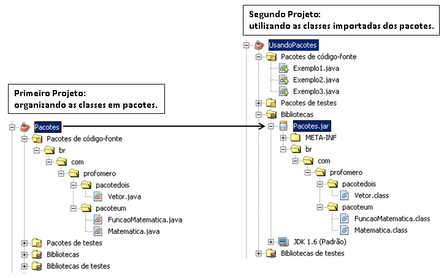

# Programação Orientada a Objetos

## Orientação a Objetos

Você já ouviu falar a expressão, linguagem de baixo e de alto nível?

À medida que a tecnologia vem evoluindo, as linguagens de programação também, e é esta transição natural que determina, quando estamos nos referindo a linguagem de baixo e alto nível.

**Baixo nível**: São linguagens que estão mais próximas da interpretação da máquina, diante do algoritmo desenvolvido. Exemplo: **Linguagem Assembly e C**.

**Alto nível**: São linguagens que disponibilizam uma proposta de sintaxe (forma de escrever processos para serem executados pelo computador) mais próxima da interpretação humana. Exemplo: **Java, JavaScript, Python e C++**

Exemplo de um simples `Hello World` em **Assembly** versus **Python**:

<details>
  <summary>Assembly</summary>

  ```wasm []
  section	.text

    global _start

  _start:

    mov	edx, len

    mov	ecx, msg

    mov	ebx, 1

    mov	eax, 4

    int	0x80

    mov	eax, 1

    int	0x80

  section	.data

  msg	db	'Hello, world!',0xa

  len	equ	$ - msg
  ```

</details>

<details>
  <summary>Java</summary>

  ```java
  System.out.print("Hello, world!");
  ```

</details>

> É bem notória a diferença entre as duas perspectivas de linguagem.

### Programação estruturada

A programação estruturada é um [paradigma de programação](https://stringfixer.com/pt/Programming\_paradigm), que visa melhorar a clareza, a qualidade e o tempo de desenvolvimento de um [programa de computador,](https://stringfixer.com/pt/Computer\_program) fazendo uso extensivo, das construções de fluxo de controle estruturado de seleção ( [if / then / else](https://stringfixer.com/pt/Conditional\_\(computer\_programming\)) ) e repetição (while e [for](https://stringfixer.com/pt/For\_loop) ), [estruturas de bloco](https://stringfixer.com/pt/Block\_\(programming\)) e [sub](https://stringfixer.com/pt/Subroutines) - [rotinas](https://stringfixer.com/pt/Subroutines) .

O que devemos ter em mente, é que na programação estruturada, implementamos algoritmos com estruturas sequenciais denominados de procedimentos lineares, podendo afetar o valor das variáveis de escopo local ou global em uma aplicação.

### Programação orientada a objetos

POO é um [paradigma de programação](https://pt.wikipedia.org/wiki/Paradigma\_de\_programa%C3%A7%C3%A3o), baseado no conceito de "[objetos](https://pt.wikipedia.org/wiki/Objeto\_\(ci%C3%AAncia\_da\_computa%C3%A7%C3%A3o\))", que podem conter [dados](https://pt.wikipedia.org/wiki/Dados) na forma de [campos](https://pt.wikipedia.org/wiki/Campo\_\(ci%C3%AAncia\_da\_computa%C3%A7%C3%A3o\)), também conhecidos como _atributos_, e códigos, na forma de [procedimentos](https://pt.wikipedia.org/wiki/Procedimento), também conhecidos como [métodos](https://pt.wikipedia.org/wiki/M%C3%A9todo\_\(programa%C3%A7%C3%A3o\)).

O que precisamos entender, é que cada vez mais as linguagens se adequam ao cenário real, proporcionando assim, que o programador desenvolva algoritmos mais próximo de fluxos comportamentais, logo, tudo ao nosso redor é representado como Objeto.

> Enquanto a programação estruturada é voltada a procedimentos e funções definidas pelo usuário, a programação orientada a objetos é voltada a conceitos, como o de classes e objetos.

### Classes e Objetos

Para compreendermos exatamente do que se trata a orientação a objetos, vamos entender quais são os requerimentos de uma linguagem para ser considerada nesse paradigma. Para isso, a linguagem precisa atender sobre o conceito de classes e os quatro pilares da orientação a objetos.

Primeiramente, devemos compreender que o conceito orientado a objetos, recomenda que toda estrutura de nosso código baseada a objeto seja um **Identificador**, **Características** e **Comportamentos**.

Toda a estrutura de código na linguagem Java é distribuído em arquivos com extensão **.java** denominados de **classe**.

As classes existentes em nosso projeto, serão composta por:

**Identificador**, **Características** e **Comportamentos**.

- **Classe** _(class)_: A estrutura e/ou representação que direciona a criação dos objetos de mesmo tipo.
- **Identificador** (identity): Propósito existencial aos objetos que serão criados.
- **Características** _(states)_**:** Também conhecido como **atributos** ou **propriedades**, é toda informação que representa o estado do objeto.
- **Comportamentos** _(behavior)_**:** Também conhecido como **ações** ou **métodos**, é toda parte comportamental que um objeto dispõe.
- **Instanciar** _(new)_**:** É o ato de criar um objeto a partir de estrutura, definida em uma classe.

#### Estrutura

Para ilustrar as etapas de desenvolvimento orientada a objetos em Java, iremos reproduzir a imagem abaixo em forma de código para explicar que primeiro criamos a estrutura correspondente, para assim criá-los com as características e a possibilidade de realização de ações (comportamentos), como se fosse no "mundo real".

<div align="center">
  
</div>

```java
// Criando a classe Student
// Com todas as características e comportamentos aplicados
public class Student {
  String name;
  int age;
  Color color;
  Sex sex;

  void eating(Lunch lunch){
    //NOSSO CÓDIGO AQUI
  }
  void drinking(Juice juice){
    //NOSSO CÓDIGO AQUI
  }
  void running(){
    //NOSSO CÓDIGO AQUI
  }
}
```

#### Instâncias

Uma instância é ação de criar um objeto. Quando dizemos que `John` pertence a classe `Student`, podemos dizer que `John` é uma instância da classe `Student`, da mesma forma, `Sophia` e `Lily` também são instâncias da classe `Student`.

```java
// Criando objetos a partir da classe Student
public class School {
  public static void main(String[] args) throws Exception {
    Student student1 = new Student();
    student1.name= "John";
    student1.age= 12;
    student1.color= Color.FAIR;
    student1.sex= Sex.MALE;

    Student student2 = new Student();
    student2.name= "Sophia";
    student2.age= 10;
    student2.color= Color.FAIR;
    student2.sex= Sex.FEMALE;

    Student student3 = new Student();
    student3.name= "Lily";
    student3.age= 11;
    student3.color= Color.DARK;
    student3.sex= Sex.FEMALE;
  }
}
```

> [!WARNING]
> No exemplo acima, **NÃO** estruturamos a classe `Student` com o padrão Java Beans **getters** e **setters**.

Seguindo algumas convenções, as nossas classes são classificadas como:

- **Classe de modelo (model)**: classes que representam estrutura de domínio da aplicação, exemplo: Cliente, Pedido, Nota Fiscal e etc.
- **Classe de serviço (service)**: classes que contém regras de negócio e validação de nosso sistema.
- **Classe de repositório (repository)**: classes que contém uma integração com banco de dados.
- **Classe de controle (controller)**: classes que possuem a finalidade de disponibilizar alguma comunicação externa, à nossa aplicação, como http web ou web-services.
- **Classe utilitária (util)**:  classe que contém recursos comuns, à toda nossa aplicação.

<div align="center">
  
</div>

> [!TIP]
> Exercite a distribuição de classes, por papéis dentro da sua aplicação, para que se possa determinar a estrutura mais conveniente, em cada arquivo do seu projeto.

#### Construtores

Aprendemos que as classes são definições estruturais e comportamentais dos objetos que existirão de suas diretrizes, exemplo:

Quando criamos um objeto a partir das definições de uma respectiva denominamos que estamos **construindo** este objeto através do recurso de construtor padrão na linguagem Java.

Vamos imaginar que tem a classe Pessoa onde a mesma determina que cada objeto criado terá as características: Nome, Data Nascimento, Endereço e Telefone:

##### Definindo a classe Pessoa

```java
import java.util.Date;

public class Pessoa {
  String nome;
  Date dataNascimento;
  String endereco;
  Long telefone;
}
```

##### Criando três pessoas com o que denominamos de `construtor padrão`

```java
public class ConstrutorPessoa {
  public static void main(String[] args) {
    Pessoa carlos   = new Pessoa();
    Pessoa lucas    = new Pessoa();
    Pessoa diego    = new Pessoa();

    //Existem 3 pessoas no sistema sem nenhuma característica
  }
}
```

Agora, iremos dizer que nosso contrato (classe) que para uma pessoa existir o nome deverá ser obrigatório no ato da construção deste objeto.

```java
public class Pessoa {
  String nome;
  Date dataNascimento;
  String endereco;
  Long telefone;

  // se o nome do parâmetro for igual, use a palavra reservada this
  // this.nome = nome
  Pessoa (String novoNome){
    nome = novoNome;
  }
}

```

> [!WARNING]
> A classe `ConstrutorPessoa` passará a apresentar um erro na tentativa de criar os objetos, vamos corrigir conforme abaixo:

```java
public class ConstrutorPessoa {
  public static void main(String[] args) {
    Pessoa carlos   = new Pessoa("carlos henrique");
    Pessoa lucas    = new Pessoa("lucas silva");
    Pessoa diego    = new Pessoa("diego felipe");
  }
}
```

> [!CAUTION]
> Não use o recurso de construtores em excesso como forma de abreviar o algorítimo para criação e definições de seus objetos.

#### Enums

Enum, é um tipo especial de classe, onde os objetos são previamente criados, imutáveis e disponíveis por toda aplicação.

Usamos Enum quando o nosso modelo de negócio contém objetos de mesmo contexto, que já existem de forma pré-estabelecida com a certeza de não haver tanta alteração de valores.

##### Exemplos

**Grau de Escolaridade**: Analfabeto, Fundamental, Médio, Superior;

**Estado Civil**: Solteiro, Casado, Divorciado, Viúvo;

**Estados Brasileiros**: São Paulo, Rio de Janeiro, Piauí, Maranhão.

> [!WARNING]
> Não confunda uma lista de constantes com enum.

Enquanto que uma constante é uma variável de tipo com valor imutável, enum é um conjunto de objetos pre-definidos na aplicação.

Como um enum é um conjunto de objetos, logo, estes objetos podem conter atributos e métodos. Veja o exemplo de um enum para disponibilizar os quatro estados brasileiros citados acima, contendo informações de: Nome, Sigla e um método que pega o nome do de cada estado e já retorna para todo maiúsculo.

```java
// Criando o enum EstadoBrasileiro para ser usado em toda a aplicação.
public enum EstadoBrasileiro {
	SAO_PAULO ("SP","São Paulo"),
	RIO_JANEIRO ("RJ", "Rio de Janeiro"),
	PIAUI ("PI", "Piauí"),
	MARANHAO ("MA","Maranhão") ;

	private String nome;
	private String sigla;

	private EstadoBrasileiro(String sigla, String nome) {
		this.sigla = sigla;
		this.nome = nome;
	}
	public String getSigla() {
		return sigla;
	}
	public String getNome() {
		return nome;
	}
	public String getNomeMaiusculo() {
		return nome.toUpperCase();
	}
}
```

##### Boas práticas para criar objetos Enum

- As opções (objetos), devem ser descritos em caixa alta separados por underline (**\_**_),_ ex.: OPCAO\_UM, OPCAO\_DOIS;
- Após as opções, deve-se encerrar com ponto e vírgula "**;"** ;
- Um enum é como uma classe, logo, poderá ter atributos e métodos tranquilamente;
- Os valores dos atributos, devem já ser definidos após cada opção, dentro de parênteses como se fosse um `new`;
- O construtor deve ser privado;
- Não é comum um enum possuir o recurso `setter`(alteração de propriedade), somente os métodos `getters` correspondentes.

Agora **NÃO** precisaremos criar objetos que representam cada estado, toda vez que precisarmos destas informações, basta usar o **enum** acima e escolher a opção (objeto), pré-definido em qualquer parte do nosso sistema.

```java
// qualquer classe do sistema poderá obter os objetos de EstadoBrasileiro
public class SistemaIbge {
	public static void main(String[] args) {
		//imprimindo os estados existentes no enum
		for(EstadoBrasileiro uf: EstadoBrasileiro.values() ) {
		   System.out.println(uf.getSigla() + "-" + uf.getNomeMaiusculo());
		}

		//selecionando um estado a partir das opções disponíveis
		EstadoBrasileiro ufSelecionado = EstadoBrasileiro.PIAUI;

		System.out.println("O estado selecionado foi: " + ufSelecionado.getNome());
	}
}
```

**values() e valueOf()**

O método `values()` retorna um array `[]` contendo todos os elementos disponíveis, logo, é possível realizar uma iteração `for-each` e obter cada elemento, veja o exemplo anteriormente.

O método `valueOf(String name)` é o recurso que converte o valor literal (texto) em um elemento do enum, exemplo:

```java
public class EnumApp {
  public static void main(String[] args) {
    EstadoBrasileiro estadoLocalizado = EstadoBrasileiro.valueOf("RIO_JANEIRO");

    // depois de obter o estado pelo seu identificador
    // conseguimos explorar todos os seus recursos
    System.out.println(estadoLocalizado.getNome());
    System.out.println(estadoLocalizado.getSigla());
    System.out.println(estadoLocalizado.getNomeMaiusculo());
  }
}
```

> [!CAUTION]
> Java é sensível quanto ao aspecto dos literais em maiúsculo e minúsculo, veja o cenário abaixo:

```java
public class EnumApp {
  public static void main(String[] args) {
    //erro
    EstadoBrasileiro estadoLocalizado = EstadoBrasileiro.valueOf("RIO JANEIRO");
    //erro
    EstadoBrasileiro estadoLocalizado = EstadoBrasileiro.valueOf("rio_janeiro");
    // OK
    EstadoBrasileiro estadoLocalizado = EstadoBrasileiro.valueOf("RIO_JANEIRO");
  }
}
```

#### Referência

Uma variável de referência é uma variável que aponta para um objeto de uma determinada classe, permitindo que você acesse o valor de um objeto. Um objeto é uma estrutura de dados composta que contém valores que você pode manipular. Uma variável de referência não armazena seus próprios valores. Em vez disso, quando você faz referência à variável de referência.

Antes de começarmos com a variável de referência, devemos saber sobre os seguintes fatos.

1. Quando criamos um objeto (instância) de classe, o espaço é reservado na memória `heap`.
1. Então, criamos um elemento apontador ou simplesmente chamado variável de referência que simplesmente aponta o objeto (o espaço criado em uma memória heap).

##### Compreendendo a variável de referência

1. A variável de referência é usada para apontar objetos/valores.
2. Classes, interfaces, arrays, enumerações e anotações são tipos de referência em Java. As variáveis de referência contêm os objetos/valores dos tipos de referência em Java.
3. A variável de referência também pode armazenar valor nulo. Por padrão, se nenhum objeto for passado para uma variável de referência, ela armazenará um valor nulo.
4. Você pode acessar os membros do objeto usando uma variável de referência usando a **sintaxe de ponto**.

> [!NOTE]
> Que tal uma ilustração em um contexto no Século XX?

Vamos viajar no tempo para podermos compreender como as nossas variáveis (referências) e objetos interagem entre si nesta majestosa e encantadora jornada que é a programação orientada a objetos.

<div align="center">
  
</div>

##### Definindo os papéis

- Heap (Salão de festas): Espaço reservado para o armazenamento dos objetos
- Objeto (Donzela): Ser que reside na memória `heap` da aplicação.
- Referência (Cavalheiro): Variável que irá conduzir o objeto referenciado

##### Interação de objetos versus referência

Imaginamos que o salão de festas `heap` está aberto para receber seus participantes aonde cada donzela `new Donzela()` aguardará o convite para uma dança de um determinado cavalheiro `referência`.

Pontos complementares:

1. Cada donzela no salão é uma instância de objeto.
2. Um cavalheiro sem uma donzela poderá escolher partir.
3. É super natural a mudança entre os pares `referência` e `objeto`.
4. Os objetos serão acessados somente através da sua referência.
5. Não é muito comum mas possível um objeto ser referenciado por duas ou mais variáveis.
6. Duas donzelas gêmeas ou de nomes iguais ainda assim são objetos diferentes.

> [!WARNING]
> Sabemos que este conteúdo é muito abstrato, mas este conceito é extramente relevante para termos uma compreensão de como JVM gerencia seu espaço em memória.
>
> Tire uns minutinhos para enriquecer seus conhecimentos na arte e na dança. [Link](https://www.youtube.com/watch?v=c-rwO3Hnabc)

### Pacotes e Importações

A linguagem Java, é composta por milhares de classes, com as finalidades de por exemplo: Classes de tipos de dados, representação de texto, números, datas, arquivos e diretórios, conexão com banco de dados, entre outras. Imagina todas estas classes, existindo em um único nível de documentos? E as classes desenvolvidas por nós meros desenvolvedores nas aplicações de variadas finalidades? Imagina como ficaria este diretório **hein!?**

#### Conceito

<div align="center">
  
</div>

Para prevenir este acontecimento, a linguagem dispõe de um recurso que organiza as classes padrões versus as criadas por nós ou pelo resto do mundo que conheceremos a partir de agora como pacote (package). Os pacotes são subdiretórios, a partir da pasta src do nosso projeto, onde estão localizadas as classes da linguagem e novas que forem criadas para o projeto. Existem algumas convenções para criação de pacotes já utilizadas no mercado.

<div align="center">
  
</div>

#### Ilustração

Vamos imaginar, que sua empresa se chama **Power Soft** e ela está desenvolvendo software comercial, governamental e um software livre ou de código aberto. Abaixo teríamos os pacotes sugeridos conforme tabela abaixo:

- **Comercial** : com.powersoft;
- **Governamental** : gov.powersoft;
- **Código aberto**: org.powersoft.

Bem, acima já podemos perceber que existe uma definição, para o uso do nome dos pacotes, porém, podemos organizar ainda mais um pouco as nossas classes, mediante a proposta de sua existência:

- **model** : Classes que representam a camada e modelo da aplicação : Cliente, Pedido, NotaFiscal, Usuario;
- **repository**: Classes ou interfaces que possuem a finalidade de interagir com tabelas no banco de dados: ClienteRepository;
- **service**: Classes que contém regras de negócio do sistema : ClienteService possui o método validar o CPF, do cliente cadastrado;
- **controller**: Classes que possuem a finalidade de, disponibilizar os nossos recursos da aplicação, para outras aplicações via padrão HTTP;
- **view**: Classes que possuem alguma interação, com a interface gráfica acessada pelo usuário;
- **util**: Pacote que contém, classes utilitárias do sistema: FormatadorNumeroUtil, ValidadorUtil.

#### Identificação

Uma das características de uma classe é a sua identificação: Cliente, NotaFiscal, TituloPagar. Porém quando esta classe é organizada por pacotes, ela passa a ter duas identificações. O nome simples (**próprio nome**) e agora o nome qualificado (**endereçamento do pacote + nome**), exemplo: Considere a classe `Usuario`, que está endereçada no pacote `com.controle.acesso.model`, o nome qualificado desta classe é **`com.controle.acesso.model.Usuario`**.

#### package vs import

A localização de uma classe é definida pela palavra reservada package, logo, uma classe só contém, uma definição de package no arquivo, sempre na primeira linha do código. Para a utilização de classes existentes em outros pacotes, necessitamos realizar a importação das mesmas seguindo a recomendação abaixo:

```java
package

import ...
import ...

public class MinhaClasse {
}
```

##### Por que é tão importante compreender de pacotes?

A linguagem Java, é composta por milhares de classes internas, classes desenvolvidas em projetos disponíveis através de bibliotecas e as classes do nosso projeto. Logo, existe uma enorme possibilidade da existência de classes de mesmo nome.&#x20;

É nesta hora, que nós desenvolvedores precisamos detectar, qual classe iremos importar em nosso projeto.

Um exemplo clássico é, a existência das classes **`java.sql.Date`** e **`java.util.Date`** da própria linguagem, recomendo você leitor, pesquisar sobre a diferença das duas classes.

#### Revisão

Imagina que você resolveu criar sua lista de amigos onde cada `amigo` com (nome, apelido, data de nascimento) contenha dados de `contato` com (email, whatsapp, nickname instagram) e `endereço` com (logradouro, numero, cidade, sigla do estado).

- Defina a estrutura de classes que achar necessária
- Crie instâncias de ao menos 03 dos seus melhores amigos
- Imprima informações aleatórias de cada amigo, exemplo: `Gleyson Sampaio tem o email gleyson@digytal.com.br`

<div align="center">
  
</div>

### Equals versus ==

**== versus equals:** Quando estamos comparando valores primitivos, como `int`, `double`, `float`, `long`, `short`, `byte`, `char`, `boolean`, usamos o operador `==`. Quando estamos comparando objetos, usamos o método `equals`.

#### Comparações Avançadas

Quando se refere a comparação de conteúdos na linguagem, devemos ter um certo domínio, de como o Java trata o armazenamento destes valores na memória.

> [!TIP]
> Quando estiver mais familiarizado com a linguagem, recomendamos se aprofundar no conceito de espaço em memória **Stack** versus **Heap**.

Vamos a alguns exemplos para ilustrar:

Valor e referência: Precisamos entender que em Java tudo é objeto, logo, objetos diferentes podem ter as mesmas características, mas lembrando, são objetos diferentes.

```java
// ComparacaoAvancada.java
public static void main(String[] args) {
  String nome1 = "JAVA";
  String nome2 = "JAVA";

  System.out.println(nome1 == nome2); //true

  String nome3 = new String("JAVA");

  System.out.println(nome1 == nome3); //false

  String nome4 = nome3;

  System.out.println(nome3 == nome4); //true

  //equals na parada
  System.out.println(nome1.equals(nome2)); //??
  System.out.println(nome2.equals(nome3)); //??
  System.out.println(nome3.equals(nome4)); //??
}
```

#### Comparando números wrappers

```java
// ComparacaoAvancada.java
public static void main(String[] args) {
  int numero1 = 130;
  int numero2 = 130;
  System.out.println(numero1 == numero2); //true

  Integer numero1 = 130;
  Integer numero2 = 130;


  System.out.println(numero1 == numero2); //false
  //uma grande pegadinha, até 127 o resultado seria true

  // A razão pela qual o resultado é false, é devido o Java tratar os valores
  // Como objetos a partir de agora.
  // Qual a solução ?
  // Quando queremos comparar objetos, usamos o método equals
  System.out.println(numero1.equals(numero2));
}
```

#### Comparando objetos

Chegou o momento mais temido ao tratar comparação de valores, a fomosa comparação entre objetos na linguagem Java.

Vamos imaginar que uma fábrica de automóveis acaba de fabricar 05 veículos da mesma, cor, marca e modelo.
Transcrevendo para Java, esta seria a estrutura de código:

```java
//arquivo Carro.java
class Carro {
  //atributos de mesmo tipo
  String cor, marca, modelo;

  //construtor
  Carro (String cor, String marca, String modelo){
    this.cor = cor;
    this.marca = marca;
    this.modelo = modelo;
  }
}

//arquivo FabricaCarro.java
public class FabricaCarro {
  public static void main (String [] args){
    Carro carro1 = new Carro("branca","fiat","palio");
    Carro carro2 = new Carro("branca","fiat","palio");
    Carro carro3 = new Carro("branca","fiat","palio");
    Carro carro4 = new Carro("branca","fiat","palio");
    Carro carro5 = new Carro("branca","fiat","palio");

    //case01
    System.out.println(carro1 == carro2); //false
    //case02
    System.out.println(carro1.equals(carro2)); //false
  }
}
```

> [!WARNING]
> Mesmo objetos contendo as mesmas características ainda serão considerados objetos diferentes até que você determine algum atributo de identificação utilizando `equals` e `hashcode`

#### Melhorando nosso contexto

```java
//arquivo Carro.java
class Carro {
  //atributos de mesmo tipo
  String cor, marca, modelo;

  //construtor
  Carro (String cor, String marca, String modelo){
      this.cor = cor;
      this.marca = marca;
      this.modelo = modelo;
  }

  //identificador de igualdade
  //os 3 atributos precisem ser idênticos
  @Override
  public boolean equals(Object o) {
    if (this == o) return true;
    if (o == null || getClass() != o.getClass()) return false;
    Carro carro = (Carro) o;
    return Objects.equals(cor, carro.cor) && Objects.equals(marca, carro.marca) && Objects.equals(modelo, carro.modelo);
  }

  @Override
  public int hashCode() {
    return Objects.hash(cor, marca, modelo);
  }
}

//arquivo FabricaCarro.java
public class FabricaCarro {
  public static void main (String [] args){
    Carro carro1 = new Carro("branca","fiat","palio");
    Carro carro2 = new Carro("branca","fiat","palio");
    Carro carro3 = new Carro("branca","fiat","palio");
    Carro carro4 = new Carro("branca","fiat","palio");
    Carro carro5 = new Carro("branca","fiat","palio");

    //case01
    System.out.println(carro1 == carro2); //false
    //case02
    System.out.println(carro1.equals(carro2)); //true
    System.out.println(carro1.equals(carro3)); //true
    System.out.println(carro1.equals(carro4)); //true
    System.out.println(carro1.equals(carro5)); //true

    //case03
    Carro carro6 = carro1; // não é um novo carro, mas sim, uma referência ao mesmo carro
    System.out.println(carro6 == carro1); //??
    System.out.println(carro6.equals(carro1)); //??
  }
}
```

> [!WARNING]
> Agora mesmo sendo objetos diferentes, eles são considerados idênticos diante das características.

### Hora da verdade

Com base no cenário acima, como você implementaria a classe Carro de forma que uma fábrica de automóveis tivesse controle de cada veículo fabricado individualmente mesmo onde os mesmos pudessem ter a mesma cor, marca e modelo ?

> [!NOTE]
> O que faria um veículo ser único no mundo real ?

<div align="center">
  
</div>

> [!TIP]
> O que precisamos compreender é que: enquanto o `==` compara referência de objetos, o método `equals` compara características. Logo se duas variáveis apontam para um mesmo objeto `==` logo ao usar `equals` será `true`.
