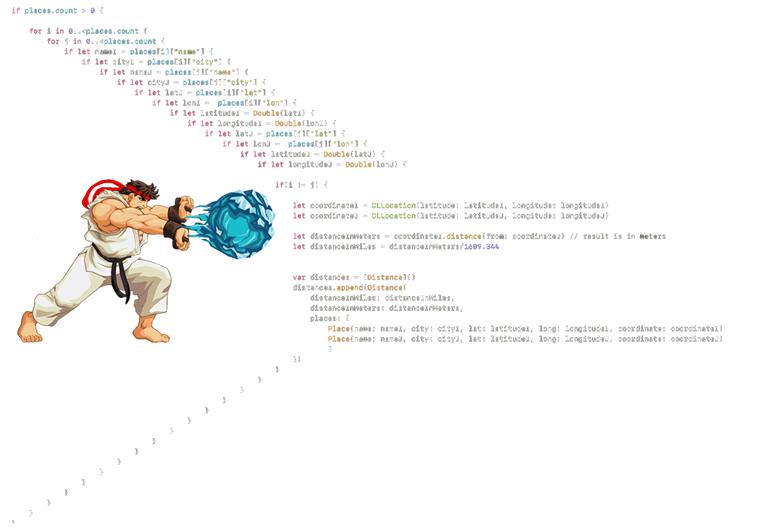
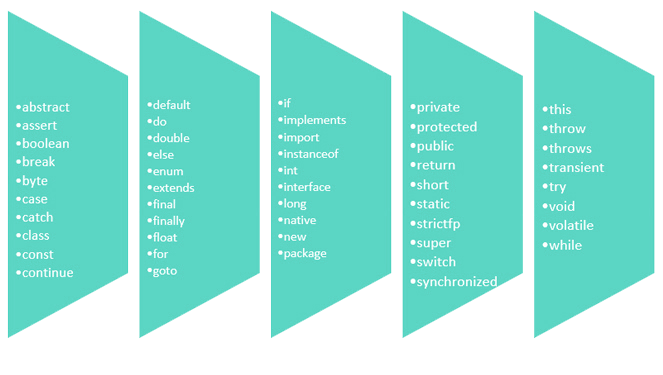
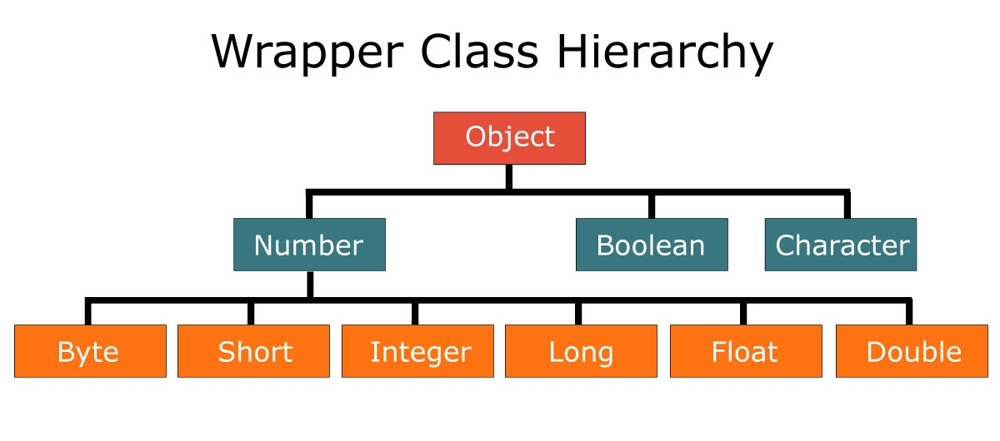
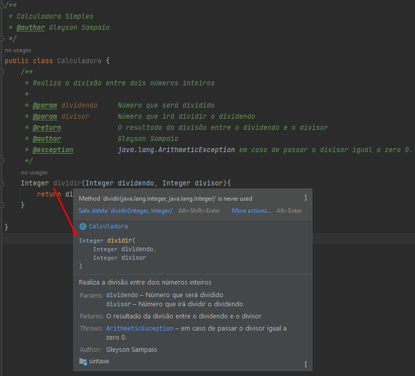
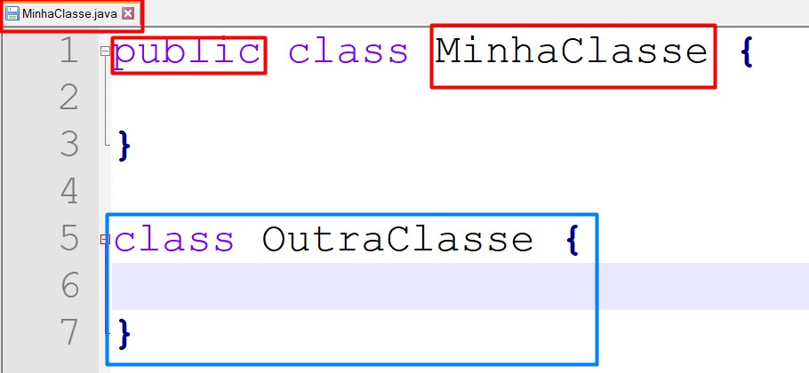
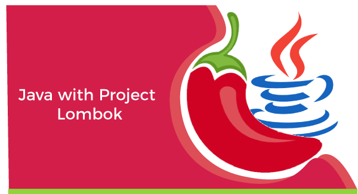

# Sintaxe

## Sintaxe e Semântica

Tudo na vida possui forma e conteúdo, mas um bom conteúdo com forma ruim é um problema, e uma forma bacana com conteúdo ruim é pior ainda.

Projetar software é lidar com isso toda hora. Modelos, especificações, código, e precisam de uma boa forma (sintaxe) e um bom conteúdo (semântica).

Entender como ter qualidade na sintaxe e na semântica é fundamental.

Quanto à semântica, de um modo geral é o estudo do significado das coisas (do conteúdo das “formas”). Na Engenharia de Software, quando falamos de semântica nos referimos ao significado dos modelos, ao nível de entendimento (clareza, objetividade, detalhamento, coesão, etc.) de algo.

Por exemplo: uma redação bem escrita (sem erros de concordância, gramática, etc.), mas com um texto ruim (sem contexto, sem concordância, com uma estória confusa, sem clareza e fluídez) possui boa “sintaxe”, mas uma “semântica” ruim.

## Anatomia e Escopo

Em Ciência da Computação escopo é um contexto delimitante aos quais valores e expressões estão associados. Linguagens de programação têm diversos tipos de escopos. O tipo de escopo vai determinar quais tipos de entidades este pode conter e como estas são afetadas, em outras palavras, a sua semântica.

Normalmente, o escopo é utilizado para definir o grau de ocultação da informação, isto é, a visibilidade e acessibilidade às variáveis em diferentes partes do programa.

Escopos podem:

- Conter declarações ou definições de identificadores;
- Conter instruções e/ou expressões, que definem um algoritmo executável ou parte dele;
- Aninhar ou ser aninhados.

> [!NOTE]
> Em resumo, escopo é a acessibilidade de objetos, variáveis e funções em diferentes partes do código.

A grande maioria das linguagens oferecem uma estrutura bem definida de codificação, seguindo o pseudocódigo conforme abaixo:

```java
class {
  // escopo global ou de classe
  globalNumber = 10

  methodOne(){
    // escopo de método
    myNumber = 1
    print(globalNumber)  // 10
  }

  methodTwo(){
    // escopo de método
    myNumber = 1

    // escopo de bloco ou de fluxo
    if(true){
      yourNumber = 2
      myNumber = yourNumber
    }

    print(myNumber) // 2
    print(yourNumber) // error - acesso somente dentro do fluxo
  }
}
```

**Exemplo**

Uma parte fundamental na elaboração de algoritmos simples ou complexos é determinar a  localização do código em questão. Sem um domínio sobre escopo de códigos, seu projeto tende a conter falhas estruturais e comprometer a proposta principal da aplicação.&#x20;

```java
public class Conta {
  // variável da classe conta
  double saldo = 10.0;

  public void sacar(Double valor) {
    // variável do método
    double novoSaldo = saldo - valor;
  }

  public void imprimirSaldo(){
    // disponível em toda classe
    System.out.println(saldo);
    // somente o método sacar conhece esta variável
    System.out.println(novoSaldo);
  }
}
```

> [!TIP]
> O exemplo ilustrado acima segue as diretrizes recomendadas e aplicadas em qualquer projeto acadêmico ou corporativo. A seguir você terá mais esclarecimentos destas regras e convenções de escrita.

### Anatomia das classes

Um dos principais recursos que utilizamos no paradigma de orientação a objetos são as classes, com elas podemos abstrair e criar representações do mundo real para o código.

```java
public class MinhaClasse {
  // SEU CÓDIGO AQUI
}
```

- 99,9% das nossas classes iniciarão com `public class`.
- Toda classe precisa de nome, exemplo `MinhaClasse`.
- Após o nome, precisamos definir o corpo { } onde iremos compor nossas classes com atributos e métodos.

````java
public class MinhaClasse {
  // CORPO DA CLASSE

  public static void main(String[] args) {
    // CORPO DO MÉTODO MAIN
  }
}
````

- É de suma importância, que agora você consiga se localizar,dentro do conjunto de chaves { } existentes em sua classe.
- Dentro de uma aplicação, **recomenda-se que somente uma classe possua o método** `main`, responsável por iniciar todo o nosso programa.
- O método main recebe seu nome main, sempre terá a visibilidade public, será definido como static, não retornará nenhum valor com `void`,e receberá um parâmetro do tipo array de caracteres `String[]`.

**Padrão de nomenclatura**

Quando se trata de escrever códigos na linguagem Java, é recomendado seguir algumas convenções de escrita. Esses padrões estão expressos nos itens abaixo:

- Arquivo .java: Todo arquivo .java deve começar com letra MAIÚSCULA. Se a palavra for composta, a segunda palavra deve também ser maiúscula, exemplo:

  `Calculadora.java`, `CalculadoraCientifica.java`

- Nome da classe no arquivo: A classe deve possuir o mesmo nome do arquivo.java, exemplo:

  ```java
  // arquivo CalculadoraCientifica.java

  public class CalculadoraCientifica {

  }
  ```

### Variáveis e métodos

Como identificar a diferença entre, declaração de variáveis e métodos em nossa programação? Existe uma estrutura comum para ambas as finalidades, exemplo:

```java
// Estrutura
Tipo NomeBemDefinido = Atribuicao (opcional em alguns casos)

// Exemplo

int idade = 23;
double altura = 1.62;
Dog spike; //observe que aqui a variável spike não tem valor, é normal
```

Uma variável é um meio de armazenar dados em memória. Em outras palavras, ela funciona como um container para valores em um programa

Nome de variável: toda variável deve ser escrita com letra minúscula, porém se a palavra for composta, a primeira letra da segunda palavra deverá ser MAIÚSCULA, exemplo: `ano` e `anoFabricacao`. O nome dessa prática para nomear variáveis dessa forma se chama **camelCase**.

> [!NOTE]
> Existe uma regra adicional para variáveis, quando na mesma queremos identificar que ela não sofrerá alteração de valor, exemplo: queremos determinar que uma variável de nome br sempre representará "Brasil" e nunca mudará seu valor, logo, determinamos como escrita o código abaixo:

```java
String BR = "Brasil"
double PI = 3.14
int ESTADOS_BRASILEIRO = 27
int ANO_2000 = 2000
```

> [!CAUTION]
> Recomendações: Para declarar uma variável nós podemos utilizar caracteres, números e símbolos, porém, devemos seguir algumas regras da linguagem.

- Deve conter apenas letras, `_` (underline), `$` ou os números de `0 a 9`;
- Deve obrigatoriamente se iniciar por uma letra (preferencialmente), `_` ou `$`, jamais com número;
- Deve iniciar com uma letra minúscula (boa prática – ver abaixo);
- Não pode conter espaços;
- Não podemos usar palavras-chave da linguagem;
- O nome deve ser único dentro de um escopo.

```java
// Declaração inválida de variáveis
int numero&um = 1; // Os únicos símbolos permitidos são _ e $
int 1numero = 1;    // Uma variável não pode começar com numérico
int numero um = 1; // Não pode ter espaço no nome da variável
int long = 1; // long faz parte das palavras reservadas da linguagem

// Declaração válida de variáveis
int numero$um = 1;
int numero1 = 1;
int numeroum = 1; // ou numeroUm
int longo = 1;
```

- Estrutura de declaração de métodos:

  As mesmas regras estruturais de variáveis se aplicam a métodos, em breve iremos abordar mais convenções e estruturação de métodos.

  ```java
  // Estrutura
  TipoRetorno NomeObjetivoNoInfinitivo Parametro(s)

  // Exemplo

  int somar (int numeroUm, int numero2)

  String formatarCep (long cep)
  ```

> [!WARNING]
> Como parte da estrutura de declaração de variáveis e métodos, também temos o aspecto da **visibilidade**, mas ainda não é necessário nesta etapa de estudos.

### Indentação

Basicamente **indentar** é um termo utilizado para escrever o código do programa de forma hierárquica, facilitando assim a visualização e o entendimento do programa.

<div align="center">
  
</div>

Abaixo, veja um exemplo de um algoritmo de validação, de aprovação de estudante.

<details>
  <summary>Sem identação:</summary>

  ```java
  // arquivo BoletimEstudantil.java

  public class BoletimEstudantil {
  public static void main(String[] args) {
  int mediaFinal = 6;
  if(mediaFinal<6)
  System.out.println("REPROVADO");
  else if(mediaFinal==6)
  System.out.println("PROVA MINERVA");
  else
  System.out.println("APROVADO");
  }
  }
  ```

</details>

<details>
  <summary>Com identação:</summary>

  ```java
  public class BoletimEstudantil {
    public static void main(String[] args) {
      int mediaFinal = 6;
      if (mediaFinal < 6)
        System.out.println("REPROVADO");
      else if (mediaFinal == 6)
        System.out.println("PROVA MINERVA");
      else
        System.out.println("APROVADO");
    }
  }
  ```

</details>

### Hora da verdade

Que tal colocar em prática tudo o que apresentamos agora?

Tente criar uma classe Conta Corrente contendo os atributos e métodos listados abaixo.


> [!TIP]
> O ponto mais relevante, em compreender a definição dos tipos de dados é o momento da definição do tipo para uma variável.
> Se precisar de mais uma ajudinha, consulte o [Link](https://www.youtube.com/watch?v=CrbSqRk9vw0&list=PL8NbPylKQ8NlRzFoqlC2iA1Dxcqvk7uSZ&index=12) em nosso canal.

## Palavras Reservadas

Palavras reservadas do java, ou keywords(palavras-chave), são palavras que possuem significado especifico no código.

A linguagem contém 52 palavras distribuídas em categorias com finalidades e fronteiras de uso bem definidas conforme tabela abaixo:

### Descrevendo as palavras

As palavras reservadas na linguagem Java possuem regras de identificação e utilização conforme descrição abaixo:



- Todas as palavras reservadas são minúsculas
- Nenhuma palavra reservada poderá ser utilizada definir nome de variáveis e métodos
- As palavras reservas determinam recursos ou características de forma individual ou agrupada para o seu algorítimo
- Conhecer e compreender todas as 52 palavras reservadas leva tempo e prática

### Agrupando as palavras

Para uma melhor interpretação e compreensão do uso das palavras reservadas em nosso cotidiano, é necessário primeiramente, uma organização e classificação das mesmas. Sendo assim, será mais fácil compreender sua aplicabilidade

**Modificadores de acesso**

| Palavra   | Descrição                                       | Classe | Variável | Método |
| --------- | ----------------------------------------------- | :----: | :------: | :----: |
| public    | Acesso de qualquer classe                       |   X    |    X     |   X    |
| private   | Acesso apenas dentro da classe                  |   X    |    X     |   X    |
| protected | Acesso por classes no mesmo pacote e subclasses |   X    |    X     |   X    |

**Tipos primitivos**

| Palavra | Descrição                                     | Classe | Variável |   Método   |
| ------- | --------------------------------------------- | :----: | :------: | :--------: |
| boolean | um valor indicando verdadeiro ou falso        |        |    X     | no retorno |
| byte    | um inteiro de 8 bits (signed)                 |        |    X     | no retorno |
| char    | um carácter Unicode (16bit unsigned) (signed) |        |    X     | no retorno |
| double  | um carácter Unicode (16bit unsigned) (signed) |        |    X     | no retorno |
| float   | um número de ponto flutuante de 32 bits       |        |    X     | no retorno |

**Modificadores de classes, variáveis ou métodos**

| Palavra      | Descrição                                                                                                                                          | Classe | Variável | Método |
| ------------ | -------------------------------------------------------------------------------------------------------------------------------------------------- | :----: | :------: | :----: |
| abstract     | classe que não pode ser instanciada ou método que precisa ser implementado, por uma subclasse não abstrata                                         |   X    |          |        |
| class        | especifica uma classe                                                                                                                              |   X    |          |        |
| extends      | indica a superclasse que a subclasse está estendendo                                                                                               |   X    |          |        |
| final        | impossibilita que uma classe seja estendida, que um método seja sobrescrito ou que uma variável seja reinicializada                                |   X    |    X     |   X    |
| implements   | indica as interfaces que uma classe irá implementar                                                                                                |   X    |          |        |
| interface    | especifica uma interface                                                                                                                           |   X    |          |        |
| native       | indica que um método está escrito em uma linguagem dependente de plataforma, como o C                                                              |        |          |   X    |
| new          | instancia um novo objeto, chamando seu construtor                                                                                                  |        |    X     |        |
| static       | faz um método ou variável pertencer à classe ao invés de às instâncias                                                                             |        |    X     |        |
| strictfp     | usado em frente a um método ou classe para indicar que os números de ponto flutuante seguirão as regras de ponto flutuante, em todas as expressões |        |          |   X    |
| synchronized | indica que um método só pode ser acessado por uma thread de cada vez                                                                               |        |          |   X    |
| transient    | impede a serialização de campos                                                                                                                    |        |    X     |        |
| volatile     | indica que uma variável pode ser alterada durante o uso de threads                                                                                 |        |    X     |        |

**Controle de fluxo dentro de um bloco de código**

| Palavra    | Descrição                                                                                                                                      | Classe | Variável | Método |
| ---------- | ---------------------------------------------------------------------------------------------------------------------------------------------- | :----: | :------: | :----: |
| break      | sai do bloco de código em que ele está                                                                                                         |        |          | fluxo  |
| case       | executa um bloco de código dependendo do teste do switch                                                                                       |        |          |   X    |
| continue   | pula a execução do código que viria, após essa linha e vai para a próxima passagem do loop                                                     |        |          | fluxo  |
| default    | executa esse bloco de código caso nenhum dos teste de switch-case seja verdadeiro                                                              |        |          |   X    |
| do         | executa um bloco de código uma vez, e então realiza um teste em conjunto com o while para determinar se o bloco deverá ser executado novamente |        |          |   X    |
| else       | executa um bloco de código alternativo caso o teste "if" seja falso                                                                            |        |          |   X    |
| for        | usado para realizar um loop condicional de um bloco de código                                                                                  |        |          |   X    |
| if         | usado para realizar um teste lógico de verdadeiro ou falso                                                                                     |        |          |   X    |
| instanceof | determina se um objeto é uma instância de determinada classe, superclasse ou interface                                                         |        |          |   X    |
| return     | retorna um método sem executar qualquer código, que venha depois desta linha (também pode retornar uma variável)                               |        |          |   X    |
| switch     | indica a variável a ser comparada nas expressões case                                                                                          |        |          |   X    |
| while      | executa um bloco de código repetidamente enquanto a condição for verdadeira                                                                    |        |          |   X    |

**Tratamento de erros**

| Palavra | Descrição                                                                                                                   | Classe | Variável |   Método   |
| ------- | --------------------------------------------------------------------------------------------------------------------------- | :----: | :------: | :--------: |
| assert  | testa uma expressão condicional, para verificar uma suposição do programador                                                |        |          |     X      |
| catch   | declara o bloco de código usado para tratar uma exceção                                                                     |        |          |     X      |
| finally | bloco de código, após um try-catch, que é executado independentemente do fluxo de programa seguido ao lidar com uma exceção |        |          |     X      |
| throw   | usado para passar uma exceção para o método que o chamou                                                                    |        |          |     X      |
| throws  | indica que um método pode passar uma exceção para o método que o chamou                                                     |        |          | assinatura |
| try     | bloco de código que tentará ser executado, mas que pode causar uma exceção                                                  |        |          |     X      |

**Controle de pacotes**

| Palavra | Descrição                                                          | Classe | Variável | Método |
| ------- | ------------------------------------------------------------------ | :----: | :------: | :----: |
| import  | importa pacotes ou classes para dentro do código                   |   X    |          |        |
| package | especifica a que pacote, todas as classes de um arquivo pertencem. |   X    |          |        |

**Variáveis de referência**

| Palavra | Descrição                             | Classe | Variável | Método |
| ------- | ------------------------------------- | :----: | :------: | :----: |
| super   | refere-se a superclasse imediata      |        |          |   X    |
| this    | refere-se a instância atual do objeto |        |          |   X    |

**Palavras reservadas não utilizadas**

| Palavra | Descrição                                                           | Classe | Variável | Método |
| ------- | ------------------------------------------------------------------- | :----: | :------: | :----: |
| const   | não utilize para declarar constantes                                |        |          |        |
| goto    | não implementada na linguagem Java, por ser considerada prejudicial |        |          |        |

### Combinação de palavras

Abaixo, iremos exercitar algumas das possibilidades mais recorrentes em combinar o uso das palavras reservadas a níveis de: Classe, Atributos e Métodos

| Nível    | Combinação           | Explicação                                                             |
| -------- | -------------------- | ---------------------------------------------------------------------- |
| classe   | public class         | Determina que a classe é pública                                       |
| classe   | abstract class       | Determina que a classe é abstrata                                      |
| classe   | final class          | Determina que a classe é final e não pode ser herdada                  |
| classe   | class A extends B    | Determina que a classe A herda da classe B                             |
| classe   | class A implements B | Determina que a classe A implementa a interface B                      |
| atributo | public static        | Determina que o atributo é público e estático (nível de classe)        |
| atributo | public static final  | Determina que o atributo é público, estático e inalterável (constante) |
| método   | abstract void        | Determina que o método é abstrato e sem retorno                        |
| método   | synchronized void    | Determina que o método é sincronizado e sem retorno                    |

> [!WARNING]
> A tabela acima é somente uma ilustração e um direcionamento para você poder fixar um pouco mais o conceito das palavras reservadas na linguagem Java.

### Palavras "opostas"

Assim como nas classificações gramaticais da língua portuguesa, existem algumas palavras que são completamente opostas (antônimas) na linguagem Java conforme tabela abaixo:

| Palavra | Palavra    | Explicação                                                                                                                                                                                                                                                                 |
| ------- | ---------- | -------------------------------------------------------------------------------------------------------------------------------------------------------------------------------------------------------------------------------------------------------------------------- |
| package | import     | Enquanto **package** determina o diretório real da classe, o **import** informa de onde será importada a classe. Isso porque, podemos ter classes de mesmo nome.                                                                                                           |
| extends | implements | enquanto **extends** determina que uma classe estende outra classe, **implements** determina que uma classe implementa uma interface, porém nunca o contrário.                                                                                                             |
| final   | abstract   | enquanto **final** determina fim de alteração de valor ou lógica comportamental, **abstract** em métodos, exige que sub-classes precisarão definir comportamento e um método abstrato. NOTA: Se uma classe contém um único método abstrato, toda classe precisa ser.       |
| throws  | throw      | Esta é uma das situações mais complicadas, de compreensão destas duas palavras. Enquanto a **throws** determina que um método pode lançar uma exceção, **throw** é a implementação que dispara a exceção. **Vamos conhecer mais sobre este conceito no assunto Exceções.** |

## Tipos e Variáveis

Com toda certeza, uma hora ou outra, seja na sua vida acadêmica ou profissional na área de desenvolvimento você já ouviu falar em tipos de variáveis.
Isso se deve ao fato de que o computador tem a necessidade que o programador “explique” para ele o que exatamente quer, da forma mais especificada possível, e no Java não é diferente.

### Tipos primitivos

Em Java, existem palavras reservadas especiais para representar tipos básicos de dados que são essenciais para construir programas. Estes tipos básicos são chamados de tipos primitivos.

> [!IMPORTANT]
> Os oito tipos primitivos em Java são:
> `int`, `byte`, `short`, `long`, `float`, `double`, `boolean` e `char` – esses tipos não são objetos e portanto representam valores brutos. Eles são armazenados diretamente na pilha de memória.

Tabela de Tipos Primitivos e seus valores:

| Tipo  | Memória | Valor Mínimo               | Valor Máximo              |
| ----- | ------- | -------------------------- | ------------------------- |
| byte  | 1 byte  | -128                       | 127                       |
| short | 2 byte  | -32.768                    | 32.767                    |
| int   | 4 bytes | -2.147.483.648             | 2.147.483.647             |
| long  | 8 bytes | -9.223.372.036.854.775.808 | 9.223.372.036.854.775.807 |

Os tipos primitivos, que podem conter partes fracionárias:

| Tipo   | Memória | Valor Mínimo   | Valor Máximo  | Precisão      |
| ------ | ------- | -------------- | ------------- | ------------- |
| float  | 4 bytes | -3,4028E + 38  | 3,4028E + 38  | 6 – 7 dígitos |
| double | 8 bytes | -1,7976E + 308 | 1,7976E + 308 | 15 dígitos    |

Embora o tipo `float` ocupe menos espaço na memória do que o tipo `double`, ele é menos utilizado devido a uma limitação na precisão decimal entre 6 e 7 dígitos.

Com os avanços nos computadores, não há mais a necessidade de se preocupar com o uso dos tipos `short` e `byte`, pois a memória é abundante.

De maneira semelhante, o tipo `long` também é pouco utilizado, pois valores grandes são raros de se trabalhar.

Portanto, na maioria das situações, utilizamos o tipo `int` para representar números inteiros ou `double` para representar números fracionados.

> [!NOTE]
> Devemos compreender que os tipos primitivos sempre terão um valor padrão mesmo NÃO havendo uma atribuição explícita, veja o código abaixo:
>
> ```java
> byte    b; // b=0
> short   s; // s=0
> int     i; // i=0
> long    l; // l=0
>
> float   f; // f=0.0
> double  d; // d=0.0
>
> char    c; // c='\u0000'
> boolean o; // b=false
> ```

### Tipos Wrappers

Os tipos primitivos não são objetos, mas às vezes é necessário trabalhar com eles como se fossem. Por exemplo, quando você precisa passar um valor primitivo como um parâmetro de um método, você precisa converter o valor primitivo em um objeto. Nesse caso, você pode usar os tipos wrappers.

Os **tipos wrappers** são classes que representam os tipos primitivos. Eles são imutáveis, o que significa que uma vez criado um objeto wrapper, seu valor não pode ser alterado para garantir a segurança.



Os seguintes tipos Wrappers estão disponíveis em Java:

```java
Integer     (int)
Long        (long)
Float       (float)
Double      (double)
Short       (short)
Byte        (byte)
Boolean     (boolean)
Character   (char)
```

#### Conversão de Tipos

A conversão de tipos é necessária quando você deseja armazenar um valor de um tipo de dado em uma variável de outro tipo. Por exemplo, você pode armazenar um valor `int` em uma variável de tipo `double` porque o tipo `double` pode armazenar valores inteiros e fracionários.

**Conversão de Tipos Explícita:** é feita por meio de uma expressão de conversão de tipos. Ela é necessária quando você deseja converter um valor de um tipo de dado em outro que não seja compatível com o dado original.

**Conversão de Tipos Implícita:** é feita automaticamente pelo compilador da linguagem não sendo necessário nenhum tipo de demarcação.

```java
// conversão de tipos explicita
double d = 100.0;
int i = (double) d;
System.out.println(i); // 100

// conversão de tipos implícita
double d = 100.0;
int i = d;
System.out.println(i); // 100
```

> [!IMPORTANT]
> O que aconteceria❓
>
> ```java
> // Tentar converter um double de valor 3.75 para um int ?
> double d = 3.75;
> int i = (double) d;
> System.out.println(i); // ???
> ```

### Métodos Wrapper

Os tipos Wrappers em Java oferecem uma série de métodos úteis para a manipulação de tipos primitivos. Alguns desses métodos incluem:

- Métodos de parsing: Esses métodos permitem a conversão de strings em tipos primitivos equivalentes. Por exemplo, o método `parseInt()` pode ser usado para converter uma string em um inteiro, e o método `parseDouble()` pode ser usado para converter uma string em um número de ponto flutuante. Esses métodos são úteis quando você precisa ler dados de uma fonte externa e convertê-los em tipos primitivos.

  ```java
  String num = "100";
  int i = Integer.parseInt(num);
  System.out.println(i); // 100
  ```

- Métodos de conversão: Esses métodos permitem a conversão de tipos primitivos para objetos e vice-versa. Por exemplo, o método `valueOf()` pode ser usado para converter um tipo primitivo em um objeto equivalente, enquanto o método `intValue()` pode ser usado para converter um objeto Integer em um inteiro.

  ```java
  String num = "100";
  Integer obj = Integer.valueOf(n);
  System.out.println(obj); // 100

  Integer obj = new Integer(100);
  int i = obj.intValue();
  System.out.println(i); // 100
  ```

> [!NOTE]
> Em Java muitos métodos possuem uma estrutura denominada de `sobcrecarga`. Isso quer dizer que, métodos que possuem o mesmo nome, mesmo retorno, porém parâmetros diferentes.
>
> ```java
> Integer.valueOf(int i)
> Integer.valueOf(String s)
> ```

- Métodos de comparação: Esses métodos permitem comparar objetos Wrappers para verificar se são iguais ou se um é maior ou menor que o outro. Por exemplo, o método `equals()` pode ser usado para comparar dois objetos Integer para verificar se eles são iguais, enquanto o método `compareTo()` pode ser usado para comparar dois objetos de forma mais geral.

  ```java
  Integer obj1 = new Integer(100);
  Integer obj2 = new Integer(100);
  System.out.println(obj1.equals(obj2)); // true
  System.out.println(obj1.compareTo(obj2)); // 0
  ```

- Métodos de informação: Esses métodos fornecem informações sobre o tipo Wrapper, como o valor mínimo e máximo que pode ser representado. Por exemplo, o método `maxValue()` pode ser usado para obter o valor máximo representável para um tipo Wrapper específico, enquanto o método `minValue()` pode ser usado para obter o valor mínimo representável.

  ```java
  System.out.println(Integer.MAX_VALUE); // 2147483647
  System.out.println(Integer.MIN_VALUE); // -2147483648
  ```

### Tipos customizados

Os tipos customizados são bibliotecas ou **pacotes externos** que não fazem parte por padrão no Java, mas são adicionados ao projeto para fornecer recursos adicionais que podem ser úteis na construção de aplicativos. Então você pode usar esses tipos customizados em seu código para adicionar funcionalidades extras.

Alguns exemplos de tipos customizados incluem:

| Nome do Projeto | Pacote principal      | Finalidade                                                                                                                   |
| :-------------- | :-------------------- | :--------------------------------------------------------------------------------------------------------------------------- |
| Joda Time       | org.joda.time         | Fornece soluções mais avançada de datas e horas incluindo suporte a fusos horários e operações de data/hora mais avançadas.  |
| Gson            | com.google.gson       | Fornece suporte para converter objetos Java em sua representação JSON e vice-versa.                                          |
| Jackson         | com.fasterxml.jackson | Fornece suporte para processamento de JSON, incluindo conversão de objetos Java para e de JSON.                              |
| Apache Commons  | org.apache.commons    | Fornece uma série de utilitários que podem ser usados para tarefas comuns, como manipulação de strings, arquivos e coleções. |
| Apache POI      | org.apache.poi        | Fornece suporte para leitura e escrita de arquivos do Microsoft Office, incluindo arquivos do Excel.                         |
| Apache Log4j    | org.apache.log4j      | Fornece suporte para registro de eventos.                                                                                    |
| Hibernate       | org.hibernate         | Fornece suporte para mapeamento objeto-relacional (ORM).                                                                     |
| Junit           | org.junit             | Fornece suporte para testes unitários.                                                                                       |

#### Por que usar bibliotecas externas?

Elas fornecem uma série de recursos úteis que ajudam a simplificar o desenvolvimento de aplicações Java, economizando tempo e esforço para o desenvolvedor, e essas bibliotecas são amplamente utilizadas na comunidade Java e são bem documentadas, o que significa que há uma ampla comunidade de desenvolvedores que as usam e podem ajudar em caso de dúvidas ou problemas.

#### Como usar bibliotecas externas?

Para usar bibliotecas externas em seu projeto, você precisa adicioná-las ao seu projeto. Existem várias maneiras de fazer isso, mas a maneira mais comum é usar o gerenciador de dependências do Maven. O Maven é um gerenciador de dependências que permite gerenciar as dependências de um projeto Java, incluindo bibliotecas externas.

#### Como adicionar bibliotecas externas ao seu projeto?

Existem várias maneiras de adicionar bibliotecas externas ao seu projeto, mas a maneira mais comum é usar o gerenciador de dependências do Maven. O Maven é um gerenciador de dependências que permite gerenciar as dependências de um projeto Java, incluindo bibliotecas externas.

```xml
<dependency>
  <groupId>com.google.gson</groupId>
  <artifactId>gson</artifactId>
  <version>2.8.6</version>
</dependency>
```

#### Como usar bibliotecas externas em seu código?

Depois de adicionar uma biblioteca externa ao seu projeto, você pode usá-la em seu código. Por exemplo, se você adicionar a biblioteca Gson ao seu projeto, você pode usar a classe Gson para converter objetos Java em sua representação JSON e vice-versa.

```java
import com.google.gson.Gson;

public class Main {
  public static void main(String[] args) {
    Gson gson = new Gson();
    String json = gson.toJson(new int[] { 1, 2, 3, 4, 5 });
    System.out.println(json); // [1,2,3,4,5]
  }
}
```

## Declaração e Atribuição

Declaração e atribuição de variáveis é uma das etapas fundamentais em programação, pois permite armazenar dados na memória do computador para uso futuro. A aplicação de regras claras e precisas ajuda a evitar erros de sintaxe e de lógica, bem como torna o código mais legível e fácil de manter.

Os métodos com e sem retorno também são importantes, pois permitem organizar o código em blocos reutilizáveis e mantê-lo claro e conciso. Os métodos com retorno devolvem um valor, enquanto os métodos sem retorno não retorna nada. É importante escolher a abordagem adequada para cada tarefa.

Finalmente, tornar uma variável uma constante pode ser útil quando você quer garantir que seu valor não mude acidentalmente durante a execução do programa. Isso ajuda a preservar a integridade dos dados e a evitar erros de lógica. Em geral, é uma boa prática usar constantes sempre que possível para garantir que o código seja claro, preciso e fácil de manter.

### Declaração de variáveis

Uma variável é uma referência a um espaço de memória utilizado pelo seu programa. De acordo com as convenções da linguagem de programação, cada variável é composta por três elementos: tipo de dados, identificação e valor atribuído.

A estrutura padrão para se declarar uma variável sempre é:

`<Tipo> <nomeVariável> <atribuiçãoDeValorOpcional>`

Exemplos abaixo:

```java
int idade; //Tipo "int", nome "idade", com nenhum valor atribuído.
int anoFabricacao = 2021; //tipo "int", nome "anoFabricacao", com valor 2021.
double salarioMinimo = 2.500; //tipo "double", nome "salarioMinimo", valor 2.500.
```

> [!IMPORTANT]
> Existe algumas peculiaridades a trabalhar com alguns tipos específicos. Observe no exemplo abaixo:

```java
public class TipoDados {
  public static void main(String[] args) {
    byte idade = 123;
    short ano = 2021;
    int cep = 21070333; // se começar com 0, talvez tenha que ser outro tipo
    long cpf = 98765432109L; // se começar com 0, talvez tenha que ser outro tipo
    float pi = 3.14F;
    double salario = 1275.33;
  }
}
```

> [!TIP]
> Observe que o tipo long precisa terminar com L, o tipo float precisa terminar com F e alguns cenários do dia-a-dia, podem estimular uma alteração de tipos de dados convencional.

Muitas das vezes criamos uma variável, definimos um valor correspondente, manipulamos esta variável e temos consciência de seu valor na aplicação. Mas, cuidado!

> [!WARNING]
> Java é linguagem de programação fortemente "tipado".

Veja o exemplo abaixo:

```java
// TiposEVariaveis.java

short numeroCurto = 1;
int numeroNormal = numeroCurto;
short numeroCurto2 = numeroNormal;

// Mesmo sabendo que numeroNormal é igual a numeroCurto,
// não é possível atribuir a numeroCurto2
```

### Declaração de constantes

As **Constantes**, são valores armazenados em memória que não podem ser modificados depois de declarados. Em Java, esses valores são representados pela palavra reservada `final`, seguida do tipo.
Por convenção, **Constantes** são sempre escritas em CAIXA ALTA.

Abaixo, temos um exemplo explicativo sobre uso de variáveis e constantes:

```java
public class ExemploVariavel {
  public static void main(String[] args) {
    /*
    * esta linha é considerada como declaração de variável iniciamos a existência
    * variável numero com valor 5 regra: tipo + nome + valor
    */
    int numero = 5;

    /*
    * na linha abaixo iremos alterar o valor do variável para 10 observe que o tipo
    * não é mais necessário, pois a variável já foi declarada anteriormente
    */
    numero = 10;

    System.out.print(numero);

    /*
    * ao usar a palavra reservada final, você determina que jamais
    * esta variavel poderá obter outro valor;
    * logo a linha 25 vai apresentar um erro de compilação
    * isso é considerado uma CONSTANTE na linguagem Java
    */
    final double VALOR_DE_PI = 3.14;

    VALOR_DE_PI=3.15; //Esta linha vai apresentar erro de compilação!
  }
}
```

> [!WARNING]
> Compreendemos que, para declarar uma variável como uma constante, utilizamos a palavra `final`, mas por convenção, esta variável deverá ser escrita toda em caixa alta.

### Declaração de métodos

Uma classe é definida por atributos e métodos. Já vimos que atributos são, em sua grande maioria, variáveis de diferentes tipos e valores. Os métodos, por sua vez, correspondem a funções ou sub-rotinas disponíveis dentro de nossas classes.

#### Critério de Nomeação de Métodos

Esses critérios não são obrigatórios, mas é recomendável que sejam seguidos, pois essas convenções facilitam a vida dos programadores ao trabalharem em códigos de forma colaborativa. Ao seguir estas convenções, tornamos o código mais legível para nós e também para outras pessoas. Para métodos, os critérios são:

- Deve ser nomeado como verbo;
- Seguir o padrão camelCase (Todas as letras minúsculas com a exceção da primeira letra da segunda palavra).

Exemplo de nomeação de métodos:

```java
somar(int n1, int n2){}

abrirConexao(){}

concluirProcessamento() {}

findById(int id){}

calcularImprimir(){}
```

### Definindo parâmetros e retorno de métodos

Mas, como sabemos a melhor forma, de definir os métodos das nossas classes? Para chegar à essa conclusão, somos auxiliados por uma convenção estrutural para todos os métodos. Essa convenção é determinada pelos aspectos abaixo:

1. **Qual a proposta principal do método?** Você deve se perguntar constantemente até compreender a real finalidade do mesmo.
2. **Qual o tipo de retorno esperado após executar o método?** Você deve analisar se o método será responsável por retornar algum valor ou não.
3. **Qual o tipo de parâmetro esperado pelo método?** Você deve analisar se o método irá receber algum parâmetro ou não.
4. **O método possui o risco de apresentar alguma exceção?** Exceções são comuns na execução de métodos, as vezes é necessário prever e tratar a possível existência de uma exceção.
5. **Qual a visibilidade do método?** Avaliar se será necessário que o método seja visível a toda aplicação, somente em pacotes, através de herança ou somente a nível a própria classe.

Abaixo, temos um exemplo de uma classe com alguns métodos e suas respectivas considerações:

```java
public class MyClass {
  public double somar(int num1, int num2){
    //LOGICA - FINALIDADE DO MÉTODO
    return ... ;
  }

  public void imprimir(String texto){
    //LOGICA - FINALIDADE DO MÉTODO
    //AQUI NÃO PRECISA DO RETURN
    //POIS NÃO SERÁ RETORNADO NENHUM RESULTADO
  }

  // throws Exception : indica que o método ao ser utilizado
  // poderá gerar uma exceção
  public double dividir(int dividendo, int divisor) throws Exception{}

  // este método não pode ser visto por outras classes no projeto
  private void metodoPrivado(){}

  //alguns equívocos estruturais
  public void validar(){
    //este método deveria retornar algum valor
    //no caso boolean (true ou false)
  }

  public void calcularEnviar(){
    //um método deve representar uma única responsabilidade
  }

  public void gravarCliente(String nome, String cpf, Integer telefone, ....){
    //este método tem a finalidade de gravar
    //informações de um cliente, por que não criar
    //um objeto cliente e passar como parâmetro ?
    //veja abaixo
  }

  public void gravarCliente(Cliente cliente){}
  //ou
  public void gravar(Cliente cliente){}
}
```

## Operadores

Você já ouviu aquela frase antiga que diz que programação é simplesmente uma lista de instruções lógicas que, quando executadas, nos entrega resultados incríveis? Bem, é isso mesmo! Quando começamos a escrever o nosso primeiro código, logo percebemos que uma das coisas mais comuns é pedir informações ao usuário, fazer algumas operações lógicas e, em seguida, apresentar o resultado final.


**Classificação do Operadores**

### Atribuição

Representado pelo símbolo de igualdade `=`.

O operador de atribuição é utilizado para definir o valor inicial ou sobrescrever o valor de uma variável. em Java, definimos um tipo, nome e opcionalmente atribuímos um valor à variável através do operador de atribuição. Exemplos abaixo:

```java
//classe Operadores.java
String nome = "GLEYSON";
int idade = 22;
double peso = 68.5;
char sexo = 'M';
boolean doadorOrgao = false;
Date dataNascimento = new Date();
```

### Aritméticos

O operador aritmético, é utilizado para realizar operações matemáticas entre valores numéricos, podendo se tornar ou não uma expressão mais complexa.

Os operadores aritméticos são: `+` (adição), `-` (subtração), `*` (multiplicação) , `/` (divisão) e `%` (módulo).

```java
//classe Operadores.java
double soma = 10.5 + 15.7;
int subtração = 113 - 25;
int multiplicacao = 20 * 7;
int divisao = 15 / 3;
int modulo = 18 % 3;
double resultado = (10 * 7) + (20/4);
```

#### Atribuição abreviada de aritméticos

Acabamos de aprender sobre operadores de atribuição e aritméticos, porém a linguagem Java ofere meios de abreviação juntando estes dois contextos conforme abaixo:

```java
// classe Operadores.java

/*
  Vamos imaginar que n1 começaria com valor 10 e n2 com valor 5
  mas em seguida gostaria de somar o valor de n1 e n2 e atribuir a n2.
*/
int n1 = 10;
int n2 = 5;

// forma literal
n2 = n2 + n1;

// forma abreviada
n2 += n1;

System.out.println(n2);
```

> [!WARNING]
> O operador de adição (+), quando utilizado em variáveis do tipo texto, realizará a “concatenação de textos”.

```java
//classe Operadores.java
String nomeCompleto = "LINGUAGEM" + "JAVA";

//qual o resultado das expressões abaixo?
String concatenacao ="?";

concatenacao = 1+1+1+"1";

concatenacao = 1+"1"+1+1;

concatenacao = 1+"1"+1+"1";

concatenacao = "1"+1+1+1;

concatenacao = "1"+(1+1+1);
```

### Relacionais

Os operadores relacionais, avaliam a relação entre duas variáveis ou expressões. Neste caso, mais precisamente, definem se o operando à esquerda é igual, diferente, menor, menor ou igual, maior, maior ou igual ao da direita, retornando um valor booleano como resultado.

- `==` Quando desejamos verificar se uma variável é IGUAL A outra.
- `!=` Quando desejamos verificar se uma variável é DIFERENTE da outra.
- `>` Quando desejamos verificar se uma variável é MAIOR QUE a outra.
- `>=` Quando desejamos verificar se uma variável é MAIOR OU IGUAL a outra.
- `<` Quando desejamos verificar se uma variável é MENOR QUE outra.
- `<=` Quando desejamos verificar se uma variável é MENOR OU IGUAL a outra.

```java
//classe Operadores.java
int numero1 = 1;
int numero2 = 2;

if(numero1 > numero2)
	System.out.print("Numero 1 maior que numero 2");

if(numero1 < numero2)
	System.out.print("Numero 1 menor que numero 2");

if(numero1 >= numero2)
	System.out.print("Numero 1 maior ou igual que numero 2");

if(numero1 <= numero2)
	System.out.print("Numero 1 menor ou igual que numero 2");

if(numero1 != numero2)
	System.out.print("Numero 1 é diferente de numero 2");
```

### Unários

Esses operadores, são aplicados juntamente com um outro operador aritmético. Eles realizam alguns trabalhos básicos como incrementar, decrementar, inverter valores numéricos e booleanos.

- (+) Operador unário de valor positivo – números são positivos sem esse operador explicitamente;
- (-) Operador unário de valor negativo – nega um número ou expressão aritmética;
- (++) Operador unário de incremento de valor – incrementa o valor em 1 unidade;
- (--) Operador unário de decremento de valor – decrementa o valor em 1 unidade;
- (!) Operador unário lógico de negação – nega o valor de uma expressão booleana.

Exemplos abaixo:

```java
//classe Operadores.java
int numero = +5; //ou somente 5

//Imprimindo o numero negativo
System.out.println(- numero);

//incrementando numero em mais 1 numero, imprime 6
numero ++;
System.out.println(numero);

//incrementando numero em mais 1 numero, imprime 7
System.out.println(numero ++);// ops algo de errado não está certo

System.out.println(numero);// agora sim, numero virou 7

//ordem de precedência conta aqui
System.out.println(++ numero);

boolean verdadeiro = true;

System.out.println("Inverteu " + !verdadeiro);
```

> [!CAUTION]
> Muito cuidado com ordem de precedência, dos operadores unários!

### Ternário

O operador de condição ternária é uma forma resumida para definir uma condição e escolher por um dentre dois valores. Você deve pensar numa condição ternária, como se fosse uma condição IF normal, porém, de uma forma em que toda a sua estrutura estará escrita numa única linha.

O operador ternário é representado pelos símbolos "?" e ":" utilizados na seguinte estrutura de sintaxe:

``<Expressão Condicional>`` ?``<Caso condição seja true>``: ``<Caso condição seja false>``

> [!WARNING]
> O operador ternário muitas das vezes é interpretado como um controle de fluxo, sendo que o seu papel principal é uma atribuição condicionada.

Exemplo abaixo:

```java
// classe Operadores.java
int a, b;

a = 5;
b = 6;

/* EXEMPLO DE CONDICIONAL UTILIZANDO UMA ESTRUTURA IF/ELSE
if(a==b)
  resultado = "verdadeiro";
else
  resultado = "falso";
*/

//MESMA CONDICIONAL, MAS DESSA VEZ, UTILIZANDO O OPERADOR CONDICIONAL TERNÁRIO
String resultado = (a==b) ? "verdadeiro" : "false";

System.out.println(resultado);
```

### Lógicos

Os operadores lógicos, representam o recurso que nos permite criar expressões lógicas maiores, a partir da junção de duas ou mais expressões.

- `&&` - Operador Lógico "E"
- `||` - Operador Lógico "OU"

```Java
// Operadores.java
boolean condicao1=true;

boolean condicao2=false;

/* Aqui estamos utilizando o operador lógico E para fazer a união de duas
expressões.
É como se estivesse escrito:
 "Se Condicao1 e Condicao2 forem verdadeiras, executar código"
*/

if(condicao1 && condicao2)
	System.out.print("Os dois valores precisam ser verdadeiros");;

//Se condicao1 OU condicao2 for verdadeira, executar código.
if(condicao1 || condicao2)
	System.out.print("Um dos valores precisa ser verdadeiro");
```

**Expressões Lógicas Avançadas**

Nós acabamos de aprender que existem os operadores lógicos `&` (E) e `||` (OU), mas por que no exemplo acima, foram ilustradas as condições:

```java
if (condicao1 && condicao2) e if(condicao1 || condicao2) ?
```

> [!TIP]
> A duplicidade nos operadores lógicos é um recurso conhecido como Operador Abreviado, isso quer dizer que, se a condição1 atender aos critérios, não será necessário validar a condição2.

```java
// ComparacaoAvancada.java
int numero1 = 1;
int numero2 = 1;

if(numero1== 2 & numero2 ++ == 2 )
  System.out.println("As 2 condições são verdadeiras");

System.out.println("O numero 1 agora é " + numero1);
System.out.println("O numero 2 agora é " + numero2);

// Vamos mudar a linha 5 do código acima para: if(numero1== 2 && numero2 ++ == 2 )
```

> [!TIP]
> O mesmo acontece com o operador `|` e `||` , considerando que operador, agora representa que se uma das alternativas for verdadeira, a outra nem precisa ser avaliada.

## Comentários

Comentários, como o próprio nome instiga, são notas que podem ser incluídas no código fonte para descrever o que se quiser. Assim, não modificam o programa executado e servem somente para ajudar o programador a melhor organizar os seus códigos. Os comentários em Java seguem a mesma sintaxe da linguagem C++.

### Linha única

Para representar uma linha de comentário utilizamos o prefixo `//` e assim todo o conteúdo deixará de ser interpretado pelo processo de checagem e compilação.

```java
{
  // esta linha é um comentário e abaixo parte de nosso algorítimo
  int a=10;
}
```

Outro exemplo

```java
{
   // este é um bloco de programação
  int a=10;
  int b=1;
  if (b==3) {
    // este é um bloco que é executado se b for igual a 3
    b=a*10;
  } else {
    // este é um bloco que é executado se b for diferente de 3
    int a=100;
    b=a*10;
  }
  System.out.println("O valor de b é " + b);
}
```

### Múltiplas linhas

As vezes nosso comentário precisará ser um pouco mais esclarecedor necessitando assim mais de uma linha. Neste cenário, utilizamos os símbolos `/* */` para esta finalidade.

```java
{
  int a=10;
  int b;
  b=a*2;

  /* a partir deste ponto, deve-se começar a exibir
  os resultados na tela do usuário */
}
```

> [!CAUTION]
> Não utilize comentários com o propósito de descrever um algorítimo mal estruturado, busque sempre seguir as convenções e boas práticas em desenvolvimento

Abaixo iremos demonstrar o mesmo algorítimo primeiro sem usar das boas práticas e em seguida uma refatoração mais legível.

<details>
  <summary>Código complexo</summary>

  ```java
  // Classe que representa uma calculadora
  public class Calc {
    int tot = 0; // variável que representa o total atual

    // método somar que recebe numero um e numero dois
    public int sm(int n, String m) {
      //como o parâmetro dois é uma String precisa converter para numero
      int n2 = Integer.parseInt(m);
      this.tot = n + n2;
      return tot;
    }
  }
  ```

</details>

<details>
  <summary>Código normalizado</summary>

  ```java
  public class Calculadora {
    int total = 0;
    public int somar(int numeroUm, int numeroDois) {
      this.total = numeroUm + numeroDois;
      return total;
    }
  }
  ```

  > [!TIP]
  > O algorítimo da classe por sí só é auto-declarativo
</details>

### Javadoc

Javadoc é um gerador de documentação criado pela Sun Microsystems para documentar a API dos programas em Java, a partir do código-fonte. O resultado é expresso em HTML. É constituído, basicamente, por algumas marcações muitos simples inseridas nos comentários do programa.

Este sistema é o padrão de documentação de classes em Java, e muitas dos IDEs desta linguagem irão automaticamente gerar um Javadoc em HTML.

### Tags

Os desenvolvedores usam certos estilos de comentários e tags Javadoc ao documentar códigos-fonte. Um bloco de comentário em Java iniciado com /** irá iniciar um bloco de comentário Javadoc, que será incluído no HTML gerado. Uma tag Javadoc começa com um "@" (arroba). Na tabela abaixo, algumas destas tags.

|tag|descrição|
|---|---------|
|@author| Nome do desenvolvedor|
|@deprecated| 	Marca o método como deprecated. Algumas IDEs exibirão um alerta de compilação se o método for chamado.|
|@exception|Documenta uma exceção lançada por um método — veja também @throws.|
|@param |Define um parâmetro do método. Requerido para cada parâmetro.|
|@return|Documenta o valor de retorno. Essa tag não deve ser usada para construtores ou métodos definidos com o tipo de retorno void.|
|@see|Documenta uma associação a outro método ou classe.|
|@since|Documenta quando o método foi adicionado a a classe.|
|@throws|Documenta uma exceção lançada por um método. É um sinônimo para a @exception introduzida no Javadoc 1.2.|
|@version| Exibe o número da versão de uma classe ou um método.|

Vamos explorar como documentar um classe simples que realizar a divisão entre dois números inteiros.

```java
/**
 * Calculadora Simples
 * @author Gleyson Sampaio
 */
public class Calculadora {
  /**
   * Realiza a divisão entre dois números inteiros
   *
   * @param dividendo     Número que será dividido
   * @param divisor       Número que irá dividir o dividendo
   * @return              O resultado da divisão entre o dividendo e o divisor
   * @author              Gleyson Sampaio
   * @exception 	        java.lang.ArithmeticException em caso de passar o divisor igual a zero 0.
   */
  static Integer dividir(Integer dividendo, Integer divisor){
    return dividendo / divisor;
  }
}
```



## Java Beans

Umas das maiores dificuldades na programação é escrever algoritmos legíveis, a níveis que sejam compreendidos por todo seu time ou por você mesmo no futuro. Para isso, a linguagem Java sugere através de convenções, formas de escrita universal, para nossas classes, atributos, métodos e pacotes.

> [!NOTE]
> Não é somente o que escreve, mas também como se escreve! Este conteúdo é um complemento das regras de [sintaxe](/topicos/linguagens/java/basico/sintaxe) apresentadas anteriormente.

### Classes

Uma classe em Java deve seguir o seguinte padrão:

- O nome da classe _pública_ deve igual ao nome do **arquivo.java**;
- Toda classe deve começar com letra maiúscula e se for uma palavra composta, A letra inicial de cada palavra, deverá também ser maiúscula, exemplo: **MinhaClasse**;
- Um arquivo.java poderá ter várias classes, mas somente a classe de mesmo nome, deverá ser `public.`Não recomendamos ter mais de uma classe em um arquivo.java.



### Atributos

O nome de uma variável, se formado por uma única palavra, deve ser declarado inteiramente em minúsculo. No caso de palavras compostas, apenas a primeira letra de cada palavra, a partir da segunda palavra, deve estar em maiúsculo. Não é muito recomendado, mas se necessário, usar números ou caracteres especiais em uma variável você deve se estender a estas regras:

- Uma variável não pode iniciar com número;
- Uma variável só pode conter os caracteres: "\_ "(underline) e "$" (cifrão);
- Uma variável não ter o nome de uma palavra reservada;
- Uma variável não pode conter espaços;
- Uma variável que representa um conjunto de valores, como array ou coleção, deve estar no formato de plural;
- Todavia, variáveis cujo nome tenha apenas um caractere, deve ser evitado, com exceção de variáveis temporárias, utilizadas em laços de repetição, onde geralmente usamos i, j ou k.

#### Variáveis válidas

```java
int um = 1;
int numeroUm = 1;
int _numeroUm = 1;
int $um = 1;
int [] numeros = {1,2,3} // ver conceito de arrays
```

#### Variáveis inválidas

```java
int 1 = 1;
int 1um = 1;
int %um = 1;
int numero um = 1;
```

### Constantes

Nós já aprendemos que existem dois tipos de variáveis, as que podemos alterar o seu valor e as que seu valor não pode ser modificado que denominamos de constante.

Um exemplo comum, é determinar a média mínima de aprovação de alunos de uma escola, como valor 7. A nota dos alunos serão modificadas, mas o valor da média mínima não. Tornando esta variável `final`, nós conseguimos garantir que seu valor não será modificado, e para explicitar esta regra, nós utilizamos o padrão onde todo o nome da variável será composta por letra maiúscula.

```java
public class NotaFinal {
  public static void main(String[] args) {
    int notaUm   	= 8;
    int notaDois 	= 7;
    int notaTres 	= 6;
    int notaQuatro	= 9;

    int mediaFinal	= (notaUm + notaDois + notaTres + notaQuatro) / 4;

    final int NOTA_MINIMA = 7;

    if(mediaFinal >=NOTA_MINIMA)
      System.out.println("Aprovado");
    else
      System.out.println("Reprovado");
  }
}
```

> [!WARNING]
> O que determina se uma variável não pode ser alterada é a palavra reservada **final**, o fato da variável ser totalmente maiúscula é uma adoção das boas práticas de escrita em Java.

### Métodos

Os métodos, deverão ser nomeados com verbos, através de uma mistura de letras minúsculas e maiúsculas. Em princípio, todas as letras que compõem o nome devem ser mantidas em minúsculo, com exceção, a primeira letra, da segunda palavra composta.

Exemplos sugeridos para nomenclatura de métodos:

```java
int somar(int n1, int n2){ return ... } // métodos podem retornar alguma valor

abrirConexao() throws Exception{} // este método diz que ao ser executado poderá propagar uma exceção

void concluirProcessamento() {} //nem sempre se alguma resposta, logo o retorno é void, vazio

findById(int id){} // não se assuste, você verá muito método em inglês em sua jornada

calcularImprimir(){} // há algo de errado neste método, ele deveria ter uma única finalidade
```

### Getters e Setters

É comum nossos objetos terem atributos ou características que podem ser definidos ou obtidos os seus valores/estado através da instância de um objeto.

Vamos ver o código abaixo, da criação de um objeto Aluno, com nome e idade:

```java
//arquivo Aluno.java
public class Aluno {
	String nome;
	int idade;
}

//arquivo Escola.java
public class Escola {
  public static void main(String[] args) {
    Aluno felipe = new Aluno();
    felipe.nome="Felipe";
    felipe.idade = 8;

    System.out.println("O aluno " + felipe.nome + " tem " + felipe.idade + " anos ");
    //RESULTADO NO CONSOLE
    //O aluno Felipe tem 8 anos
  }
}
```

Seguindo a convenção Java Beans, uma classe que contém esta estrutura de estados, deverá seguir as regras abaixo:

- Os atributos precisam ter o modificador de acesso `private`. Ex.: private String nome;
- Como agora os atributos estarão somente a nível de classe, precisaremos dos métodos **get**X e **set**X, Ex.: getNome() e setNome(String novoNome);
- O método **get,** é responsável por obter o valor atual do atributo, logo, ele precisa ser `public` e retornar um tipo correspondente ao valor, Ex.: `public String getNome() {}`;
- O método **set,** é responsável por definir ou modificar o valor de um atributo, em um objeto, logo, ele também precisa ser `public`, receber um parâmetro do mesmo tipo da variável, mas não retorna nenhum valor void. Ex.: `public void setNome(String newNome)`;

```java
//arquivo Aluno.java
public class Aluno {
  private String nome;
  private int idade;

  public String getNome() {
    return nome;
  }
  public void setNome(String newNome) {
    nome = newNome;
  }
  public int getIdade() {
    return idade;
  }
  public void setIdade(int newIdade) {
    this.idade = newIdade;
  }
}

//arquivo Escola.java
public class Escola {
  public static void main(String[] args) {
    Aluno felipe = new Aluno();
    felipe.setNome("Felipe");
    felipe.setIdade(8);

    System.out.println("O aluno " + felipe.getNome() + " tem " + felipe.getIdade() + " anos ");
  }
}
```

> [!WARNING]
> A proposta do código acima é a mesma que o código anterior, a diferença é que adotamos a convenção Java Beans, para definir e obter as características dos nossos objetos.

Uso do `this` no método `set`, é muito comum vermos nossos métodos de definição, ter a seguinte sintaxe:

```java
//arquivo Aluno.java
private String nome;

public void setNome(String nome) {
	this.nome = nome;
}
```

> [!WARNING]
> Observe que, a descrição do nosso atributo `nome` é igual a descrição do parâmetro, logo, utilizamos mais uma palavra reservada `this` para distinguir um do outro.

**Projeto Lombok**

O Lombok é uma biblioteca Java focada em produtividade e redução de código boilerplate que, por meio de anotações adicionadas ao nosso código, ensinamos o compilador (maven ou gradle) durante o processo de compilação a criar código Java.



## Modificadores

Em Java, utilizamos três palavras reservadas e um conceito default (sem nenhuma palavra reservada) para definir os quatro tipo de visibilidade de atributos, métodos e até mesmo classes, no que se refere ao acesso por outras classes. Iremos ilustrar do mais visível ao mais restrito tipo de visibilidade nos arquivos em nosso projeto.

Para uma melhor ilustração iremos representar os conceitos de visibilidade de recursos através do contexto em uma lanchonete que vende lanche natural e suco.

### Modificador public

Como o próprio nome representa, quando nossa classe, método e atributo é definido como public, qualquer outra classe em qualquer outro pacote, poderá visualizar tais recursos.


> [!NOTE]
> Primeiro, iremos criar o pacote `lanchonete`

<details>
  <summary>Estabelecimento.java</summary>

  ```java
  package lanchonete;

  public class Estabelecimento {
    public static void main(String[] args) {
      Cozinheiro cozinheiro = new Cozinheiro();
      //ações que não precisam estarem disponíveis para toda a aplicação
      cozinheiro.lavarIngredientes();
      cozinheiro.baterVitaminaLiquidificador();
      cozinheiro.selecionarIngredientesVitamina();
      cozinheiro.prepararLanche();
      cozinheiro.prepararVitamina();
      cozinheiro.prepararVitamina();

      //ações que estabelecimento precisa ter ciência
      cozinheiro.adicionarSucoNoBalcao();;
      cozinheiro.adicionarLancheNoBalcao();
      cozinheiro.adicionarComboNoBalcao();

      Almoxarife almoxarife = new Almoxarife();
      //ações que não precisam estarem disponíveis para toda a aplicação
      almoxarife.controlarEntrada();
      almoxarife.controlarSaida();
      //ação que somente o seu pacote cozinha precisa conhecer (default)
      almoxarife.entregarIngredientes();
      almoxarife.trocarGas();

      Atendente atendente = new Atendente();
      atendente.pegarPedidoBalcao();
      atendente.receberPagamento();
      atendente.servindoMesa();

      Cliente cliente = new Cliente();
      cliente.escolherLanche();
      cliente.fazerPedido();
      cliente.pagarConta();

      //não deveria, mas o estabelecimento
      //ainda não definiu normas de atendimento
      cliente.pegarPedidoBalcao();

      //esta ação é muito sigilosa, qua tal ser privada ?
      cliente.consultarSaldoAplicativo();

      //já pensou os clientes ouvindo que o gás acabou ?
      cozinheiro.pedirParaTrocarGas(almoxarife);
    }
  }
  ```

</details>

<details>
  <summary>Cozinheiro.java</summary>

  ```java
  package lanchonete;

  public class Cozinheiro {
    //pode ser default
    public void adicionarLancheNoBalcao() {
      System.out.println("ADICIONANDO LANCHE NATURAL HAMBÚRGUER NO BALCÃO");
    }
    //pode ser default
    public void adicionarSucoNoBalcao() {
      System.out.println("ADICIONANDO SUCO NO BALCÃO");
    }
    //pode ser default
    public void adicionarComboNoBalcao() {
      adicionarLancheNoBalcao();
      adicionarSucoNoBalcao();
    }
    //pode ser private
    public void prepararLanche() {
      System.out.println("PREPARANDO LANCHE TIPO HAMBÚRGUER");
    }
    //pode ser private
    public void prepararVitamina() {
      System.out.println("PREPARANDO SUCO");
    }

    //pode ser private
    public void prepararCombo() {
      prepararLanche();
      prepararVitamina();
    }
    //pode ser private
    public void selecionarIngredientesLanche() {
      System.out.println("SELECIONADO O PÃO, SALADA, OVO E CARNE");
    }
    //pode ser private
    public void selecionarIngredientesVitamina() {
      System.out.println("SELECIONADO FRUTA, LEITE E SUCO");
    }
    //pode ser private
    public void lavarIngredientes() {
      System.out.println("LAVANDO INGREDIENTES");
    }
    //pode ser private
    public void baterVitaminaLiquidificador() {
      System.out.println("BATENDO VITAMINA NO LIQUIDIFICADOR");
    }
    //pode ser private
    public void fritarIngredientesLanche() {
      System.out.println("FRITANDO A CARNE E OVO PARA O HAMBÚRGUER");
    }

    //pode ser default
    public void pedirParaTrocarGas(Almoxarife meuAmigo) {
      meuAmigo.trocarGas();
    }
    //pode ser default
    public void pedirIngredientes(Almoxarife almoxarife) {
      almoxarife.entregarIngredientes();
    }

  }
  ```

</details>

<details>
  <summary>Almoxarife.java</summary>

  ```java
  package lanchonete;

  public class Almoxarife {
    //pode ser private
    public void controlarEntrada() {
      System.out.println("CONTROLANDO A ENTRADA DOS ITENS");
    }
    //pode ser private
    public void controlarSaida() {
      System.out.println("CONTROLANDO A SAIDA DOS ITENS");
    }
    //pode ser default
    public void entregarIngredientes() {
      System.out.println("ENTREGANDO INGREDIENTES");
      //...?
    }
    //pode ser default
    public void trocarGas() {
      System.out.println("ALMOXARIFE TROCANDO O GÁS");
    }
  }
  ```

</details>

<details>
  <summary>Atendente.java</summary>

  ```java [Atendente.java]
  package lanchonete;

  public class Atendente {

    public void servindoMesa() {
      //...?
      System.out.println("SERVINDO A MESA");
    }
    public void receberPagamento() {
      System.out.println("RECEBENDO PAGAMENTO");
    }

    //poder ser private, complemento do servindo a mesa
    public void pegarPedidoBalcao() {
      System.out.println("PEGANDO O PEDIDO NO BALCÃO");
    }
  }
```

</details>

<details>
  <summary>Cliente.java</summary>

  ```java
  package lanchonete;

  public class Cliente {
    public void escolherLanche() {
      System.out.println("ESCOLHENDO O LANCHE");
    }
    public void fazerPedido() {
      System.out.println("FAZENDO O PEDIDO");
    }
    public void pagarConta() {
      System.out.println("PAGANDO A CONTA");
    }
    public void pegarPedidoBalcao() {
      System.out.println("PEGANDO O PEDIDO NO BALCÃO");
    }

    //poder ser private
    public void consultarSaldoAplicativo() {
      System.out.println("CONSULTANDO SALDO NO APLICATIVO");
    }
  }
  ```

</details>

> [!NOTE]
> **Acredite!** Nem tudo precisa ser visto por todos. 😉

### Modificador default

O modificador **`default`,** está fortemente associado a organização das classes por pacotes ONDE algumas implementações não precisam estar disponíveis para todo o projeto, e este modificador de acesso, restringe a visibilidade por pacotes.

Dentro do pacote **`lanchonete`**, iremos criar dois sub-pacotes para representar a divisão do estabelecimento.&#x20;

- **lanchonete.atendimento.cozinha**: Pacote que contém classes da parte da cozinha da lanchonete e atendimentos.
- **lanchonete.area.cliente**: Pacote que contém classes relacionadas ao espaço do cliente.

Após criar os pacotes, em sua IDE mova as as classes conforme imagem ilustrativa abaixo:


**Hora de praticar a visibilidade de nossos recursos**

```java
// Cozinheiro.java

// ANTES
public void lavarIngredientes() {
  System.out.println("LAVANDO INGREDIENTES");
}

// nível de pacote
// sem nenhuma palavra reservada de acesso
void lavarIngredientes() {
  System.out.println("LAVANDO INGREDIENTES");
}
```

> [!WARNING]
> Alguns erros poderão ser apresentados na sua tela, não se preocupe iremos corrigí-los.

### Modificador private

Depois de reestruturar nosso estabelecimento (projeto), onde temos as divisões (pacotes), espaço do cliente e atendimento, chegou a hora de uma reflexão sobre visibilidade ou modificadores de acesso.

Conhecemos as ações disponíveis nas classes `Cozinheiro, Almoxarife, Atendente e Cliente`, mesmo com a organização da visibilidade por pacote, será que realmente estas classes precisam ser tão explícitas?

- Será que o `Cozinheiro` precisa saber que\como o `Almoxarife` controla as entradas e saídas ?
- Que o `Cliente` precisa saber como o `Atendente` recebe o pedido para servir sua mesa ?
- Que o `Atendente` precisa saber que antes de pagar o `Cliente` consulta o saldo no App ?

Diante destes questionamentos, é que nossas classes precisam continuar mantendo suas ações (métodos), mas nem todas precisam ser vistas por alguém.

> [!TIP]
> A visibilidade de recursos da linguagem não está associada a **interface gráfica**, mas sim, o que as classes conseguem **acessar** umas das outras.😏

### Modificador protected

O que precisamos compreender sobre o modificador `protected` inicialmente? Que o mesmo está fortemente relacionado a herança, um dos princípios disponível no conceito de [POO - Paradigma da Orientação à Objetos](/).
