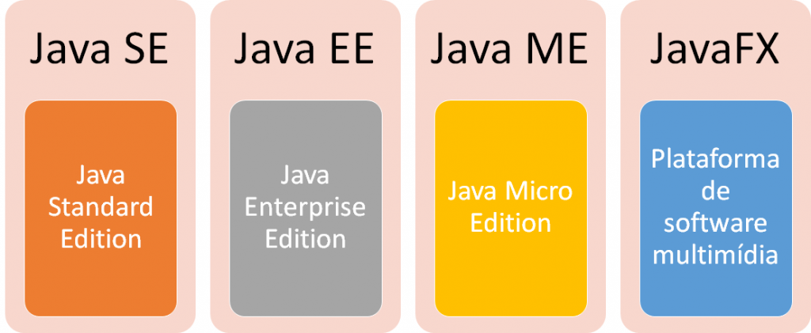

# Essencial

## Ecossistema

A Linguagem Java é composta por um conjunto bem definido de funcionalidades (features) que são super recomendadas para você entusiasta em programação conhecer o máximo que puder.

Abaixo iremos explorar algumas funcionalidades essenciais para nosso engajamento com a linguagem.

  

### Simples

Java é uma linguagem de programação simples e fácil de entender, pois não contém complexidades que existiam em linguagens de programação anteriores. Na verdade, a simplicidade era o objetivo do design dos povos Javasoft, porque ele tem que funcionar em dispositivos eletrônicos onde menos memória/recursos estão disponíveis.

### Orientada a Objeto 

Java é uma linguagem de Programação Orientada a Objetos. Isso significa que em Java tudo é escrito em termos de Classes e Objetos.

Para começar a desenvolver softwares de forma consistente com Java, é necessário compreender os pilares da Programação Orientada a Objetos (POO). Eles são:

1. Classe e Objeto;
2. Encapsulamento;
3. Abstração;
4. Herança;
5. Polimorfismo.

### Plataforma independente 

O objetivo de design do javasoft people é desenvolver uma linguagem que funcione em qualquer plataforma. Uma plataforma é o ambiente de hardware ou software no qual um programa é executado.&#x20;

Em Java, o código-fonte Java é compilado para Bytecode e esse Bytecode não está vinculado a nenhuma plataforma.

### Portátil

O conceito WORA (Write Once Run Anywhere) e o recurso independente de plataforma torna o Java portátil. Agora, usando a linguagem de programação Java, os desenvolvedores podem obter o mesmo resultado em qualquer máquina, escrevendo o código apenas uma vez. A razão por trás disso é JVM e Bytecode.&#x20;

### Robusta

A linguagem de programação Java é robusta, o que significa que é capaz de lidar com o encerramento inesperado de um programa.&#x20;

* Ele usa um gerenciamento de memória forte;
* Java fornece coleta de lixo automática;
* Há tratamento de exceção e mecanismo de verificação de tipo em Java.

### Segura

Problemas como ameaças de vírus, adulteração, espionagem ou representação podem ser tratados ou minimizados usando Java. E nossa construção de aplicativo usando Java também precisa de algum tipo de segurança. Por isso, a linguagem também fornece recursos de segurança para os programadores. Também existem recursos de criptografia e descriptografia para proteger seus dados contra _espionagem_ e _adulteração_ na Internet.

### Interpretada

Nas linguagens de programação, você aprendeu que eles usam o compilador ou o interpretador, mas a linguagem de programação Java usa os dois. Os programas Java são compilados para gerar arquivos de Bytecode e a JVM (Java Virtual Machine) interpreta o arquivo de Bytecode durante a execução.

### Multi-thread

Thread é um subprocesso leve e independente de um programa em execução (ou seja, processo) que compartilha recursos. Multi-threading é o nome dado ao processo de vários threads sendo executados simultaneamente.

**Principais características**

* **Independente de plataforma:** Programas Java são compilados para uma forma intermediária (Bytecodes).
* **Orientado a objetos:** Java é uma linguagem puramente orientada a objetos; Tudo em Java são classes ou instâncias de classes, com exceção de seus tipos primitivos de dados.
* **Coletor de lixo (Garbage Collector):** Possui um mecanismo automático de gerenciamento de memória.
* **Permite Multithreading:** Recursos que permite o desenvolvimento de aplicações capazes de executar rotinas concorrentemente.
* **Tratamento de exceções:** Permite o tratamento de situações excepcionais; Possui exceções embutidas e permite a criação de novas exceções.

## Processo de desenvolvimento

* Todo código fonte escrito em arquivo texto possui extensão **.java**;
* Este arquivo é compilado com o **javac** gerando o arquivo **.class**;
* O arquivo **.class** não contém código de máquina nativo, e sim o `Bytecodes`.

  

## JVM

**Máquina virtual Java** (em [inglês](https://pt.wikipedia.org/wiki/L%C3%ADngua\_inglesa): _Java Virtual Machine_, **JVM**) é um programa que carrega e executa os aplicativos [Java](https://pt.wikipedia.org/wiki/Linguagem\_de\_programa%C3%A7%C3%A3o\_Java), convertendo os [Bytecodes](https://pt.wikipedia.org/wiki/Bytecode\_Java) em código executável de máquina. A JVM é responsável pelo gerenciamento dos aplicativos, à medida que são executados.

Graças à máquina virtual Java, os programas escritos em Java podem funcionar em qualquer plataforma, de hardware e software que possua uma versão da JVM, tornando assim essas aplicações independentes da plataforma onde funcionam.

  

## Plataformas Java

A linguagem Java conta com quatro ambientes de desenvolvimento:

  

* **JSE (Java Standard Edition):** É a base da plataforma; inclui o ambiente de execução e as bibliotecas comuns e é voltada a aplicações para PCs e servidores.
* **JEE (Java Enterprise Edition):** A edição voltada para o desenvolvimento de aplicações corporativas e para a internet.
* **JME (Java Micro Edition):** É a edição para o desenvolvimento de aplicações para dispositivos móveis e embarcados.
* **JFX (Java FX):** JavaFX é uma tecnologia de software que, ao ser combinada com Java, permite a criação e implantação de aplicações de aparência moderna e conteúdo rico de áudio e vídeo.

## Componentes

O Java se subdivide em componentes de desenvolvimento (JDK) e de execução (JRE), isso quer dizer que, se pretende desenvolver aplicações é necessário ter instalado o JDK, mas para disponibilizar o executável (.jar) simplesmente a instalação da JRE será o suficiente.

**JDK (Java Development Kit) - Kit de Desenvolvimento Java**

* Composto pelo Compilador (javac + JVM);
* Visualizador de applets, bibliotecas de desenvolvimento;
* Programa para composição de documentação (javadoc);
* Depurador básico de programas e versão da JRE.

**JRE (Java Runtime Environment) - Ambiente de Execução Java**

* É composta de uma JVM e por um conjunto de bibliotecas que permite a execução de softwares em Java;
* Apenas permite a execução de programas, ou seja, é necessário o programa Java compilado pela JDK gerando os arquivos **.class**.
