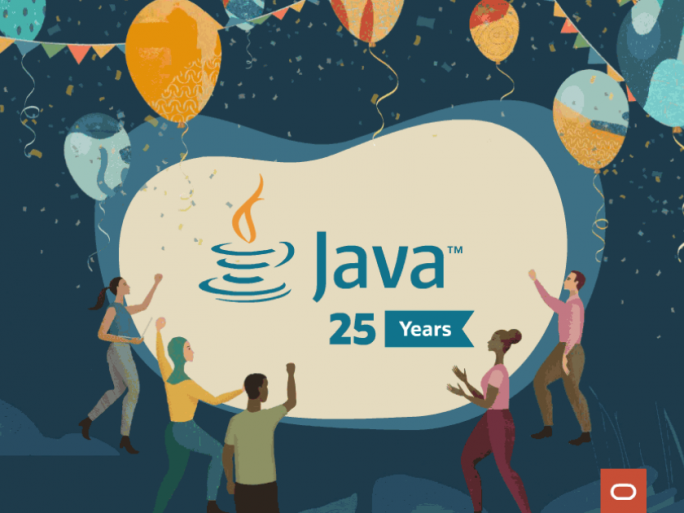

# Sobre

## Uma breve história

Interessada em dispositivos eletrônicos inteligentes, a Sun Microsystems financiou uma pesquisa interna com o codinome Green em 1991. O projeto resultou no desenvolvimento de uma linguagem baseada em C e C++ que seu criador, James Gosling considerado o Pai da linguagem de programação Java, chamou de Oak (carvalho) em homenagem a uma árvore que dava para a janela do seu escritório na Sun.

  

## Início do projeto

A inspiração do nome Java surgiu em 1992 em uma cafeteria local, cujo café vinha de uma ilha da Indonésia chamada Java.Assim inspirou o nome da linguagem de programação que conhecemos atuamente e mundiamente como Java.
Em 1993 a Sun aposta no imediato potencial de utilizar Java para criar páginas da Web com o chamado conteúdo dinâmico.

## Motivações

A ideia de criar um interpretador para pequenos dispositivos, facilitando a reescrita de software para aparelhos eletrônicos que logo perceberam a sua aderência ao novo fenômeno que surgia, a World Wide Web.

## Dilemas

O mercado para dispositivos eletrônicos inteligentes destinados ao consumidor final, não estava se desenvolvendo tão rapidamente como a Sun tinha previsto e seu projeto atravessou algumas dificuldades.  E um importante contrato pelo qual a Sun competia foi concedido a outra empresa.

Então, o projeto estava em risco de cancelamento e por um golpe de sorte, a World Wide Web explodiu em popularidade em 1993 e as pessoas da Sun viram o imediato potencial de utilizar Java para criar páginas da Web com o chamado conteúdo dinâmico. Isso deu nova vida ao projeto.

## Java em todo lugar

Em maio de 1995, a Sun anunciou Java formalmente em uma conferência importante. Um evento como esse normalmente não gera muita atenção.

Entretanto, Java gerou interesse imediato na comunidade comercial, em decorrência do fenomêno interesse pela World Wide Web.

* Páginas da Web com conteúdo interativo e dinâmico;
* Aplicações corporativas de grande porte;
* Softwares destinados ao consumidor final;
* Aplicativos para Smartphones.

## Principais características

* **Independente de plataforma:** Programas Java são compilados para uma forma intermediária (bytecodes).
* **Orientado a objetos:** Java é uma linguagem puramente orientada a objetos; Tudo em Java são classes ou instâncias de classes, com exceção de seus tipos primitivos de dados.
* **Coletor de lixo (Garbage Collector):** Possui um mecanismo automático de gerenciamento de memória.
* **Permite Multithreading:** Recursos que permite o desenvolvimento de aplicações capazes de executar rotinas concorrentemente.
* **Tratamento de exceções:** Permite o tratamento de situações excepcionais; Possui exceções embutidas e permite a criação de novas exceções.

## Processo de desenvolvimento

* Todo código fonte escrito em arquivo texto possui extensão **.java**;
* Este arquivo é compilado com o **javac** gerando o arquivo **.class**;
* O arquivo **.class** não contém código de máquina nativo, e sim o `bytecodes`.

## Evolução da plataforma

Em 20 de Abril de 2009, A Oracle Inc. uma gigante em banco de dados, compra os direitos da linguagem por US$ 7,4 bilhões visando uma disputa com força no mercado de servidores.

  

> [!NOTE]
> Em 23 de janeiro de 2021 foi celebrado os 25 anos da linguagem Java que hoje é mantida pela Oracle Inc.

Características de cada versão

| Versão         | Data                       | Recurso                                                                                                                                                                                                                                                                                                                                                    |
| -------------- | -------------------------- | ---------------------------------------------------------------------------------------------------------------------------------------------------------------------------------------------------------------------------------------------------------------------------------------------------------------------------------------------------------- |
| JDK 1.0        | 23 de janeiro de 1996      | É a 1ª versão sendo hoje usada para compatibilidade de browsers mais antigos.                                                                                                                                                                                                                                                                              |
| JDK 1.1        | 19 de fevereiro de 1997    | Muitas bibliotecas adicionadas, das quais se destacaram o Java RMI, JavaBeans, novo modelo de eventos e JDBC driver, para conexão com banco de dados.                                                                                                                                                                                                      |
| J2SE 1.2       | 8 de dezembro de 1998      | Obteve um grande aumento das classes, na biblioteca Java (API).                                                                                                                                                                                                                                                                                            |
| J2SE 1.3       | 8 de maio de 2000          | Foram incluídas as bibliotecas JNDI, JavaSound, entre outros.                                                                                                                                                                                                                                                                                              |
| J2SE 1.4       | 6 de fevereiro de 2002     | Foi criada a palavra reservada “assert”, biblioteca NIO, entre outros.                                                                                                                                                                                                                                                                                     |
| **J2SE 5.0**   | **30 de setembro de 2004** | **Introdução dos Generics, Enumeração, Auto-boxing, for-each entre outros.**                                                                                                                                                                                                                                                                               |
| JAVA SE 6      | 11 de dezembro de 2006     | Obteve uma melhora significativa na performance e na estabilidade, tendo o surgimento do JIT.                                                                                                                                                                                                                                                              |
| JAVA SE 7      | 28 de julho de 2011        | Suporte ao uso de strings em condições do switch, inferência na criação de objetos com tipos genéricos, simplificação na invocação de métodos com parâmetros VarArgs e tipos genéricos, entre outros.                                                                                                                                                      |
| **JAVA SE 8**  | **18 de março de 2014**    | **Expressões Lambdas, forEach, Consumer e interfaces no java.util.functions, Default methods, Method references e etc.**                                                                                                                                                                                                                                   |
| JAVA SE 9      | 21 de setembro de 2017     | Uma das novidades dessa versão, são os factory methods para coleções.                                                                                                                                                                                                                                                                                      |
| JAVA SE 10     | 20 de março de 2018        | Dentre as novidades do java 10 podemos apontar a nova API para criação de coleções imutáveis e a nova forma de se declarar variáveis locais.                                                                                                                                                                                                               |
| **JAVA SE 11** | **25 de setembro de 2018** | **Métodos readString() writeString(). Alguns métodos foram adicionados no tocante a manipulação de cordas como o repeat, strip, stripLeading, stripTrailing, lines e isBlank. Também vale ressaltar a utilização de variáveis por inferência.**                                                                                                            |
| JAVA SE 12     | 19 de março de 2019        | Expressão Switch melhorada e métodos String indent e transform.                                                                                                                                                                                                                                                                                            |
| JAVA SE 13     | 17 de setembro de 2019     | O Java 13 trouxe dois novos recursos de linguagem, embora no modo de visualização. Usando yield, agora podemos efetivamente retornar valores de uma expressão switch. O segundo recurso de visualização são blocos de texto para Strings de várias linhas, como JSON, XML, HTML, etc.                                                                      |
| JAVA SE 14     | 17 de março de 2020        | Helpful NullPointerExceptions, nos permite saber quem causou e a consequência, Records (Preview) criado pela oracle para reduzir a verbosidade, Switch Expressions tornando a sintaxe do switch mais fácil e simples, deixando o código mais limpo e agradável.                                                                                            |
| JAVA SE 15     | Setembro de 2020           | O Java 15, oferece aos desenvolvedores 14 aprimoramentos/alterações, incluindo um módulo de incubadora, três recursos de visualizações, dois recursos obsoletos e duas remoções. Algumas mudanças servem para reduzir o tamanho e o escopo do JDK através da depreciação, que é uma técnica para transmitir informações, sobre o ciclo de vida de uma API. |
| JAVA SE 16     | Março de 2021              | Foram acrescentados muitos recursos para melhorar a performance, consumo de memória e uso da linguagem. Alguns dos novos recursos incluem mudanças no ZGC, suporte à versão 14 do C++ para evolução da JDK e JVM, capacidade elástica do metaspace, novas APIs e ferramentas.                                                                               |
| JAVA SE 17 LTS | Setembro de 2021           | Entre os novos recursos da nova versão do Java padrão, estão o suporte a filtros de desserialização específicos do contexto, que é um aprimoramento de segurança e uma visualização de correspondência de padrões para instruções switch.                                                                                                                  |

## Exercício

1. Pesquise e faça um resumo sobre plataforma do Java.
2. Pesquise e faça um resumo sobre a evolução da linguagem Java.
