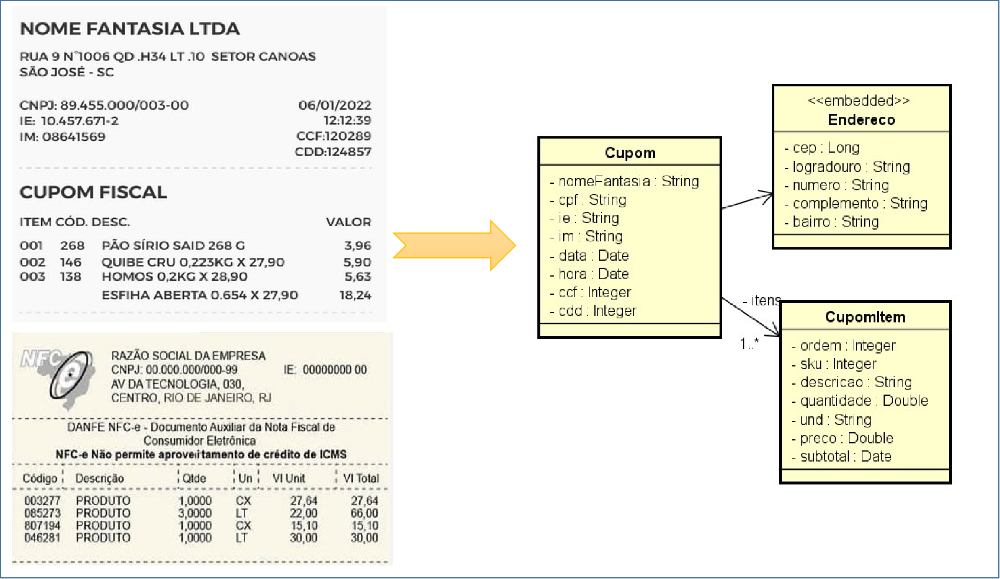
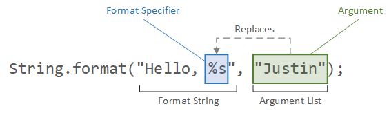

# Expressões

## Introdução

Compreender algumas expressões é uma das maneiras mais assertivas para se poder interagir em qualquer contexto de comunicação, e na programação não seria diferente, afinal, é através de escrita de algumas expressões que nos comunicamos e definimos as execuções que serão realizadas pelo nosso software.

<div align="center">
  
</div>

Nesta fase de seus estudos você já deve facilmente compreender expressões iguais a estas abaixo:

```
a = b + c representa que: a é igual a soma de b mais c 
        
a = b > c representa que: a será verdadeiro se b for maior que c

a = b <> c representa que: a será verdadeiro se b for diferente que c (linguagem x)
a = b != c representa que: a será verdadeiro se b for diferente que c (linguagem z)

```

Mas e as expressões abaixo? Qual será a sua representação e finalidade na programação?

```
representa a geração de um texto com números com zeros à esquera e números com 2 casas decimais
com base nos 3 argumentos recebidos respectivamente 

%s%010d%,.2f 

representa uma validação de e-mail

^([a-zA-Z0-9_\-\.]+)@((\[[0-9]{1,3}\.[0-9]{1,3}\.[0-9]{1,3}\.)|(([a-zA-Z0-9\-]+\.)+))([a-zA-Z]{2,4}|[0-9]{1,3})$ 

```

## Formatação

Imagina que recebemos a tarefa de realizar a confecção de cupom de venda não fiscal que inicialmente será exibida no console para depois salvar em arquivo.

> [!TIP]
> Nem tudo o que vemos é o que realmente é

<div align="center">
  
</div>

> [!NOTE]
> No contexto do paradigma da orientação a objetos, percebemos que o mais relevante no começo, é definir o modelo de classes para criação de nossos objetos 😲.

## Definição

A classe String possui o método estático chamado `format` conforme assinatura abaixo:

```java
format(String format, Object ... args) 
```

1. O parâmetro `String format` representará o formato esperado
2. O parâmetro `Object ... args` representará o(s) valore(s) que será(ão) formatado(s)

<div align="center">



</div>

> [!NOTE]
> Imagina como ficará a formatação do endereço no cupom em uma única linha? Esse será um de nossos desafios !!!

### Tipos e especificadores

Cada tipo de dado é representado para um caractere especificador prefixado pelo símbolo % que representa o início de cada especificador. Abaixo segue a lista com os mais utilizados

| especificador | tipos de dados               |
|---------------|------------------------------|
| %s            | Uma string de caracteres     |
| %d            | Dígitos inteiros             |
| %f            | Dígitos fracionados          |
| %t            | Representação de data e hora |

### Estrutura de formatação

O parêmetro que representa a formatação possui a flexibilidade de receber em sua sintexe os argumentos abaixo:

| nome       | valores       | descrição                                                                      |
|------------|---------------|--------------------------------------------------------------------------------|
| index      | 1$ ,2$ e etc  | representa ao indíce dos argumentos que começa com 1                           |
| flags      | 0, -          | Utilizado para determinado zeros ou alinhamento à esquerda, dependente do tipo |
| width      | 5, 10, e etc  | Comprimento do texto formatado                                                 |
| .precision | 2, 3 e etc    | Define a quantidade de caracteres decimais                                     |
| typechar   | s, d, f e etc | tipo de dado que será formatado                                                |

## Mão na massa

Vamos realizar algumas formatações para compreendermos todos os conceitos citados acima.

Altere o código abaixo conforme os cenários apresentados:

```java
public class StringFormat {
    public static void main(String[] args) {
        String formato="O nome do candidato é %s";
        String argumento="Gleyson Sampaio";
        System.out.println(String.format(formato, argumento));
    }
}
```

### Formatação básica

| string de formatação          | argumentos      | resultado                                                                                   |
|-------------------------------|-----------------|---------------------------------------------------------------------------------------------|
| "O nome do candidato é %s"    | Gleyson Sampaio | O nome do candidato é Gleyson Sampaio                                                       |
| "O nome do candidato é %40s"  | Gleyson Sampaio | O nome do candidato é Gleyson Sampaio - comprimento de 40 caracteres justificado a direita  |
| "O nome do candidato é %-40s" | Gleyson Sampaio | O nome do candidato é Gleyson Sampaio - comprimento de 40 caracteres justificado a esquerda |
| "O salário pretendido do candidato foi de R$ %,.2f" | 5357.45         | O salário pretendido do candidato foi de R$ 5.357,45 |
| "A matrícula do candidato é %05d" | 32              | A matrícula do candidato é 00032 |

### Formatação avançada

| string de formatação                                | argumentos                          | resultado                                                                                              |
|-----------------------------------------------------|-------------------------------------|--------------------------------------------------------------------------------------------------------|
| "O candidato será entrevistado na data %td/%tm/%ty" | data, data, data                    | O candidato será entrevista da data 18/06/23                                                           |
| "O candidato será entrevistado na data %tD"         | data                                | O candidato será entrevistado na data 06/18/23 (Locale US ou Default)                                  |
| "O candidato será entrevistado na data %1$td/%1$tm/%1$ty"       | data                                | O candidato será entrevistado na data 18/06/23, pois informamos o mesmo índice 1$ dos arqumentos       |
| "O candidato será entrevistado na data %td/%<tm/%<ty"         | data                                | O candidato será entrevistado na data 18/06/23, o símbolo `<` representa considerar o agumento anterior |
| "Os diferentes nomes %10.10s e %10.10s agora possuem o mesmo comprimento" | GLEYSON SAMPAIO, IZABELLY SAMPAIO   | Os diferentes nomes GLEYSON SA e IZABELLY S agora possuem o mesmo comprimento|
| "A terceira e segunda habilidades do candidato são %3$s e %2$s" | "Java", "Spring", "Postgres", "Vue" | A terceira e segunda habilidades do candidato são Postgres e Spring |

## Hora da verdade

Segue abaixo o código que nos auxiliará a compreender sobre formatação utilizando `String.format`.

<details>
  <summary>Endereco.java</summary>

  ```java
  public class Endereco {
    String cep;
    String logradouro;
    String numero;
    String complemento;
    String bairro;

    //não está na UML pois o modelo pode variar
    String cidade;
    String uf;
}
  ```

</details>

<details>
  <summary>CupomItem.java</summary>

  ```java
  public class Endereco {
    String cep;
    String logradouro;
    String numero;
    String complemento;
    String bairro;

    //não está na UML pois o modelo pode variar
    String cidade;
    String uf;
  ```

</details>

<details>
  <summary>Cupom.java</summary>

  ```java
import java.time.LocalDate;
import java.time.LocalTime;
import java.util.ArrayList;
import java.util.List;

public class Cupom {
    String nomeFantasia;
    Endereco endereco;
    String cpf;
    String ie;
    String im;
    LocalDate data;
    LocalTime hora;
    Integer ccf;
    Integer cdd;
    List<CupomItem> itens = new ArrayList<>();
}
  ```

</details>

<details>
  <summary>GeradorCupom.java</summary>

  ```java
import java.time.LocalDate;
import java.time.LocalTime;

public class GeradorCupom {
    public Cupom gerar(){
        Cupom cupom = new Cupom();
        cupom.data= LocalDate.of(2022, 1, 6);
        cupom.hora = LocalTime.of(12,12,39);
        cupom.nomeFantasia="PANIFICADORA PAO DOURADO";

        Endereco endereco = new Endereco();
        endereco.logradouro="RUA 9";
        endereco.numero="1006";
        endereco.complemento="QD 34";
        endereco.bairro="SETOR CANOAS";
        endereco.cidade="SAO JOSE";
        endereco.uf="SC";
        cupom.endereco = endereco;

        cupom.ccf=120289;
        cupom.cdd=124857;
        cupom.cpf = "33498700867";
        cupom.ie="10.457.671-2";
        cupom.im="08641569";

        CupomItem item01 = new CupomItem();
        item01.ordem=1;
        item01.sku=146;
        item01.descricao = "QUIBE CRU";
        item01.preco=27.9;
        item01.und = "KG";
        item01.quantidade=0.233;
        item01.subtotal=5.90;
        cupom.itens.add(item01);

        CupomItem item02 = new CupomItem();
        item02.ordem=2;
        item02.sku=138;
        item02.descricao = "ESFIHA ABERTA" ;
        item02.preco=12.0;
        item02.und = "KG";
        item02.quantidade=0.654;
        item02.subtotal=18.24;
        cupom.itens.add(item02);

        return cupom;
    }
  ```

</details>

<details>
  <summary>PaniSys.java</summary>

  ```java
public class PaniSys {
    public static void main(String[] args) {
        GeradorCupom geradorCupom = new GeradorCupom();

        Cupom cupomGerado = geradorCupom.gerar();;

        System.out.println(cupomGerado);

        ImpressorCupom impressorCupom = new ImpressorCupom();
        impressorCupom.imprimir(cupomGerado);
    }
}
  ```

</details>

> [!WARNING]
> Existem algumas divergências nas especificações para que possamos refletir sobre as respectivas soluções e omitirmos os métodos getters e setters para fins de redução de conceitos.

Chegou a hora de aplicar tudo que abordamos para implementarmos o desafio apresentado, segue abaixo o código que precisa ser complementado com o que aprendemos para conseguirmos concluir o requisito de impressão de cupom.

```java
public class ImpressorCupom {
    public void imprimir(Cupom cupom){
        /**
         vamos somente impimir o resultado no console
         mas este mesmo conteúdo poderá proporicionar várias saidas
         logo a variável conteudo deveria ser retornada para outros "processadores"
         como gerador de arquivo txt, pdf ou até mesmo envio por e-mail
         */

        /*
        CONSIDERE O COMPRIMENTO MÁXIMO DE 50 CARACTERES EM CADA LINHA
        E APLIQUE O RESPECTIVO ALINHAMENTO
         */
        StringBuilder conteudo = new StringBuilder();
        conteudo.append(tracos());
        conteudo.append(cupom.nomeFantasia + "\n"); //preencher com espaços até ter 50 caracteres de comprimento
        Endereco end = cupom.endereco;
        conteudo.append(end.logradouro + " N. " + end.numero + " " + end.complemento + " " + end.bairro + " " + end.cidade + "-" + end.uf + "\n"); //como formatar vários campos
        conteudo.append("CPF/CNPJ:" + cupom.cpf + " " + cupom.data + "\n");//calcular os respectivos comprimentos e aplicar alinhamento
        conteudo.append("IE:" + cupom.ie + " " + cupom.hora + "\n");//calcular os respectivos comprimentos e aplicar alinhamento
        conteudo.append("IM:" + cupom.im + " " +  "CCF:" + cupom.ccf + "\n");//calcular os respectivos comprimentos e aplicar alinhamento
        conteudo.append("CDD:" + cupom.cdd + "\n");//aplicar alinhamento à direita
        conteudo.append(tracos());
        conteudo.append("CUPOM FISCAL\n");
        //modelo para ser replicado
        conteudo.append(String.format("ITEM COD. %-30s%10s\n","DESCRIÇÃO","VALOR"));
        for(CupomItem item:cupom.itens){
            conteudo.append("DESCRICAO DE ACORDO COM CADA ITEM EXISTENTE\n");
        }
        conteudo.append(tracos());
        System.out.println(conteudo.toString());
        //em caso de resolver explorar algumas formas de apresentação
        //return conteudo.toString();
    }
    private String tracos(){
        String repeated = new String(new char[50]).replace("\0", "-");
        return repeated + "\n";
    }
    private String cpfCnpj(String cpfCnpj){
        String newCnpj = "";
        if(cpfCnpj.length()==11)
            newCnpj = cpfCnpj.replaceAll("(\\d{3})(\\d{3})(\\d{3})(\\d{2})", "$1.$2.$3-$4");
        else
            newCnpj = cpfCnpj.replaceAll("(\\d{2})(\\d{3})(\\d{3})(\\d{4})(\\d{2})", "$1.$2.$3/$4-$5");
        return newCnpj;
    }
}

```

> [!TIP]
> A solução apresentada acima foi desenvolvida sem explorarmos todo o potencial do uso de formatação de caracteres, agora é com você 😉.
