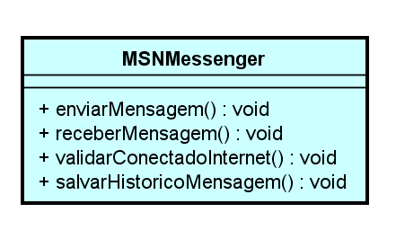
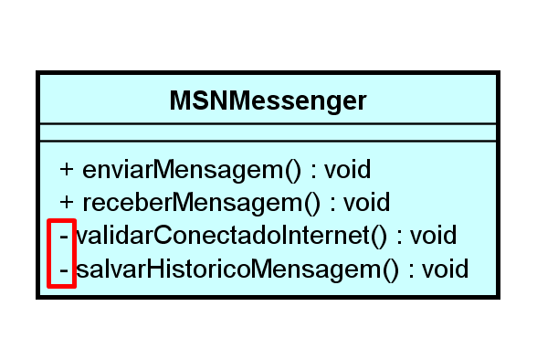
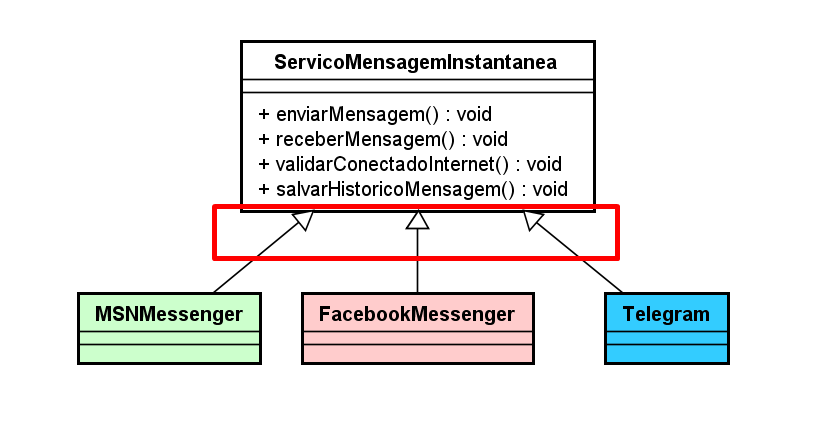
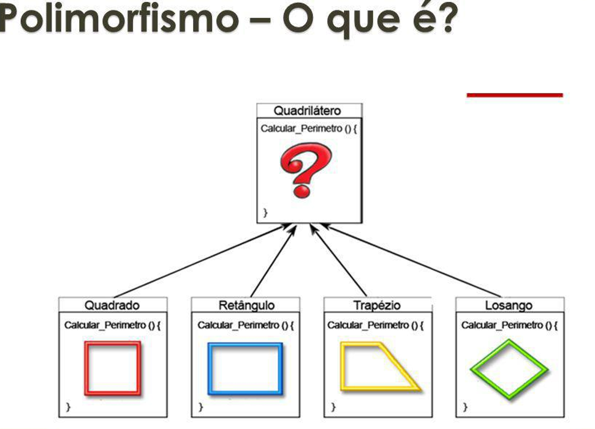
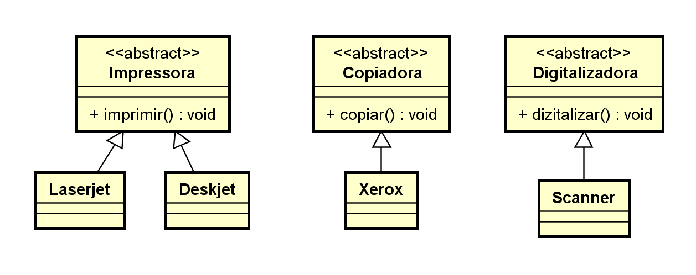
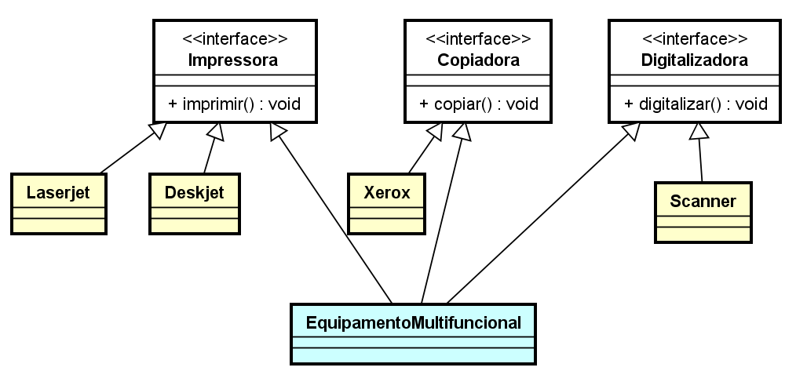

# Pilares do P O O

## Introdução

**Programação orientada a objetos** (**POO**, ou **OOP** segundo as suas siglas em inglês), é um [paradigma de programação](https://pt.wikipedia.org/wiki/Paradigma\_de\_programa%C3%A7%C3%A3o) baseado no conceito de "[objetos](https://pt.wikipedia.org/wiki/Objeto\_\(ci%C3%AAncia\_da\_computa%C3%A7%C3%A3o\))", que podem conter [dados](https://pt.wikipedia.org/wiki/Dados) na forma de [campos](https://pt.wikipedia.org/wiki/Campo\_\(ci%C3%AAncia\_da\_computa%C3%A7%C3%A3o\)), também conhecidos como _atributos_ e códigos na forma de [procedimentos](https://pt.wikipedia.org/wiki/Procedimento) também conhecidos como [métodos](https://pt.wikipedia.org/wiki/M%C3%A9todo\_\(programa%C3%A7%C3%A3o\)).

Como se trata de um contexto análogo ao mundo real, tudo que nos referimos são objetos, exemplo: Conta bancária, Aluno, Veículo, Transferência etc.

A programação orientada a objetos é bem requisitada no contexto das aplicações mais atuais no mercado devido a possibilidade de reutilização de código e a capacidade de representação do sistema ser muito mais próximo do mundo real.

Abaixo segue uma definição conceitual dos quatro pilares da programação orientada a objetos:

* **Encapsulamento:** Nem tudo precisa estar visível, grande parte do nosso algoritmo pode ser distribuído em métodos com finalidades específicas que complementa uma ação global em nossa aplicação.

    Exemplo: Ligar um veículo exige muitas etapas para a engenharia, mas o condutor só visualiza  a ignição, da partida e a _“magia”_ acontece.
* **Herança:** Características e comportamentos comuns, podem ser elevados e compartilhados através de uma hierarquia de objetos.

    Exemplo: Um Carro e uma Motocicleta possuem propriedades como placa, chassi, ano de fabricação e métodos como acelerar, frear. Logo, para não ser um processo de codificação redundante, podemos desfrutar da herança criando uma classe **Veiculo** para que seja herdada por Carro e Motocicleta.
* **Abstração:** É a indisponibilidade para determinar a lógica de um ou vários comportamentos em um objeto.

    Exemplo: **Veículo** determina duas ações como acelerar e frear, logo, estes comportamentos deverão ser _abstratos_ pois existe mais de uma maneira de se realizar a mesma operação.   ver _Polimorfismo_.
* **Polimorfismo:** São as inúmeras maneiras de se realizar uma mesma ação.

    Exemplo: Veículo determina duas ações como acelerar e frear, primeiramente precisamos identificar se estaremos nos referindo a **Carro** ou **Motocicleta** para determinar a lógica de aceleração e frenagem dos respectivos veículos.  &#x20;

### Em prática

Para ilustrar a proposta dos Princípios de POO no nosso cotidiano, vamos simular algumas funcionalidades dos aplicativos de mensagens instantâneas pela internet.

**MSN Messenger** foi um programa de mensagens instantâneas criado pela Microsoft Corporation. O serviço nasceu em 22 de julho de 1999, anunciando-se como um serviço que permitia falar com uma pessoa através de conversas instantâneas pela internet. Ao longo dos anos, surgiram novos serviços de mensagens pela internet, como **Facebook Messenger** e o **VKontakte Telegram**.


Vamos descrever em UML e depois em código, algumas das principais funcionalidades de qualquer serviço de comunicação instantânea pela internet, inicialmente pelo MSN Messenger e depois inserindo os demais, considerando os princípios de POO.

<details>
  <summary>Representação</summary>
    - UML:
  
   

  Pontos de atenção:

* Todos os métodos da classe são **public** (tudo realmente precisa estar visível ?);
* Só existe uma única forma de se comunicar via internet (como ter novas formas de se comunicar mantendo a proposta central ?).

* CODE:

```java
public class MSNMessenger {
    public void enviarMensagem() {
        System.out.println("Enviando mensagem");
    }
    public void receberMensagem() {
        System.out.println("Recebendo mensagem");
    }
    public void validarConectadoInternet() {
        System.out.println("Validando se está conectado a internet");
    }
    public void salvarHistoricoMensagem() {
        System.out.println("Salvando o histórico da mensagem");
    }
}
```

</details>

## Encapsulamento

> Nem tudo precisa estar disponível para todos

Já imaginou, você instalar o MSN Messenger e ao querer enviar uma mensagem, fosse solicitado a você verificar se o computador está conectado a internet, e depois pedir para você salvar a mensagem no histórico? ou, se ao tentar enviar um SMS pelo celular, primeiro você precisasse consultar manualmente o seu saldo ?

Acredito que não seria uma experiência tão agradável de ser executada, recorrentemente, por nós usuários.

Mesmo ainda sendo necessária algumas etapas nos processos citados, não é um requisito uma visibilidade pública, isso quer dizer, além da própria classe que possui a responsabilidade de uma determinada ação.

Quanto ao MSN Messenger, para nós, só é relevante saber que podemos e como devemos enviar e receber a mensagem, logo, as demais funcionalidades poderão ser consideradas privadas (private). E é ai que se caracteriza a necessidade do pilar de Encapsulamento. O que esconder ?

> [!NOTE]
> Nem tudo precisa estar disponível para todos

Vamos a revisão de nossa implementação



<details>
  <summary>Antes</summary>

  ```java
  /*
 * Simulação do uso da classe MSNMessenger
 */
public class ComputadorPedrinho {
    public static void main(String[] args) {
        //abrindo MSN Messenger
        MSNMessenger msn = new MSNMessenger();

        msn.validarConectadoInternet();
        msn.enviarMensagem();
        msn.salvarHistoricoMensagem();

        msn.receberMensagem();
    }
}
  ```

</details>

<details>
  <summary>MSNMessenger.java</summary>

  ```java
    public class MSNMessenger {
    public void enviarMensagem() {
        //primeiro confirmar se esta conectado a internet
        validarConectadoInternet();

        System.out.println("Enviando mensagem");

        //depois de enviada, salva o histórico da mensagem
        salvarHistoricoMensagem();
    }
    
    public void receberMensagem() {
        System.out.println("Recebendo mensagem");
    }

    //métodos privadas, visíveis somente na classe
    private void validarConectadoInternet() {
        System.out.println("Validando se está conectado a internet");
    }
    
    private void salvarHistoricoMensagem() {
        System.out.println("Salvando o histórico da mensagem");
    }
}
  ```

</details>

<details>
  <summary>Depois</summary>

  ```java
    /*
 * Simulação do uso da classe MSNMessenger
 * com métodos encapsulados - privados
 */
public class ComputadorPedrinho {
 public static void main(String[] args) {
  //abrindo MSN Messenger
  MSNMessenger msn = new MSNMessenger();
  
  msn.enviarMensagem();
  
  msn.receberMensagem();
 }
}
  ```

</details>

## Herança

> Nem tudo se copia, às vezes se herda.

Já imaginou você ter sido classificado para a vaga de emprego de seus sonhos e como desafio seria justamente você criar um diagrama de classes e em seguida os respectivos arquivos .java, que apresentasse os fundamentos de POO com base no contexto de vários aplicativos de mensagens instantâneas? Sorte sua que você está nos acompanhando nesta nossa jornada. 😜


> [!NOTE]
> Com base na nossa classe **MsnMessenger**, você já poderia dar os primeiros passos para se dar bem no processo seletivo, simplemente, copiar e colar a estrutura, para as novas classes **FacebookMessenger, Telegram** e **BINGO 😁😁😁!!!**

Agora é escrever o código das classes acima e esperar pela contratação !

> [!CAUTION]
> Lamentamos dizer, mas esta não seria a melhor alternativa para a proposta citada acima.

Além de uma compreensão do desafio, é necessário que, tenhamos domínio dos pilares de POO e aplicá-los em situações iguais a esta.

> [!NOTE]
> Todas as três classes, possuem a mesma estrutura comportamental e diante deste contexto, se encaixa perfeitamente o segundo pilar da POO, a Herança.



<details>
  <summary>ServicoPai</summary>

  ```java
    //a classe MSNMessenger é ou representa
public class ServicoMensagemInstantanea {
    public void enviarMensagem() {
        //primeiro confirmar se esta conectado a internet
        validarConectadoInternet();
        System.out.println("Enviando mensagem");
        //depois de enviada, salva o histórico da mensagem
        salvarHistoricoMensagem();
    }
    public void receberMensagem() {
        System.out.println("Recebendo mensagem");
    }

    //métodos privadas, visíveis somente na classe
    private void validarConectadoInternet() {
        System.out.println("Validando se está conectado a internet");
    }
    private void salvarHistoricoMensagem() {
        System.out.println("Salvando o histórico da mensagem");
    }
}
  ```

</details>

<details>
  <summary>MSN</summary>

  ```java
    public class MSNMessenger extends ServicoMensagemInstantanea{

}
  ```

</details>

<details>
  <summary>Facebook</summary>

  ```java
    public class FacebookMessenger extends ServicoMensagemInstantanea {

}
  ```

</details>

<details>
  <summary>Telegram</summary>

  ```java
    public class Telegram extends ServicoMensagemInstantanea {

}
  ```

</details>

<details>
  <summary>ComputadorPedrinho</summary>

  ```java
    public class ComputadorPedrinho {
    public static void main(String[] args) {

        MSNMessenger msn = new MSNMessenger();
        msn.enviarMensagem();
        msn.receberMensagem();

        FacebookMessenger fbm = new FacebookMessenger();
        fbm.enviarMensagem();
        fbm.receberMensagem();

        Telegram tlg = new Telegram();
        tlg.enviarMensagem();
        tlg.receberMensagem();

    }
}
  ```

</details>

Podemos avaliar a importância de compreender os pilares de POO para ter uma melhor implementação, reaproveitamento e reutilização de código em qualquer contexto das nossas aplicações, mas não para por aí.

> [!WARNING]
> Será que todos os sistemas de mensagens realizam as suas operações de uma mesma maneira? E agora ? Este é um trabalho para os pilares **Abstração** e **Polimorfismo**.

## Abstração

> Para você ser é preciso você fazer.

Sabemos que qualquer sistema de mensagens instantâneas realiza as mesmas operações de Enviar e Receber Mensagem, dentre outras operações comuns ou exclusivas de cada aplicativo disponível no mercado.

Mas será que as ações realizadas, contém o mesmo comportamento ? Acreditamos que não.

> [!NOTE]
> Já imaginou a **Microsoft** falar para o **Facebook**: _**"Ei, toma meu código do MSN!"**_. 😲

O que vale destacar para compreender, é que todo e qualquer sistema de mensagem precisa sim, no mínimo Enviar e Receber Mensagem, logo, consideramos se firmar um "contrato" para qualquer um que queira se apresentar assim para o mercado.

Observem a nova estruturação dos códigos abaixo, com base na implementação apresentada no pilar Herança.

<details>
  <summary>ServicoPai</summary>

  ```java
public abstract class ServicoMensagemInstantanea {
    public abstract void enviarMensagem();
    public abstract void receberMensagem();
}
  ```

</details>

<details>
  <summary>MSN</summary>

  ```java
public class MSNMessenger extends ServicoMensagemInstantanea{
    public void enviarMensagem() {
        System.out.println("Enviando mensagem pelo MSN Messenger");
    }
    public void receberMensagem() {
        System.out.println("Recebendo mensagem pelo MSN Messenger");
    }
}
  ```

</details>

<details>
  <summary>Facebook</summary>

  ```java
public class FacebookMessenger extends ServicoMensagemInstantanea {
    public void enviarMensagem() {
        System.out.println("Enviando mensagem pelo Facebook Messenger");
    }
    public void receberMensagem() {
        System.out.println("Recebendo mensagem pelo Facebook Messenger");
    }
}
  ```

</details>

<details>
  <summary>Telegram</summary>

  ```java
public class Telegram extends ServicoMensagemInstantanea {
    public void enviarMensagem() {
        System.out.println("Enviando mensagem pelo Telegram");
    }
    public void receberMensagem() {
        System.out.println("Recebendo mensagem pelo Telegram");
    }
}
  ```

</details>

> [!TIP]
> Em Java, o conceito de abstração é representado pela palavra reservada `abstract` e métodos que **NÃO** possuem corpo na classe abstrata (pai) e é muito difícil falar de _abstração_ e **NÃO** mencionar _polimorfismo_.

## Polimorfismo

> Um mesmo comportamento, de várias maneiras.

Podemos observar no contexto de **Abstração** e **Herança,** que conseguimos criar uma singularidade estrutural de nossos elementos. Isso quer dizer que, qualquer classe que deseja representar um serviço de mensagens, basta estender a classe **`ServicoMensagemInstantanea`** e implementar, os respectivos métodos _abstratos_. O que vale reforçar aqui é, cada classe terá a mesma ação, executando procedimentos de maneira especializada.&#x20;



Este é o resultado do que denominamos como, Polimorfismo. Veja o exemplo abaixo:

```java
public class ComputadorPedrinho {
 public static void main(String[] args) {
  
  ServicoMensagemInstantanea smi = null;
  
  /*
      NÃO SE SABE QUAL APP 
      MAS QUALQUER UM DEVERÁ ENVIAR E RECEBER MENSAGEM
   */
  String appEscolhido="???"; 
  
  if(appEscolhido.equals("msn"))
   smi = new MSNMessenger();
  else if(appEscolhido.equals("fbm"))
   smi = new FacebookMessenger();
  else if(appEscolhido.equals("tlg"))
   smi = new Telegram();
  
   
  smi.enviarMensagem();
  smi.receberMensagem();
 }
}
```

> [!NOTE]
> Para concluirmos a compreensão, Polimorfismo permite que as classes mais abstratas, determine ações uniformes, para que cada classe filha concreta, implemente os comportamentos de forma específica.

### **Modificador protected**

Vamos para uma retrospectiva quanto ao requisito do nosso sistema de mensagens instantâneas desde a etapa de encapsulamento.&#x20;

O nosso requisito, solicita que além de Enviar e Receber Mensagens, precisamos validar se o aplicativo está conectado a internet (**`validarConectadoInternet`**) e salvar o histórico de cada mensagem (**`salvarHistoricoMensagem`**).

Sabemos que cada aplicativo, costuma salvar as mensagens em seus respectivos servidores cloud, mas e quanto validar se está conectado a internet? Não poderia ser um mecanismo comum a todos ? Logo, qualquer classe filha, de **ServicoMensagemInstantanea** poderia desfrutar através de herança, esta funcionalidade.

> [!TIP]
> Mas fica a reflexão do que já aprendemos sobre visibilidade de recursos: Com o modificador `private` somente a classe conhece a implementação, quanto que o modificador `public` todos passarão a conhecer. Mas gostaríamos que, somente as classes filhas soubessem. Bem, é ai que entra o modificador `protected`.

```java
public abstract class ServicoMensagemInstantanea {
 
 public abstract void enviarMensagem();
 public abstract void receberMensagem();
 
 //mais um método que todos os filhos deverão implementar
 public abstract void salvarHistoricoMensagem();
 
 //somente os filhos conhecem este método
 protected void validarConectadoInternet() {
  System.out.println("Validando se está conectado a internet");
 } 
}
```

## Interface

> [!WARNING]
> Antes de tudo, NÃO estamos nos referindo a interface gráfica. Ok? 😁😉

Como vimos anteriormente, **Herança** é um dos pilares de POO, mas uma curiosidade que se deve ser esclarecida, na linguagem Java, é que ela não permite o que conhecemos como **Herança Múltipla**.

A medida que vão surgindo novas necessidades, novos equipamentos (objetos), que nascem para atender as expectativas de oferecer ferramentas com finalidades bem específicas, como por exemplo: Impressoras, Digitalizadoras, Copiadoras e etc.

Observem que não há uma especificação de marca, modelo e ou capacidades de execução das classes citadas acima, isto é o que consideramos o nível mais abstrato da orientação a objetos, que denominamos como **interfaces**.

Ilustração de interfaces dos equipamentos citados acima:


Representação de objetos reais com base nas interfaces citadas acima:


> Então o que você está dizendo é que **interfaces** é o mesmo que **classes**? Um molde para representação dos objetos reais?

Este é um dos maiores questionamentos dos desenvolvedores, no que se refere a modelo de classes da aplicação.

Como citado acima, Java não permite herança múltipla, logo, vamos imaginar que, recebemos o desafio de projetar uma nova classe, para criar objetos que representam as três características citadas acima e que iremos denominar de **EquipamentoMultifunional**.


Para uma melhor compreensão, vamos analisar os diagramas de classes abaixo, comparando o conceito de herança entre, classes e interfaces.

**Cenário 1**



**Cenário 2**



Antes de iniciarmos a representação via código, devemos compreender que, assim como em classes e métodos abstratos, quando herdamos de uma interface, precisamos implementar todos os seus métodos, pois eles são implicitamente **`public abstract`**.

E para encerrar, uma das mais importantes ilustrações quanto ao uso de interfaces para desenvolvimento de componentes revolucionários, é apresentado em 2007 por nada mais nada menos que Steve Jobs ao lançar o primeiro **iPhone** da história.


> [!NOTE]
> Um único equipamento, que pode ser considerado tanto como um: **Reprodutor Musical,  Aparelho Telefônico e Navegador na Internet.**
