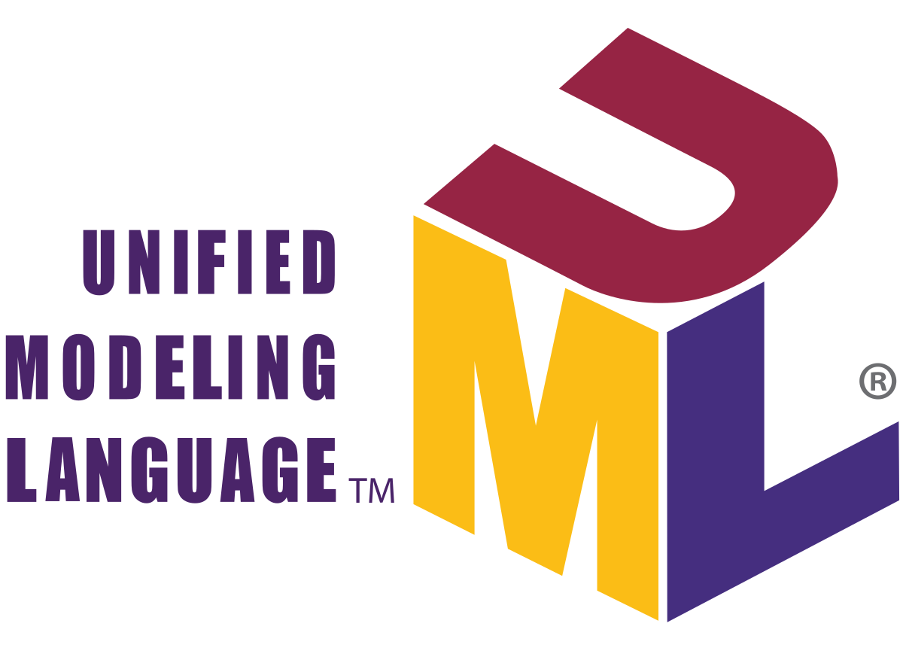
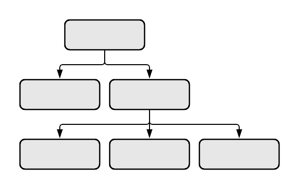
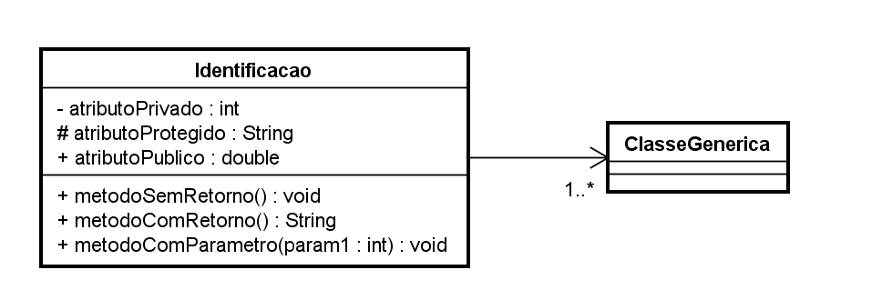
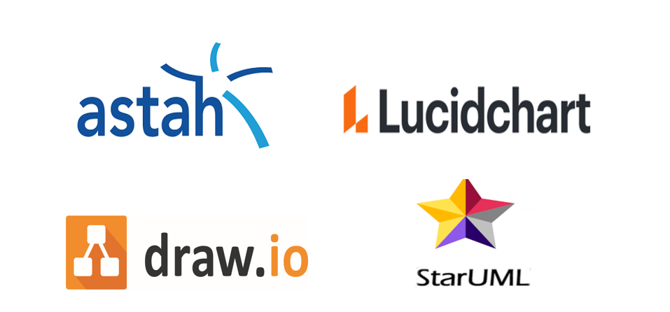

# Diagramas e Representações

## UML

Linguagem de Modelagem Unificada ou UML, é uma notação, que possibilita a representação gráfica do projeto.

## Introdução

Na UML, temos três conceitos necessários para compreendermos inicialmente:&#x20;

**Diagramas**, **elementos** e **relacionamentos**.

As notações UML, são distribuídas em duas categorias de diagramas, a estrutural e comportamental conforme listagem abaixo:

### Diagramas

#### Diagramas estruturais

* **Diagrama de classe:** O Diagrama de Classes é utilizado para fazer a representação de estruturas de classes de negócio, interfaces e outros componentes do sistema. Por esta característica, este diagrama é considerado o mais importante para a UML, pois auxilia a maioria dos demais diagramas.
* **Diagrama de objetos**: Este diagrama, representa os objetos existentes em um determinado instante ou fato na aplicação. Assim, conseguimos ter uma perspectiva do estado de nossos objetos, mediante a interação dos usuários no sistema.&#x20;

> [!NOTE]
> Existem outras categorias de diagramas estruturais e comportamentais, porém iremos focar nos citados acima.

#### Diagrama de classe

O diagrama de classes, ilustra **graficamente** como classes serão estruturadas e interligadas entre si, diante da proposta do nosso software.

Em diagrama, a estrutura das classes é constituída por:

**Identificação:** Nome e/ou finalidade da classe;

**Atributos:** Propriedades e/ou características;

**Operações:** Ações e/ou métodos.

### Relacionamentos

Em um diagrama, as classes podem existir de forma independente, mas obviamente haverá, em alguma etapa da aplicação a necessidade de algumas se relacionarem, o que devemos compreender é o nível de dependência entre elas:

#### Associação

Uma associação, define um relacionamento entre duas classes, permitindo que um objeto tenha acesso a estrutura de um outro objeto.

* **Agregação:** Um tipo especial de associação. Em uma agregação, a classe principal (chamada objeto-todo) precisa ser complementada por um ou mais objetos de uma mesma classe. Esse tipo de associação tenta demonstrar uma relação **todo/parte**

* **Composição:** Uma associação do tipo composição constitui-se em uma variação da agregação, onde é apresentando um vínculo mais forte entre o **objeto-todo** e o(s) **objeto(s)-parte**, procurando demonstrar que o objeto-parte esta associado a um único objeto-todo.

> [!TIP]
> O símbolo de agregação difere de associação simples por conter um losango na extremidade da classe que representa o objeto-todo.
>A associação de agregação pode, em muitos casos, ser substituída por uma associação binária simples, dependendo da visão de quem fez a modelagem.
>A função principal de uma agregação é identificar a obrigatoriedade de uma complementação das informações de um *objeto-todo* por seu(s) *objeto(s)-parte*

### Multiplicidade

Nem sempre o relacionamento entre as classes, será de **um para um**, em um determinado cenário poderá exigir multiplicidades específicas, conforme opções abaixo:

* 1\. -> Representa uma associação, **contendo um elemento;**
* \*. -> Representa uma associação, **contendo uma lista de elementos;**
* 0..1 -> Representa uma associação, **contendo zero ou um elemento;**
* 0..\* -> Representa uma associação, **contendo zero ou uma lista de elementos;**
* 1..\* -> Representa uma associação. **contendo um ou uma lista de elementos**.
* 1..1 -> Representa uma associação. **Um e somente um**.
* 3..5 -> Representa uma associação. **No mínimo 3 e máximo 5**.

### Visibilidade

Os atributos e métodos de uma classe, podem receber níveis de visibilidade, e na UML existem símbolos que representam cada um deles.

* (+) Visibilidade pública;
* (#) Visibilidade protegida (muito associada com herança);
* (-) Visibilidade privada.

#### Representação

### Ferramentas

Existem inúmeras ferramentas de diagramação, tanto online, como pagas e gratuitas.

